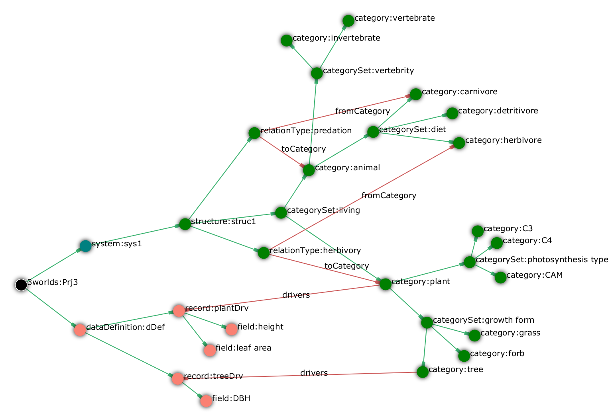

===== The __partition__/__category__/__relation__ concepts: specification of groups of entities

3Worlds uses these concepts to specify the ecological entities manipulated during a simulations. 

====== Category

`.../partition/*category*:<[underline]##__name__##>` {1..*}

A `*category*` is simply a name attached to a set of objects sharing common properties. Practically, these common properties are _state variables_, _parameters_ and dynamic behaviours (or _processes_). Categories and partitions constitute a user-defined _classification_ of _system component types_ relevant for a particular model.

To make this classification useful, we attach _parameters_ and _state variables_ to categories. State variables are variables (numbers, text, logical values) that characterize the state of a system component at an instant in time (_e.g._ biomass, age, sex, social status...). They will vary during a simulation. Parameters do not vary during a simulation; they are characteristic of a set of system components sharing them -- conceptually, a 'species' (e.g. average individual growth rate, mortality rate...).

Practically, this means that any instance of a system component of a given category will implement the state variables of this category and share parameters with other system components of the same 'species'.

The exact data structures for state variables and parameters are specified under the <<truethe-em-codesource-em-node,codeSource>> node and linked to the category through the following:

_Cross-links for_ `category`:

`parameters -> record:<[underline]##__name__##>` {0..1}::
This link tells which record data structure (in <<truethe-em-codesource-em-node,codeSource>>) is used to store parameters.

`drivers -> record:<[underline]##__name__##>` {0..1}::

`decorators -> record:<[underline]##__name__##>` {0..1}::
Similarly, these links tell which data structure in <<truethe-em-codesource-em-node,codeSource>> is used to store state variables. State variables are further classified into _drivers_, i.e. variables that _drive_ the dynamics of the system; and _decorators_, i.e. secondary state variables which values are computed from those of the drivers, only reflecting the dynamics of the drivers.

A category may be defined with no parameters, drivers or decorators, but it would be pretty useless to have neither of them.

====== Partition

`/3worlds/ecology/*partition*:<[underline]##__name__##>` {1..*}

Some categories must be exclusive of each other: for example, an ecological entity is either a plant or an animal, but can't be both. For this reason, _exclusive_ categories are grouped into `*partitions*`. A partition is _a set of **mutually exclusive** categories_. A partition may apply only to categories of a particular type (defined in another, higher level, partition). Hence categories can be nested:

`.../category/*partition*:<[underline]##__name__##>` {0..*}

====== Relation

`/3worlds/ecology/*relation*:<[underline]##__name__##>` {0..*}

A `*relation*` is just a name representing a meaningful link between two categories. It is specified by giving it a name and cross-linking it to the relevant categories with `fromCategory` or `toCategory` cross-links. Note that a relation can link more than one 'from' categories to more than one 'to' categories if required. Relations are used to implement specific processes acting on ecological entities (for example, a predation process).

_Cross-links for_ `relation`:

`fromCategory -> category:<__name__>` {1..*}::
This link tells which categories are at the start of the relation.

`toCategory -> category:<__name__>` {1..*}::
This link tells which categories are at the end of the relation 

_Properties for_ `relation`:

[horizontal]
`lifespan`:: This property specifies if this type of relation will stay attached to its `systemComponents` during all their life, or may get created and deleted during their lifespan.
+
****
include::ArchetypeDoc-system-LifespanType.adoc[]
****

====== Example: a category / partition tree

On this diagram (generated with `ModelMaker`), hierarchical links are in green and cross-links are in black.

[#fig-category-example]
.Example of a configuration with partitions, categories and relations

In this example, a _plant_ can be a _C3 tree_ but cannot be simultaneously a _grass_ and a _liana_. Similarly, an _animal_ cannot be both _herbivore_ and _carnivore_. The _predation_ relation links an _animal_ of any kind (the prey) to a _carnivore_ (its predator).

===== The specification of ecological entities: _system components_

====== System component

`/3worlds/ecology/*system*:<[underline]##__name__##>` {1..*}

3Worlds simulates a _system_ made of _system components_. These are the things which are instantiated at run time, hold state variables, and are dynamically changed over the time course of a simulation. When setting up a simulation, one must attach _categories_ to _system components_. The rules prevailing to build up partitions and categories mean that a system can belong to a number of non-exclusive categories, as long as the exclusion and nesting rules are respected. For example, we could define a system as belonging to the _plant_ and _tree_ categories, but not to the _animal_ and _tree_ categories.

_Cross-links_ for `system`:

`memberOf -> category:<__name__>` {1..*}::
This link tells to which categories a system component type belongs. The categories must not belong to the same partition. If there are nested categories, membership is inherited (e.g. in the previous example, belonging to the _C3_ category automatically implies the system component is also a _plant_).

`initialiser -> initialiser:<__name__>` {0..1}::
Use this optional link to specify a function to initialise state variables of a `systemComponent` at the beginning of a simulation.

include::ArchetypeDoc-system.adoc[]

====== Life cycle

`/3worlds/ecology/*lifeCycle*:<[underline]##__name__##>` {0..*}

As __system component__s are designed to represent -- among other things -- individual organisms, they are able to create other system components ar runtime, or to transform themselves into system component of another category set. These abilities are captured in the description of a `*lifeCycle*`, which describes the possible creations and transitions of system components of a given category set into another.

Since `systemComponents` belong to `categories`, different types of system components represented by different state variables, subject to different ecological processes, can coexist in a simulation. It may occur in a particular model that one wishes to represent a transition between, e.g. development stages: think for example of a caterpillar turning into a butterfly. There are chances that you don't want to describe the caterpillar with the same variables and behaviours as the adult butterfly. The operation of transforming a system component from a set of categories to another is called _recruitment_. Computationally, it means that the simulator must keep track of the system component's identity and age in the first stage and carry these properties on to the new system component of the second stage, and call an appropriate method to transform state variables of the first stage into the new one.

_Reproduction_ is the second process by which system components of a given category set may produce other system components belonging to possibly different categories.

A specification of a life cycle is made by specifying `recruit` and `produce` nodes to match these two behaviours.

====== Recruitment

`/3worlds/ecology/lifeCycle/*recruit*:<[underline]##__name__##>` {0..*}

This node specifies that two `systemComponent` types are linked by a _recruitment_ process.

_Cross-links for_ `recruit`:

`from -> system:<__name__>` {1}::
This link tells which system component type is getting changed by the recruitment.

`to -> system:<__name__>` {1}::
This link tells which system component type is the result of the recruitment.

`process -> process:<__name__>` {1}::
This link tells which ecological process is used to compute the recruitment.

====== Reproduction

`/3worlds/ecology/lifeCycle/*produce*:<[underline]##__name__##>` {0..*}

This node specifies that two `systemComponent` types are linked by a _reproduction_ process.

_Cross-links for_ `produce`:

`from -> system:<__name__>` {1}::
This link tells which system component type is producing new system components.

`to -> system:<__name__>` {1}::
This link tells which system component type is the result of the reproduction.

`process -> process:<__name__>` {1}::
This link tells which ecological process is used to compute the production of new system components.

====== Example of a life cycle specification

This life cycle:

[#fig-life-cycle-example]
.Example of a life cycle
image::example-life-cycle.svg[align="center"]

is specified with this graph:

[#fig-life-cycle-config-example]
.Example of a life cycle configuration
image::example-life-cycle.png[align="center"]

*[TODO: fix the graph with the missing 'to' node for vegetative reproduction + add processes]*

===== The setup of an initial state for a simulation

====== Initial state

`/3worlds/ecology/*initialState*:<__name__>` {0..1}

To run a simulation, an initial population of `systemComponents` must be provided. Nodes under the `initialState` node are used to input data to create such an initial state. 

IMPORTANT: Please note that 3Worlds allows for five different ways of initialising a simulation. These methods are explained in detail in section <<truefeeding-the-model-with-data,feeding the system with data>>).

====== Species

`/3worlds/ecology/community/*species*:<__name__>` {0..*}

This node specifies an instance of a _species_, characterized by a _life cycle_. Different instances of this life cycle may be specified by means of different names.

_Cross-links for_ `species`:

`speciesType -> lifeCycle:<__name__>` {0..1}::
This link tells which life cycle should be used for this species. It is not required if the species only has one _stage_ (see below).

`loadFrom -> dataSource:<__name__>` {0..1}::
This link tells which data source the species data should be read from. It is required if no `name` is given to the species. If no `name` is given, the file may contain data for more than one species and a species instance will be setup for every species entry found in the data file.  cf. section <<truethe-em-dataio-em-node,dataIO>>.

WARNING: if no `name` is given, the data must be read from a file, i.e. there must be a `loadFrom` cross-link.

====== Developmental stages

`/3worlds/ecology/community/species/*stage*:<__name__>` {0..*}

This node specifies an instance of a _stage_, characterized by a _system type_. Different instances of this system type may be specified by means of different names.

_Cross-links for_ `stage`:

`systemType -> system:<__name__>` {1}::
This link tells which system component type should be used for system components belonging to this stage.

`loadFrom -> dataSource:<__name__>` {0..1}::
This link tells which data source the stage data should be read from. It is required if no `name` is given to the stage. If no `name` is given, the file may contain data for more than one stage and a stage instance will be setup for every stage entry found in the data file. cf. section <<truethe-em-dataio-em-node,dataIO>>.

WARNING: if no `name` is given, the data must be read from a file, i.e. there must be a `loadFrom` cross-link.

====== Individuals present at simulation start

`/3worlds/ecology/community/species/stage/*individual*:<__name__>` {0..*}

This node specifies an instance of a _system component_ to be created at the beginning of a simulation.

_Cross-links for_ `individual`:

`loadFrom -> dataSource:<__name__>` {0..1}::
This link tells which data source the system component data should be read from. It is required if no `name` is given to the individual. If no `name` is given, the file may contain data for more than one individual and a system component instance will be setup for every individual entry found in the data file. cf. section <<truethe-em-dataio-em-node,dataIO>>.

WARNING: if no `name` is given, the data must be read from a file, i.e. there must be a `loadFrom` cross-link.

Format of data files are described in section <<truethe-em-dataio-em-node,dataIO>>.

It is possible to directly input data in ModelMaker (recommended for small amounts of data only) by using a `load` node as a child node of either `species`, `stage` or `individual`: 

====== Using _load_ to directly input data from ModelMaker

`/3worlds/ecology/community/.../*load*`

_Properties for_ `load`: 

Any field or leaf table defined in the <<truethe-em-codesource-em-node,codeSource>> section can be instantiated with a properly typed value here.

===== The representation of time

Simulation is about mimicking the dynamics of a real system. Here, dynamics is specifying by attaching particular behaviours (called processes) to either categories or relations.

====== Simulator

`/3worlds/ecology/*engine*:<[underline]##__name__##>` {1}

This node specifies the type of simulator to use. 

NOTE: Currently, there is only one type of simulator available, so it is set by default without user intervention. This may change in the future, so that user choice may be needed here.

====== Time line

`/3worlds/ecology/engine/*timeLine*:<[underline]##__name__##>` {1}

Every simulation experiment has a reference _time line_. Since different ecological processes may run according to different time models, they must refer to a common time frame for interaction to be possible among them. A `*timeLine*` defines what kind of time scale and time units can be used in this experiment, and more importantly what is the time _grain_, i.e. the duration below which events are considered simultaneous. Internally, the `ModelRunner` uses integers to represent time, with 1 = one time grain.

include::ArchetypeDoc-timeLine.adoc[]

====== Time models

`/3worlds/ecology/engine/timeLine/*timeModel*:<[underline]##__name__##>` {1..*}

Ecological processes may be run following different time models. A time model is a particular way of representing time in the simulator. Time models may differ in parameters, like e.g. two time models using different time steps; but they can also be radically different in their logic: e.g. clock-like ticking vs. event-driven simulation.

include::ArchetypeDoc-timeModel.adoc[]

`class`:: the type of `timeModel` to use.
+
****
_possible values_:

[horizontal]
`ClockTimeModel`:: Time is incremented by a constant amount _dt_. This is commonly used to simulate regular processes like growth.
`EventTimeModel`:: Model dynamics generates _events_ and computes the date in the future at which they are going to occur. This is commonly used to generate irregular processes like fire occurrence.
`ScenarioTimeModel`:: *Not yet implemented*.
****

_Additional properties when_ `class = ClockTimeModel`

[horizontal]
`dt`:: The constant time increment used in this `ClockTimeModel`, expressed as an integer number of `TimeModel` base unit (=`TimeModel.nTimeUnits` x `TimeModel.timeUnit`). For example, if the TimeModel has `timeUnit` = `DAY` and `nTimeUnits` = 3, `dt` is expressed in units of 3 days (e.g. `dt` = 2 means the time increment is 6 days).
+
WARNING: if calendar time is used (`timeLine.scale` = `GREGORIAN`), then `dt` will sometimes not be constant (e.g. if `dt` = 2 `MONTH`, `dt` will vary in duration between 28 and 31 days according to the exact date).

_Additional sub-tree when_ `class = EventTimeModel`

`/3worlds/ecology/engine/timeLine/timeModel/*eventQueue*:<[underline]##__name__##>` {1}

An `EventTimeModel` maintains a queue of time events that gets populated by ecological processes. Time events are stored in this queue based on their date and activated by the simulator following time order.

_Cross-links for_ `eventQueue`

`populatedBy -> function:<[underline]##__name__##>` {1..*}::
These links indicate which ecological processes will populate the event queue with time events.

====== Simulation stopping condition

`/3worlds/ecology/*stoppingCondition*:<[underline]##__name__##>` {0..*}

A simulation may be run indefinitely (interactively), but in big simulation experiment it is useful to automatically stop the simulations according to some criterion. Besides the simplest stopping condition, reaching a maximal time value, 3Worlds provides many other possibilities to stop a simulation (e.g. based on a population size, on a variable passing a threshold value, etc.).

Although not directly attached to the simulation engine (they are managed by the <<truethe-em-experiment-em-node,simulation experiment>> node), stopping conditions sometimes have to know about the system modelled, for example when they must read a variable value in the simulated system. This is why they are defined here.

When no stopping condition is defined, the simulation will run indefinitely.

_Properties for_ `stoppingCondition`

[horizontal]
`class`:: The type of stopping condition to use
+
****
_possible values_:

`SimpleStoppingCondition`:: 
Simulation stops when a maximal time value is reached.
`ValueStoppingCondition`:: 
Simulation stops when a variable in a reference system component is reached.
`InRangeStoppingCondition`:: 
Simulation stops when a variable in a reference system gets within the given range.
`OutRangeStoppingCondition`:: 
Simulation stops when a variable in a reference system gets out of the given range.
`MultipleOrStoppingCondition`:: 
Compound stopping condition: simulation stops when _any_ of the elementary stopping conditions within this multiple condition's list is true.
`MultipleAndStoppingCondition`:: 
Compound stopping condition: simulation stops when _all_ of the elementary stopping conditions within this multiple condition's list are true.
****

_Additional properties when_ `class = SimpleStoppingCondition`

[horizontal]
`endTime`:: The time at which the simulation will stop, in time line `shortestTimeUnits` (i.e. the simulation will stop at `endTime`*`timeLine.grain`).

_Additional cross-links when_ `class = ValueStoppingCondition`, `InRangeStoppingCondition`,  `OutRangeStoppingCondition`

`stopSystem -> system:<[underline]##__name__##>` {1}::
The system component in which the criterion variable will be checked to stop the simulation.
*[TODO: check this - seems flawed to me]*

_Additional properties when_ `class = ValueStoppingCondition`, `InRangeStoppingCondition`, `OutRangeStoppingCondition`

[horizontal]
`stopVariable`:: The name of the variable which value will be checked.

_Additional properties when_ `class = ValueStoppingCondition`

[horizontal]
`stopValue`:: The value of `stopVariable` at which to stop the simulation.

_Additional properties when_ `class = InRangeStoppingCondition`, `OutRangeStoppingCondition`

[horizontal]
`upper`:: The upper value of the `stopVariable` range. Only `double` values are accepted.
`lower`:: The lower value of the `stopVariable` range. Only `double` values are accepted.

_Additional cross-links when_ `class = MultipleOrStoppingCondition`, `MultipleAndStoppingCondition`

`condition -> stoppingCondition:<[underline]##__name__##>` {1}::
These links point to the stopping conditions that will be used as elementary stopping conditions by the multiple and/or stopping condition.

===== Ecological processes

====== Process

`/3worlds/ecology/*process*:<[underline]##__name__##>` {1..*}

_Processes_ are used in 3Worlds to compute change in _system components_. Each process acts on system components of a particular category set (cf. <<truecategory,Category>>, <<truesystem-component,System Component>>) and is scheduled by a particular time model (cf. <<truetime-representation,time representation>>). Processes contain user-defined code that represents ecological processes. This gives 3Worlds its versatility: one can mix in a single models completely different ecological entities (system components of different category sets), implement any ecological process depending on user needs, and put them to work on different time scales (time models).

_Cross-links for_ `process`

A process can act on a single system component at a time (called the _focal_ system component), or on a pair of components linked by a relation (called the _focal_ and the _other_ system components). This is specified using the `appliesTo` cross-link (one at least must be present):

`appliesTo -> category:<[underline]##__name__##>` {0..*}::
These links indicate the category set of the system components that will be acted on by the process.
`appliesTo -> relation:<[underline]##__name__##>` {0..1}::
This link indicates to which relation between system component the process applies.
`dependsOn -> process:<[underline]##__name__##>` {0..*}::
This link tells that the process must be activated _after_ the processes targeted by the links. Use this link to organize computations when there are dependencies between them.
`timeModel -> timeModel:<[underline]##__name__##>` {1}::
This link tells which `timeModel` shall be used to activate the process. 

====== Function

`/3worlds/ecology/process/*function*:<[underline]##__name__##>` {1..*}

User-defined code for computing ecological processes is located in _functions_, which constitute the modifiable part of _processes_. There are different types of predefined functions, which differ by the way they act on system components (cf. << >>).

_Cross-links for_ `function`

`spec -> functionSpec:<[underline]##__name__##>` {0..1}::
This link points to a function code specification provided in <<truethe-em-codesource-em-node, `codeSource` >>. Based on this specification, `ModelMaker` will generate the appropriate java source file for insertion of user-defined code.

_Properties for_ `function`

[horizontal]
`className`:: The name of an _existing_ java class containing the user-defined function code. *[TODO: check validity of this]*

Either the `spec` cross-link or the `className` property must be provided, but not both.

====== Function consequences

`/3worlds/ecology/process/function/*consequence*:<[underline]##__name__##>` {0..*}

Some functions may imply consequences: for example, a decision to delete another system component may be followed by a change in state based on the deleting component's state at the time it is deleted. Such functions that are only activated when certain events take place are called _consequences_ and may be specified by a child node to a function.

====== Data tracking

`/3worlds/ecology/process/*dataTracker*:<[underline]##__name__##>` {0..1}

Simulations are useless if data cannot be efficiently output. The _data tracker_ is a particular function able to send data to an output (either the 3Worlds graphical user interface or some kind of database). Since it is associated to a _process_, it will follow a timeModel and apply to a particular set of system components. A data tracker may be attached to a process that already has a function defined, or not.

TIP: There is a potential runtime saving in attaching data trackers and functions together in a process, since their invocation will be performed in a single loop on system components.

The data tracker mimicks real-world data loggers: a channel links a 'sensor' (the internal 3Worlds variable) to an output (a chart on the user interface, a file or a database table). Channels can be attached to a single system component or to a set of them, using various statistical aggregation methods. Many properties are defined to enable to fine-tune the production of output.

include::ArchetypeDoc-dataTracker.adoc[]

====== Initial computations

`/3worlds/ecology/*initialiser*:<[underline]##__name__##>` {0..*}

In some models, computations on parameters are required before the model starts to run. The `initialiser` node fullfils this requirement by allowing users to write code to perform these computations.

_Cross-links for_ `initialiser`

`spec -> initialiserSpec:<[underline]##__name__##>` {0..1}::
This link points to an initialiser code specification provided in <<truethe-em-codesource-em-node, `codeSource` >>. Based on this specification, `ModelMaker` will generate the appropriate java source file for insertion of user-defined code.

_Properties for_ `initialiser`

[horizontal]
`class`:: The name of an _existing_ java class containing the user-defined initialiser code. *[TODO: check validity of this]*

Either the `spec` cross-link or the `class` property must be provided, but not both.

