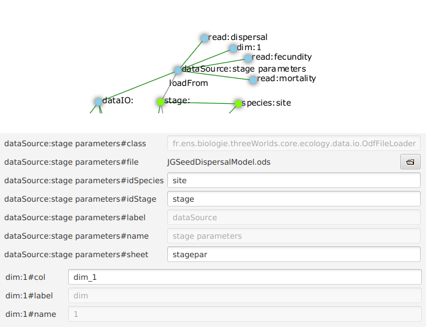

_Properties for_ `experiment`:

[horizontal]
`nReplicates`:: The number of times all elementary treatments must be replicated. Use this only if there is an internal source of variation in simulations, like random numbers. Otherwise all simulations will be strictly identical.

_Cross-links for_ `experiment`:

`baseLine -> system:<[underline]##__name__##>` {1}::
This link points to a model setup (<<configuration-reference.adoc#truethe-system-node>>) that will be used as a _base line_ simulation. A base line simulation is the equivalent of a control in a real experiment, i.e. a reference case that serves as a basis to which other treatments are compared. Often, the base line is the setup for which data is available to compare simulation outputs to.

===== Simulation duration

`/3worlds/experiment/*timePeriod*` {0..*}

The duration of a particular simulation is specified using a `timePeriod` node. 

*[TO DO: sort out the conflict between this and the stopping conditions]*

_Properties for_ `timePeriod`

[horizontal]
`start`:: The starting time of a simulation in `timeLine` shortest time units.
`end`::  The ending time of a simulation in `timeLine` shortest time units.

NOTE: Both properties are optional. If none is set, the simulation will start at time 0 and run indefinitely.

_Cross-links for_ `timePeriod`:

`stopOn -> stoppingCondition:<[underline]##__name__##>` {0..1}::
This link tells how to stop the simulation in case no `end` property is given.

NOTE: The stopping condition has the priority over the `end` property. 
** TO DO: check this**

===== Experimental design

`/3worlds/experiment/*design*:<[underline]##__name__##>` {1}

An experimental design specifies the method used to perform the simulations, e.g. number of replicate simulations, treatments as changes in parameter values or initial states, etc. An experimental design can be specified by using standard designs, or by passing a design description file.

For more information on experimental designs for simulation experiments, we recommend reading the documentation of the R software _planor_ and _mtk_ packages (e.g. these packages could be used to generate design files for use in 3Worlds).

**[TO DO: OpenMole integration]**

include::ArchetypeDoc-design.adoc[]

===== Experimental treatments

====== Treatments

`/3worlds/experiment/*treatment*:<[underline]##__name__##>` {0..*}

An experimental treatment records a particular set of parameter values and initial state to run a simulation or a series of replicated simulations. It is the basic block of the experiment, just as in real-world experimentation.

Treatements may be specified 

* in full detail: this is done by specifying more than one `system` nodes, each `system` being used for a different treatment;

* as (minor) changes relative to the experiment `baseLine`.

**NB: not fully implemented yet**

====== Treatments as changes relative to _baseLine_

`/3worlds/experiment/treatment/*modelChange*` {0..*}

**NB: not fully implemented yet**

===== Managing experiment data

====== Inputs: _dataSource_

`/3worlds/experiment/*dataSource*:<[underline]##__name__##>` {0..*}

This node describes a source of data to use to instantiate a model: name of the data source, access method, etc.

_Properties for_ `dataSource`

[horizontal]
`file`:: A valid data file name
`subclass`:: A data format to use to read that file
+
****
_possible values_:

[horizontal]
`CsvFileLoader`:: https://en.wikipedia.org/wiki/Comma-separated_values[comma separated value] `.csv` text file
`OdfFileLoader`:: https://en.wikipedia.org/wiki/OpenDocument[OpenDocument] `.ods` spreadsheet
****

_Additional properties when_ `subclass = CsvFileLoader`

[horizontal]
`separator`:: the field separator used for this `.csv` file (default: tabulation `"\t"`)

_Additional properties when_ `subclass = OdfFileLoader`

[horizontal]
`sheet`:: the name of the spreadsheet to load from this `.ods` file (different spreadsheets in the same `.ods` file must be specified as different `dataSource` nodes). If this property is absent or not set, the first spreadsheet will be loaded.

_Additional properties when_ `subclass = CsvFileLoader`, `OdfFileLoader`

`.csv` and `.ods` file formats both assume the data come in 2 dimensional tables with cross-references between the tables. Table columns must match parameter and driver field or table names. Table rows must match species, stage or system component instances.

The following rules must be respected when preparing the data files:

* The data must not contain any missing value or structural empty cells.
* Empty lines are permitted (they are skipped).
* Text data must not be quoted.
* The first data line of any file or spreadsheet must contain column headers. They must match field names as defined under the `dataDefinition` node (<<configuration-reference.adoc#truethe-datadefinition-node>>).

*[TO DO how to handle data hierarchy - DataLabels. cf file configuration-dataIO.adoc for other properties as this is going to change in reimplementation]*

_Additional sub-tree when_ `class = CsvFileLoader`, `OdfFileLoader`

`/3worlds/dataIO/dataSource/*read*:<[underline]##__name__##>` {0..*}

This node specifies that a particular parameter/driver must be read from the file/spreadsheet. The _name_ property of the `read` node must match the parameter/driver name to read. By default, when no `read` node is present, _all_ parameters/drivers found in the file/spreadsheet will be read. Use `read` nodes to restrict the number of columns to read in a data source.

`/3worlds/dataIO/dataSource/*dim*:<[underline]##__name__##>` {0..*}

This node is used when reading data into tables (<<configuration-dataDefinition.adoc#truetable>>). The node name must be an integer matching the dimension declared in a table under the `dataDefinition` node. It must then have the following property:

[horizontal]
`col`:: header of the column containing the index values for this dimension.

When `dim` nodes are present, the index values contained in the dimension columns specified in `col` are used to fill a table within the same 3Worlds data structure.

====== Example of a _dataSource_ specification

*[TO DO: refactor this example when data sources are reimplemented - this example no longer holds]*

This `.csv` file:

|===

|stage|dim_1|fecundity|mortality|dispersal|site
|population|0|0.1|0.2|0.1|site
|population|1|0.1|0.5|0.1|site
|population|2|0.2|0.5|0.2|site
|population|3|0.5|0.01|0.5|site
|population|4|2|0.8|1|site
|population|5|3.5|0.56|0.5|site
|population|6|14.0|0.02|0.01|site
|population|7|2.5|0.001|0.5|site
|population|8|6.2|0.03|0.2|site
|population|9|3|0.1|0.3|site
|===

with the following specifications: 

[#fig-data-source-example]
.Example of a data source configuration.

will result in the instantiation of a single parameter set with species='site', stage='population', and data contained in an 10-cell array of records with 3 fields, fecundity, mortality and dispersal.

How?

* property `idSpecies` states that the column labelled 'site' is the species identifier (last column of the csv file).
* property `idStage` states that the column labelled 'stage' is the stage identifier (first column of the csv file).
* since there is no `idComponent` property, it means this file contains stage parameter data.
* node `dim` with `name`=1 specifies that the data to be read go into a table
* property `col` states that the column labelled `dim_1` contains the indices for dimension 1 of the table.
* the `read` nodes specify that the columns labelled 'fecundity', 'dispersal' and 'mortality' are to be read. Notice that these nodes were not required, since the default behaviour would have caused all these columns to be read anyway.
* finally, the 10 different lines with different table indices (CAUTION: the indices start at 0 for 3Worlds table data structures) will all go into the same parameter set since only one (species name, stage name) pair is given here. Hence only one stage parameter set is instantiated.

====== Outputs: _dataSink_

`/3worlds/experiment/*dataSink*:<[underline]##__name__##>` {0..*}

This node describes a 'sink' where data resulting from simulation output is to be stored for later processing by other software.

*[Not yet implemented]*

_Properties for_ `dataSink`

[horizontal]
`file`:: A valid data file name

_Cross-links for_ `dataSink`:

`source -> dataTracker:<[underline]##__name__##>` {1}::
This link the origin of the data to save into the sink. Usually, a data tracker (<<configuration-ecosystem-dynamics.adoc#truedata-tracking>>)