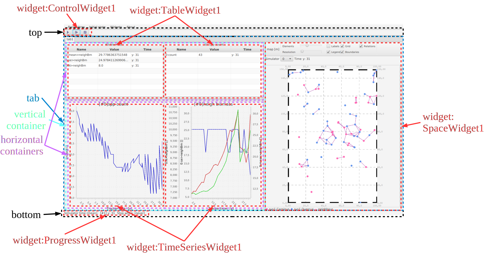
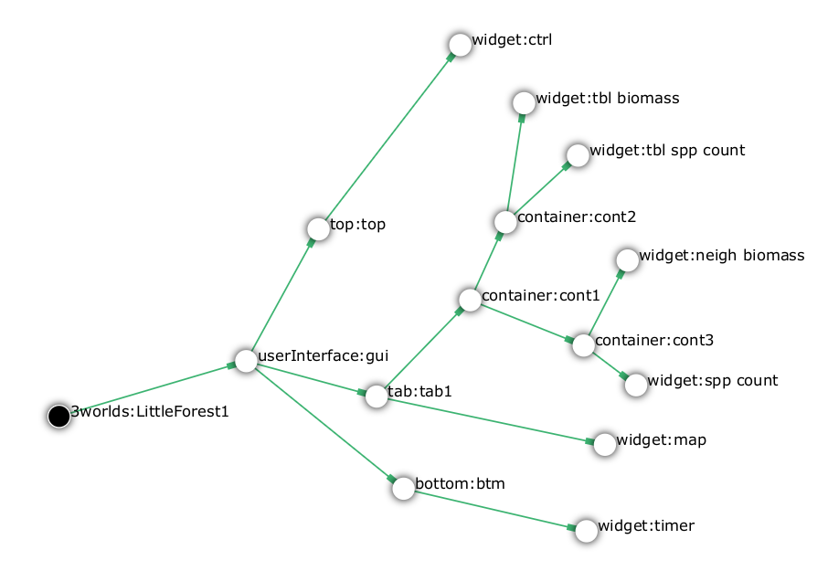

3Worlds provides a series of _widgets_, i.e. classes that can manage output from the simulator and either show it graphically or perform some other non-graphic task (e.g. save data to disk). Examples of graphic widgets are: time series or scatter plots, simulation control buttons, progress bars, maps etc... The basic `ModelRunner` GUI just provides places to place widgets: a _top_, a _bottom_ and any number of _tabs_. Any number of widgets can be placed within these (<<fig-example-gui>>,<<fig-example-gui-tree>>).

[[fig-example-gui]]
.The ModelRunner graphical user interface.

[[fig-example-gui-tree]]
.The configuration sub-tree specifying the GUI of <<fig-example-gui>>.

===== Top

`/3worlds/userInterface/*top*:<__name__>` {1}

This is a tool bar and appears at the top, just below the menu bar. Widgets placed here will appear beside each other in an order specified in `ModelMaker` properties (_Order_). The top is typically a place where small widgets are added that remain accessible no matter where other widgets are placed. Typically a controller or progress widgets are placed here. Checks are made by `ModelMaker` to ensure only small widgets can be placed here (<<fig-example-gui>>).

===== Bottom

`/3worlds/userInterface/*bottom*:<__name__>` {0..1}

The _bottom_ is a status bar and appears at the bottom of the GUI. It has the same constraints as the _top_. Widgets such as a progress bar can be placed here if desired (<<fig-example-gui>>).

===== Tabs and containers

`/3worlds/userInterface/*tab*:<__name__>` {0..*}

`/3worlds/userInterface/tab/*container*:<__name__>` {0..*}

`/3worlds/userInterface/.../container/*container*:<__name__>` {0..*}

There can be any number of _Tabs_ and each _Tab_ can contain any number of widgets through the use of _containers_. _Tabs_ are intended for large widgets such as charts and maps. Since only one tab is visible at a time when the model is run, large GUIs can be assembled without the limits imposed by window size (<<fig-example-gui>>). 
_Tab_ contents are structured as a binary tree made of a combination of widgets or containers of widgets. A _Tab_ can have:

* One or two widgets;
* One widget and one container; or,
* Two containers.

Containers have the same constraints as tabs - i.e. each container can have:

* One or two widgets;
* One widget and one container; or,
* Two containers.

Only widgets can be leaf nodes in this binary tree i.e you can't have a container or tab that contains nothing.

The widget/container pairs in this binary tree can be arranged vertically or horizontally. This allows all possible arrangements of widgets in the GUI.

include::ArchetypeDoc-tab.adoc[]

include::ArchetypeDoc-container.adoc[]

===== Headless UI

`/3worlds/userInterface/*headless*` {0..*}

If you want to run a simulation unattended, you may not need a GUI at all. Instead, you may want the simulation to begin immediately and use widgets to write data to disk. Such widgets are call `Headless`. All headless widgets are children of the `gui:Headless:` node.

===== Widgets

`/3worlds/userInterface/top/*widget*:<__name__>` {0..*}

`/3worlds/userInterface/bottom/*widget*:<__name__>` {0..*}

`/3worlds/userInterface/tab/*widget*:<__name__>` {0..*}

`/3worlds/userInterface/.../container/*widget*:<__name__>` {0..*}

`/3worlds/userInterface/headless/*widget*:<__name__>` {0..*}

Widgets are the interesting part of the GUI configuration as they provide feedback and control of a simulation. A widget may be added as a child of `top`, `botton`, `tab`, `container`  or `headless`  nodes.

include::ArchetypeDoc-widget.adoc[]

`subclass`:: A widget class
+
****
_possible values_:
[horizontal]
`ControlWidget1`:: A simple simulator controller with run/pause, step and reset buttons. Add this as a child of a `top` or `bottom` node. A GUI definition can only have one controller.

`ControlWidget2`:: As for `ControlWidget1`, but also displays the stopping condition(s) and the time taken to complete each simulation step and the total simulation time. These timings are only accurate when deploying a single simulation. They are not accurate when deploying multiple simulations. Therefore, this widget is best used when developing a model to check its performance. Use ControlWidget1 otherwise.

`ControlWidget3`:: As for `ControlWidget2`, but displays a time series plot of simulation execution time. Add this widget as a child of a `tab` or `container` node. 

`ProgressWidget1`:: A simple display of simulation time (average time if deploying multiple simulations) and stopping condition. Add this widget as a child of a `top` or `bottom` node.

`ProgressWidget2`:: A bar graph of simulation progress intended for use when deploying multiple simulations. Add this widget as a child of a `tab` or `container` node.

`TimeseriesWidget1`:: A graph of _x~i~_ = __f__(__t__), where _x~i~_ are component descriptors and _t_ is time.  Add as a child of a `tab` or `container` node. This widget uses the fast charting library from https://github.com/GSI-CS-CO/chart-fx[Chartfx]. The widget has a number of additional facilites accessed by moving the mouse to the top of the chart display. Here, data can be viewed as a table and exported to file.

`ScatterplotWidget1`:: A graph of _y_ = __f__(__x__) where _x_ and _y_ are two descriptors of a component.  Add as a child of a `tab` or `container` node. This widget also uses the fast charting library from https://github.com/GSI-CS-CO/chart-fx[Chartfx].

`SpaceWidget1`:: A map of a  <<configuration-ecosystem-structure.adoc#truethe-representation-of-space,space>>.  Add as a child of a `tab` or `container` node.
`TableWidget1`:: A table of number values __x~i~__(__t__).  Add as a child of a `tab` or `container` node. Add as a child of a `tab` or `container` node. 

`MatrixWidget1`:: A colour display of a 2-dimensional table. Add as a child of a `tab` or `container` node. *untested*

`GraphWidget1`:: A display of the system graph. Add as a child of a `tab` or `container` node.  *not yet implemented*

`HLSimpleTimeSeriesWidget`:: Saves time series data to a file. Add as a child of a `headless` node.  *untested*

`HLSimpleControlWidget`:: As `ControlWidget1`, but for unattended simulations. Add as a child of a `headless` node.
****

Many widgets have settings which can be adjusted from the _Widget_ menu of _ModelRunner_. These settings are automatically saved to a preferences file when _ModelRunner_ is closed thus preserving the look and feel of the interface between uses.

====== Additional properties for widget sub-classes

_for_ `ProgressWidget1`:

[horizontal]
`refreshRate`:: (optional) The rate at which this widget updates its display (ms) (_default_ 250 ms). This property is for the purpose of efficency. Because this widget can display the average progress of a very large number of simulations (e.g 1 million parallel simulations), it would be very inefficient, not to mention uninformative, if the display was updated every time any one of the simulators sent a message. 

_for_ `TimeSeriesWidget1` _and_ `TableWidget1`:

[horizontal]
`nSenders`:: (optional) The number of parallel simulators to display (_default_ 1). As noted, there can be far too many simulators to reasonably display their output. In such cases, this property limits that number to whatever you think you can handle.
`firstSender`:: (optional) The lowest sender (simulator id) to display (_default_ 0). Output from simulators is shown for contiguously numbered simulators. This property sets the lowest number from which to display _n_ simulator outputs.

_for_ `TimeSeriesWidget1`:

[horizontal]
`maxAxes`:: Sets the maximum number of _y_ axes to display on the chart. As this widget can show time series for any number of variables, it is important to assign them to their own axis. However, if you have so too many outputs the chart will be all axes and no data. There, the number of axes can be constrained with this property. 

`bufferSize`:: Number of time intervals to plot on the time axis, e.g. a value of 100 will display times 900-1000 when reaching time 1000. That is, what you see is a rolling buffer of data.

_for_ `SpaceWidget1`:

[horizontal]
`nViews`:: This widget records data produced from any number of simulators. However, its often unreasonable to view every one of what may be a very large number. However, being able to visually compare independent parallel simulations is useful. This setting allow more than one (at the moment this is unlimited) view. A drop-down list for each view allows you to select which data set to display. 

====== Additional cross-links for widget sub-classes

_for_ `ControlWidget2`, `ControlWidget3`, `ProgressWidget1`  _and_ `ProgressWidget2`:

`trackTime -> dynamics:<[underline]##__name__##>` {1}::
This link identifies the _dynamics_ system the widget is listening to.

_for_ `TimeSeriesWidget1`, `TableWidget1` _and_  `HLSimpleTimeSeriesWidget`:

`trackSeries -> dataTracker:<[underline]##__name__##>` {1}::
This link identifies the `dataTracker` the widget is listening to.

_for_ `SpaceWidget1`:

`trackSpace -> space:<[underline]##__name__##>` {1}::
This link identifies the `space` the widget is listening to.

_for_ `GraphWidget1`:

`trackSystem -> system:<[underline]##__name__##>` {1}::
This link identifies the `system` the widget is listening to
