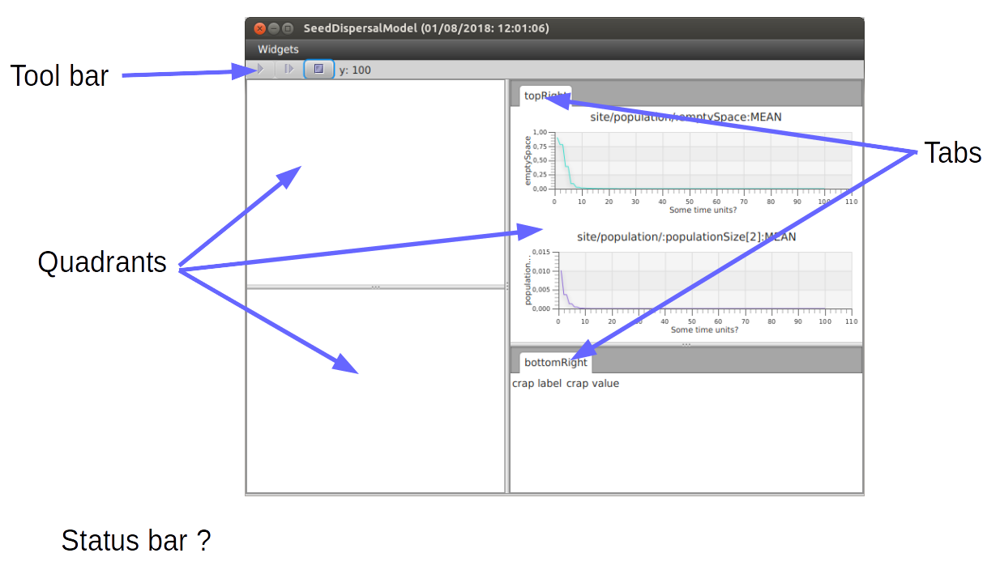

*[HERE: refactor this part]*

3Worlds provides a series of interface _widgets_, i.e. graphical objects that can be used to design a **G**raphical **U**ser **I**nterface (GUI). Examples of widgets are: time series or scatter plots, simulation control buttons, progress bars, maps etc... The basic `ModelRunner` GUI just provides places to put widgets: a _top_, a _bottom_ and any number of _tabs_. Any number of widgets can be placed within these.

[#fig-GUI-ModelRunner]
.The ModelRunner graphical user interface.

*TODO: improve this figure*

===== Top

`/3worlds/userInterface/*toolBar*` {1}

The _top_ is a tool bar. Widgets placed here will appear beside each other in an order specified in ModelMaker properties (_Order_). The top is typically the place where to put (small) widgets that must always remain accessible (e.g., simulation control buttons). Checks are made by ModelMaker to ensure only small widgets are placed here.

===== Bottom

`/3worlds/userInterface/*statusBar*` {0..1}

The _bottom_ is a status bar. It has the same constraints as the _top_. Widgets such as a progress bar can be placed here if desired.

===== Tabs

`/3worlds/userInterface/*tab*` {0..*}

There can be any number of _Tabs_ and each _Tab_ can contain any number of widgets through the use of _containers_. _Tabs_ are intended for large widgets such as charts and maps. Since only one tab is visible at a time when the model is run, large GUIs can be assembled without the constraints imposed by window size. 
_Tab_ contents are structured as a binary tree made of a combination of widgets or containers of widgets. A _Tab_ can have:

* One or two widgets;
* One widget and one container; or,
* Two containers.

Containers have the same constraints as tabs - i.e. each container can have:

* One or two widgets;
* One widget and one container; or,
* Two containers.

Widgets can be leaf nodes in this binary tree i.e you can't have a container or tab that contains nothing.

The widget/container pairs in this binary tree can be arranged vertically or horizontally. This allows all possible arrangements of widgets in the GUI.

include::ArchetypeDoc-tab.adoc[]

==== Headless UI

If you want to run a simulation unattended, you may not need a GUI at all. Instead you may want the simulation to begin immediately and use widgets to write data to disk. Such widgets are call `Headless`. All headless widgets are children of the `gui:Headless:` node.

===== Widgets

`/3worlds/userInterface/.../*widget*` {0..*}

Widgets are the interesting part of the GUI configuration as they provide feedback and control of a simulation. A widget may be added as a child of `top`, `botton`, `tab`, `container`  or `headless`  nodes.

_Properties for_ `widget`

[horizontal]
`order`:: Determines the layout order of the widget within its parent node.
`class`:: A widget class
+
****
_possible values_:
[horizontal]
`TimeDisplayWidgetfx`:: display simulation time
`SimpleSimulationControlWidgetfx`:: control a single simulation
`TimeSeriesPlotWidgetfx`:: plot time series output
`LabelValuePair`:: *???*
`SingleGridWidget`:: *???*
****

_Cross-links for_ `widget`:

`dataListener -> dataTracker:<[underline]##__name__##>` {0..*}::
This link tells the widget where to get the data from.

====== Time display

_Cross-links for_ `TimeDisplayWidgetfx`:

`timeListener -> engine:<[underline]##__name__##>` {1}::
This link tells the widget where to get the time values from.

====== Simulation control

_Cross-links for_ `SimpleSimulationControlWidgetfx`:

`stateMachineListener -> engine:<[underline]##__name__##>` {1}::
This link tells the widget which engine it is going to control.

====== Plotting time series data

_Cross-links for_ `TimeSeriesPlotWidgetfx`:

`stateMachineListener -> engine:<[underline]##__name__##>` {1}::
This link tells the widget where to get simulation status information (e.g. when the simulation is over, reset, paused, etc.)

====== [Value pair widget]

_Cross-links for_ `LabelValuePair`:

`stateMachineListener -> engine:<[underline]##__name__##>` {1}::
This link tells the widget where to get simulation status information (e.g. when the simulation is over, reset, paused, etc.)

