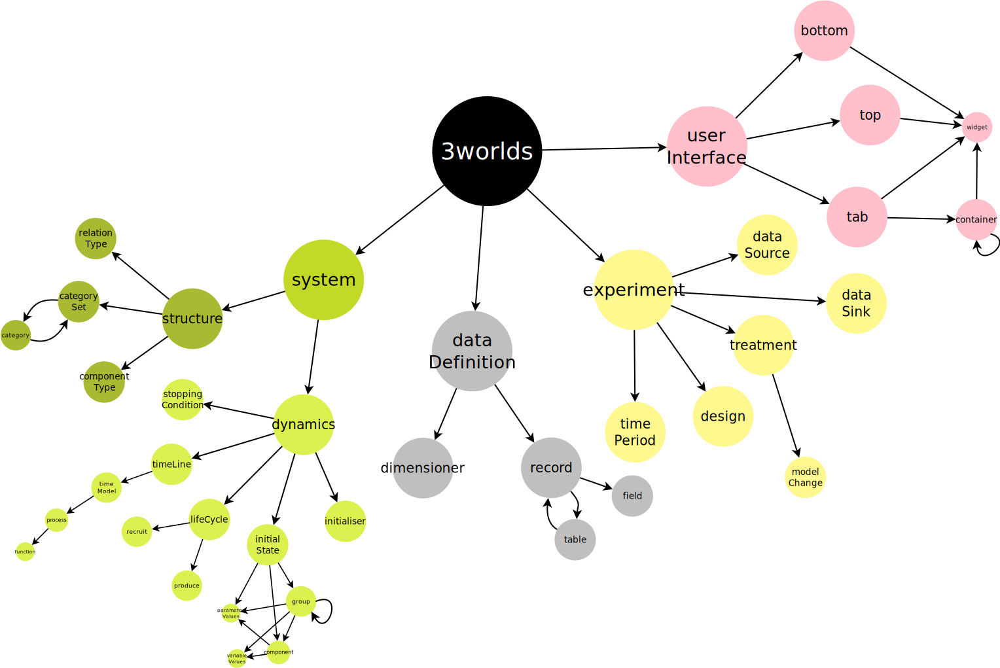

// author Gignoux 26/6/2018
// raw version

=== General concepts: structure of a 3Worlds configuration

==== A tree structure...

The configuration of a 3Worlds _simulation experiment_ is organised as a tree (_cf._ <<fig-configuration-tree>>). Each tree _node_ specifies a subset of the parameters of the whole configuration. Each _node_ has _child nodes_ linked through a _tree edge_, so that large pieces of configuration can be broken down into the relevant details. At each level of this hierarchy, _properties_ can be attached to _nodes_.

_Nodes_ have a _label_ and a _name_ that are displayed in the `ModelMaker` interface as `label:name`:

*  The _label_ specifies what role this particular _node_ plays in the whole configuration. For example, the _node_ labelled `experiment` is used to configure a _simulation experiment_.
*  The _name_ is used to differentiate _nodes_. It must be unique over the whole configuration tree. By default, ModelMaker generates unique names (by adding a number to the name if replicates are found).

The _root node_ of a configuration is always labelled `3worlds`.

[#fig-configuration-tree]
.Tree structure of a simulation experiment configuration in 3Worlds

The configuration tree is stored in a file in a specially designed text format, ending with the extension `.ugt` or `.twg`. Such files are produced by `ModelMaker` and can then be exchanged and imported into `ModelMaker` via the `Projects -> Import...` menu entry. Their format is human-readable, but they must *never* be edited with another software than `ModelMaker` - *the risk is to corrupt all your configuration* and be unable to run it (or even edit it with `ModelMaker` again).

Each node in the configuration has a particular meaning for `ModelRunner`: the configuration must comply with certain rules and constraints, the first one being the particular set of _nodes_ that have been designed and appear on <<fig-configuration-tree>>. The detailed meaning of all _nodes_ and their _properties_ is described in section <<truereference-of-3worlds-configuration,3Worlds reference>>.

==== ...with cross-links

Actually, the 3Worlds configuration is not stritcly hierarchical (_cf._ <<fig-configuration-tree2>>): according to their role in `ModelRunner`, some configuration _nodes_ need to gather information from other parts of the configuration tree. This is done by allowing for some cross-reference _edges_ to be defined, that overlay with the strict hierarchical structure of the tree. As a result fo these cross links, the whole configuration is a _graph_ rather than a tree.

[#fig-configuration-tree2]
.Tree structure of a simulation experiment configuration in 3Worlds, showing the cross-links between tree nodes
image::dsl-tree2links.svg[align="center"]

_Edges_ representing cross links have a _label_, _name_, and may have _properties_ just as _nodes_ do. The detailed meaning of all cross-reference _edges_ and their _properties_ is described in section <<configuration-reference.adoc#Configuration options: reference>>.

==== What ModelMaker does for you

`ModelMaker` knows the details of the configuration constraints. It facilitates the design of a configuration by only letting you add the _nodes_, _edges_ and _properties_ that will produce a valid, runnable configuration file. During the configuration building process, it constantly checks the validity of the graph and reports any errors or missing parts in its `log` panel. `ModelMaker` is far more than a nice visual editor producing a graph: a configuration graph produced with `ModelMaker` is *guaranteed* to run with `ModelRunner` because of all these internal consistency and validity checks.