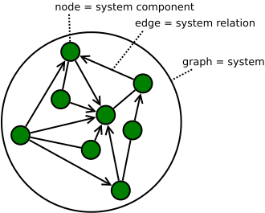
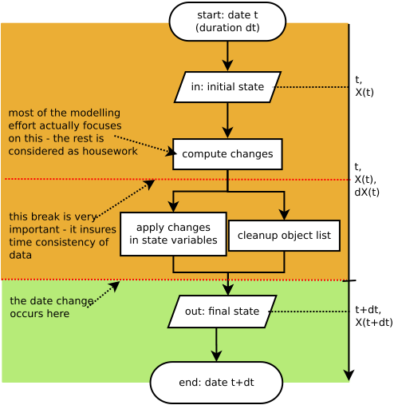

=== Why another simulation environment for ecology?

_“Though the organisms may claim our primary interest, when we are trying to think fundamentally we cannot separate them from their special environment, with which they form
one physical system”_ A. G. Tanlsey (1935). 

Ecosystems, as first proposed by Arthur Tansley (1935), have both _physical_ and _biological_ aspects. They comprise
the physics of energy and chemical stocks and flows and the biology of living things with a fleeting existence. They are made from and return to the physical world 
(dust to dust, ashes to ashes), are part of it and at one and the same time, they constitute an entire new world
where concepts such as reproduction, social interaction, communication and life cycle dominate. To this day, reconciling these two aspects remains a key problem in ecosystem 
studies: How does an energy flux translate into a number of living individuals or in a higher biodiversity? 
How might the reproduction strategy of the beaver affect river hydrology and the regional water budget? 
How might social interactions (society) affect the frequency of hurricanes (e.g. climate change)? 
*3Worlds* aims at providing _a tool for building simulations that couple the physical and biological aspects of ecosystems_.

In our view, existing tools focus too much on one or other of these aspects. For example, dynamic models based on differential equations and can only represent reproduction and growth using metaphors for continuous physical quantities (e.g. matrix population models). Multi-agent systems (MAS), on the other hand, model social interactions well but pose difficulties in balancing mass or energy budgets.

In addition to this physical and biological duality, ecosystems are '_multi-scale_' (cf. an extensive discussion on
this topic and other questions related to the ecosystem concept in Gignoux et al. 2011). Tansley's ecosystem definition
applies equally well to the whole biosphere as to a single bacteria in a drop of water. Currently, there is no
software enabling one to consider ecosystems at such different spatial and temporal scales within the same
conceptual framework. A second aim of *3Worlds* is to fill this gap. If the ecosystem concept is robust enough, and
we believe it is given its success in ecology and its adoption in other scientific fields, then it should be possible
to design a conceptually sound and consistent computing framework to deal with a multiplicity of scales.

However, changing the scale of a model is not just a matter of changing spatio-temporal resolution.
It also involves the level of detail of the representations used in the model, something which has been formalized
in _abstraction theory_ (Zucker 2003): the more detailed a model, the less abstract it is. The question arises then as to what level of detail should we model our system to capture its important behaviour? How does changing scale (in this 
 broadest sense) effect model outcomes? There can be no general answer to this question beyond trial and error. This makes the possibility
 to test and compare different representations of the same system at different scales an essential feature of
 any software dealing with ecosystems. *3Worlds* provides _great flexibility in ecosystem representation_
 enabling one to represent _any_ ecosystem at _any_ spatial and temporal scale with _any_ level of detail -- all this being determined by
 the researcher in accordance with the purpose of their study. The researcher has full control on the detailed biological functions 
and variables relevant to their study.
 
How is this flexibility compatible with the strong conceptual backbone? *3Worlds* uses _aspect-oriented thinking (AOT)_ (Flint 2006), a method to build complex systems (e.g.
software) from independent areas of knowledge. We have designed an _archetype_ of what we believe constitutes an 
ecosystem -- a recursive and multi-scale system of interacting entities. We use an implementation of AOT to ensure
that any user-defined representation of an ecosystem complies with the archetype. This guarantees that, despite a 
great freedom left to the modeller, their model will always be compatible with the 3Worlds software. The great 
benefit of this is that while we believe it’s possible to construct any type of 
model within this archetype, imposing specification constraints greatly assists in model comparison: why should 
two models, ostensibly constructed for the same purpose, differ in their outputs? How does a change in temporal 
or spatial scale affect projections?  How does adding or removing sub-systems change model projections?
_Models developed in *3Worlds* are always comparable_,  unlike many large model intercomparison exercises where the models are independently developed without reference to any common structuring principals.

The ecosystem is a recursive concept (Gignoux et al. 2011): ecosystems can be nested. Parts of an ecosystem can
be studied as ecosystems themselves. We use the concept of a hierarchical system, formalized as a graph (Gignoux et
al. 2017) to implement this idea. In *3Worlds*, _the modelled ecosystem is a graph_ where nodes represent relevant 
entities: individuals, populations, climate, soil, area, ...; and edges represent relations between these entities.
These relations can be of any kind, including a hierarchical relation describing the complex nesting of sub-systems. 
This provides an elegant solution to the apparent complexity of ecosystems: it allows for various types of _emergence_,
enables the comparison of system structures and simulation trajectories, and can represent virtually anything
an ecological modeller can conceive of.

*3Worlds* builds upon more than thirty years of experience of its developers in ecosystem and complex system modelling and simulation. Over this time, we have reached the conclusion that: (1) robust concepts
are fundamental for building sound software; (2) some problems that appear over and over again in the life of a
simulation modellers often have well-established solutions, sometimes in other scientific fields; and (3) complex
systems are more easily managed and understood when designed within a sound framework. 

Many of the ideas we use are already available, it's just a matter of making them work together, and *3Worlds* is our best attempt to do so! 

=== Design Concepts

3Worlds is based on a few concepts and techniques that have a very broad application and harnesses them to fit the needs of ecosystem modelling.

==== Individual based models

Fundamentally, *3Worlds* is designed as a framework for __individual-based models__ (IBMs: Grimm & Railsback 2005). IBMs, like multi-agent systems (MASs: Bousquet & Lepage 2004), assume that some important properties of complex systems (like ecosystems and human societies) cannot be understood without representing the detailed behaviour of every individual in the system. In an IBM, a list of 'individuals' (called 'agents' in MASs) is kept in memory, and their interactions through various functions yield the dynamics of the whole system over time. Individuals can come and go, which means that their list is constantly changing in size.

3Worlds simulates a _system_ made of interacting __system components__, which are equivalent to the individuals or agents of IBMs and MASs. If required by a simple application, the 3Worlds _system_ can be reduced to zero components, just as in any system dynamics application; but this is not the use 3Worlds has been designed for, and other more specialised software may be more adapted for this use case.

==== The complex system as a dynamic graph

Ecosystems are commonly considered as _complex systems_, without much agreement on what this concept means. Complex systems are usually assumed to possess __emergent properties__; again, with little agreement on what this means. We argued in Gignoux et al. (2017) that the only common feature of all definitions of emergence is that emergence can only appear in systems with a 'macro-state' and 'micro-states'. We called such systems _hierarchical systems_ and assumed that they can be ideally represented with a __dynamic graph__.

According to https://en.wikipedia.org/wiki/Graph_theory[graph theory], a _graph_ is a mathematical object comprising a set of _nodes_, a set of _edges_ linking these nodes defined in an __incidence function__ (<<fig-what-is-a-graph>>). A _dynamic_ graph (Harary & Gupta 1997) is a graph where these three components (the sets of nodes, edges, and the incidence function) can change over time.

[[fig-what-is-a-graph]]
.A mathematical graph, showing both the usual mathematical terms and the vocabulary used in 3Worlds. The incidence function defines edges between nodes. Edges can be directed (with arrows) or undirected.

With the addition of _descriptors_ (e.g. numbers with a specific meaning: <<fig-graph-descriptors>>) to nodes and edges, we can use the graph nodes as the individuals of our IBM, and the graph edges give a concrete existence to the interactions between those nodes. If we define _functions_ that can modify nodes and edges and their descriptors, the graph becomes dynamic. A *3Worlds* simulation runs a dynamic graph where nodes, edges, descriptors, functions can be adapted to the user's particular application. Nodes are called _system components_, edges __system relations__, and descriptors __properties__.

[[fig-graph-descriptors]]
.An example of graph descriptors (redrawn from Gignoux et al. 2017).
image::graph-with-descriptors.svg[align="center]

==== Categories

In an IBM, every individual differs from all others. But it is common practice to assume that some groups of individuals share some things in common. This is the essence of modelling: finding commonalities within an ocean of particular cases. We use the concept of _category_ to group system components that 'look like each other' in some way. Categories are used to express how alike and how different certain groups of components are from each other.

In a dynamic graph, categories are used to specify common descriptors to groups of components (e.g. a plant species average growth rate, an animal cohort survival rate, ...) and functions that operate on a group of components of the same category. They are also used to specify which _type of relation_ is possible between components of different categories.

This category concept is similar in many ways to the class concept used in the http://uml.org/what-is-uml.htm[UML] language and in  https://en.wikipedia.org/wiki/Object-oriented_programming[object oriented programming] . Categories can be nested, and can be exclusive of each other or not. They are central to the organisation and execution of a simulation in *3Worlds*.

==== Time with simultaneous events

Because ecosystems are both biological and physical systems, they not only deal with individuals and populations of living organisms, but also with fluxes of matter and energy. To properly compute a mass or energy balance typical of physical questions, we need a time model that insures that all system components are modified synchronously - otherwise, leaks in mass and energy budgets may occur (<<fig-3w-main-loop>>). This is where IBMs differ somewhat from MASs in their most common current implementations: MASs emphasize the _autonomy_ of agents by allowing them to modify their state immediately. In other words, MASs assume that no two events occurring in a simulation can be simultaneous, while mass/energy balance requires simultaneity of events. 3Worlds assumes that simultaneous events are the default, but by using particular time models it is possible to relax this constraint. 

[[fig-3w-main-loop]]
.The time model of 3Worlds. The overall dynamics of a system is computed as X(t+dt) = f(X(t)) where X represents the state of all system components, t is time and f is the function (or rather, the set of functions) used to compute the change over the time interval dt.

Given the diversity of topics subject to ecological modelling, ecological processes span many orders of magnitude in their rate of action. Demographic models often use a yearly time step, while ecophysiological models may use daily time steps and physiological models may run with time steps of a second. *3Worlds* provides three types of _time model_ that can be used in interaction: '__clock__' models using a constant time step, __event-driven __time models where time events trigger computations that can generate further events in the future, and _scenarios_ where the list of events determines when computations are to be made. Time steps span the whole scale of time units relevant to ecology, i.e. from milliseconds to millenia. Standard Gregorian calendar time can also be used.

==== Space as a mediator for interactions

IBMs are often 'spatialized', which means they include some representation of the physical space in which organisms of an ecosystem interact. We argued in Gignoux et al. (2011) that space is not a requirement of the ecosystem definition, but rather an optional feature. Besides the usual 3-dimensional space, we called the place where organisms interact in an ecosystem the __arena__, i.e. the place where things happen and where a public (of ecological modellers) is watching them. This does not mean an Euclidian (or any other kind of) space must be associated with the ecosystem representation. Using a dynamic graph is sufficient.

However, it is often the case that explicitly considering space in a model is necessary for computing ecological interactions. In most ecological process models, there are actually implicit assumptions about space and how it affects organism interactions. For example, seed dispersal in plants is easily computed in a 2-dimensional space where the location of seeds depends on that of parent plants and some simple distance law; water flow in a catchment relies on a 2-dimensional space plus an elevation of ground surface to some x and y resolution; competition between individual trees in a forest assume a vertical distribution of leaves depicted with varying degrees of detail.

Following Gignoux et al. (2011), we optionally provide predefined spatial representations to include in a simulator. Different spaces can be used within a single simulator, depending on the needs of the process computations. They are associated with optimal search algorithms (e.g. Kd-trees) that speed up the search of components with which to form dynamic relations.

==== Modelling made easy

The community of ecological scientists has been developing an impressively large number of models, yet most of them are poorly designed in terms of programming, as ecologists are not necessarily software engineers. Ecosystem simulators are among the most complex programs (Coquillard & Hill 1997). They require high programming skills and constitute a huge investment in time, which makes their production slow and hazardous. As a result, once built, they tend to be used beyond their initial domain of application (e.g. the overuse and abuse of the CENTURY model: Parton et al. 1988), issues of provenance and repeatability are rarely addressed, shedding some doubt on the discipline as a whole.

With *3Worlds*, we wanted to provide a simulation platform for ecosystem modelling using state-of-the-art concepts and algorithms, and sound programming techniques (e.g. systematic code testing, separated concerns), so that ecological modellers can concentrate on the ecological part of the problem and forget about the computer science part. We used _automatic code generation_ to ensure that researchers need only edit one code file to build a simulator for their particular model. We used a _graph editor_ to build the configuration and organise the data required for a particular study. In *3Worlds* therefore, an ecosystem model only requires two files: a specification file organised as a graph, and a computer code file where all relevant ecological processes are written. None of this prevents the modeller from using software libraries, either their own or from a third party, to extend their coding capabilities.

When designing a model, it is important to get quick visual feedback of how the system behaves when one changes equations or their implementation. *3Worlds* comes with a library of user-interface objects (graphs, maps, time series) that can be freely assembled to adapt outputs to the needs of the researcher.

==== Model comparison: graphs can be compared

Climate change modelling relies on 19 major general circulation models (GCMs) all based on the same equations. When run with identical datasets (initial data plus forcings), they all yield different results. This is expected given the size of their code, but what is troubling is that nobody is able to trace within the code where the differences come from  (Lim & Roderick 2009). This problem arises again and again in the modelling literature (e.g. Melilo et al. 1995; Roxburgh et al. 2004). The ultimate reason for this impossibility is that all the knowledge invested into these huge models is represented in computer code, which are very difficult to compare for any but the simplest of models.

*3Worlds* is an attempt to solve this issue _in the future_ (there is nothing we can do for past model codes). If models are developed within the standard framework of *3Worlds*, the only thing that needs to be compared among models is their specification file (a graph) and their code file - hundreds to thousands of lines, not more. Everything else is equal. In theory this should facilitate model comparison.

==== Problem upscaling

Developing a simulator is only a small part of the ecological modelling exercise: once the simulator is ready, it is used as a real ecosystem in _simulation experiments_. Designing and running such experiments is a very important part of the job - if not the most important, as it is the one which will produce ecologically relevant, publishable results.

IBMs are often stochastic, as population rates translate into probabilities at the individual level: e.g., the code has to decide which individuals to delete to satisfy a mortality rate of 10%. This is usually based on drawing random numbers. As a result, every simulation is different even when using identical parameters, and an asymptotic behaviour of the system can only be obtained by running multiple simulations. Fortunately, this is easily parallelized with modern computers.

3Worlds is interfaced with https://openmole.org/[OpenMole]  to provide access to big computing power. Through OpenMole, big simulation experiments can be deployed on networks of computers, grids, or supercomputers.

==== Portability and performance

*3Worlds* is written in Java to ensure portability between all operating systems. Its code has been carefully optimised, although generality inevitably comes with some performance cost.

*Cited references:*

Bousquet, F., & Le Page, C. (2004). Multi-agent simulations and ecosystem management: a review. __Ecological Modelling__, 176:313–332. https://doi.org/10.1016/j.ecolmodel.2004.01.011

Coquillard, P., & Hill, D. (1997). __Modélisation et simulation d’écosystèmes. Des modèles déterministes aux simulations à événements discrets__. Masson, Paris.

Flint, S. R. (2006). _Aspect-Oriented Thinking - An approach to bridging the disciplinary divides_. PhD, Australian National University.

Gignoux, J., I.D. Davies, S.R. Flint, & J.D. Zucker (2011). The Ecosystem in Practice: Interest and 
Problems of an Old Definition for Constructing Ecological Models. _Ecosystems_ 14: 1039‑54. https://doi.org/10.1007/s10021-011-9466-2.

Gignoux, J., G. Chérel, I.D. Davies, S.R. Flint, & E. Lateltin (2017). Emergence and Complex Systems: The 
Contribution of Dynamic Graph Theory. _Ecological Complexity_ 31: 34‑49. https://doi.org/10.1016/j.ecocom.2017.02.006.

Grimm, V., & Railsback, S. (2005). __Individual-based modelling and ecology__. Princeton University Press.

Harary, F., & Gupta, G. (1997). Dynamic graph models. __Mathematical and Computer Modelling__, 25(7), 79–87. https://doi.org/10.1016/S0895-7177(97)00050-2

Lim, W. H., & Roderick, M. L. (2009). _An atlas of the global water cycle based on the IPCC AR4 climate models._ ANU E Press.

Melilo, J. M., Borchers, J., Chaney, J., Fisher, H., Fox, S., Haxeltine, A., Janetos, A., Kicklighter, D. C., Kittel, T. G. F., McGuire, A. D., McKeown, R., Neilson, R., Nemani, R., Ojima, D. S., Painter, T., Pan, Y., Parton, W. J., Pierce, L., Pitelka, L., … Woodward, F. I. (1995). Vegetation/ecosystem modeling and analysis project: comparing biogeography and biogeochemistry models in a continental-scale study of terrestrial ecosystem responses to climate change and CO~2~ doubling. __Global Biogeochemical Cycles__, 9(4), 407–437.

Parton, W., Stewart, J., & Cole, C. (1988). Dynamics of C,N, P and S in grassland soils: a model. __Biogeochemistry__, 5, 109–131.

Roxburgh, S. H., Barrett, D. J., Berry, S. L., Carter, J. O., Davies, I. D., Gifford, R. M., Kirschbaum, M. U. E., McBeth, B. P., Noble, I. R., Parton, W. G., Raupach, M. R., & Roderick, M. L. (2004). A critical overview of model estimates of net primary productivity for the Australian continent. __Functional Plant Biology__, 31(11), 1043–1059.

Tansley, A G. (1935). The use and abuse of vegetational concepts and terms. _Ecology_ 16: 284‑307.

Zucker, J.D. (2003). A Grounded Theory of Abstraction in Artificial Intelligence. _Philosophical Transactions of 
the Royal Society B: Biological Sciences_ 358: 1293‑1309. https://doi.org/10.1098/rstb.2003.1308.

