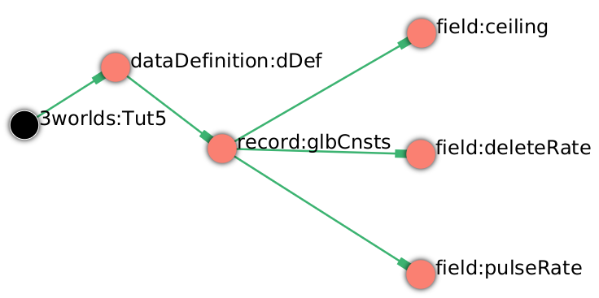
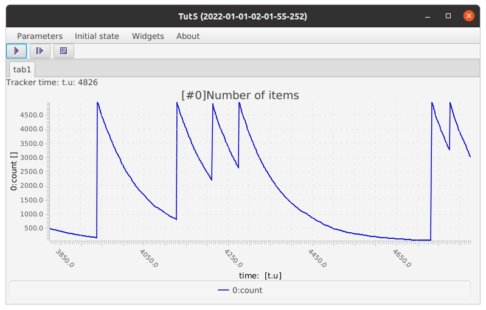

=== Event driven systems: Using the Event Timer

==== Introduction

Many processes in nature are episodic and can be triggered when some other process reaches a particular state. For example, in arid environments, organisms may reproduce en masse when a rain event occurs; an epidemic may break out when a population reaches a certain density or; smouldering fire may spread if weather conditions cross some threshold.

The previous tutorials have used a clock timer to drive the simulation dynamics. In essence, a clock timer simply issues regular time events autonomously, at intervals determined by its properties – its time step. 
An event timer, on the other hand, is not autonomous. It drives its child processes through events posted to it by other processes. 

In this tutorial we mimic the dynamics of an episodic system with an Individual-based Model (IBM). We use an event timer to drive pulse creation of entities and a clock timer for their deletion. Here, we refer to the 'entities' as 'items' so as not to be distracted by ecological details.

==== Specifications

. Start _ModelMaker_ and create a new project from the `SimpleClock1` template and name the project 'Tut5'.

===== Data definition
Three fields are required: a deletion rate, pulse rate and a ceiling to provide a limit to item creation. These will be global constants.

[start = 2]

. Collapse all sub-trees from the root node and then expand `dataDefinition:dDef`.

. Delete `record:drvs`. There are no drivers needed.

. Rename `record:cnsts` to 'glbCnsts'.

. Create three `field` nodes as children of `record:glbCnsts`, name them 'ceiling', 'deleteRate' and 'pulseRate' - all of type `Double`.

[#fig-tut5-data-definition]
.Data definition specifications.

===== Structure
We need 2 component types for this model: the system (which already exists i.e. `system:sys`) and the 'item' component type which we've yet to define. These have a hierarchical relationship: the system is an assemblage of 'items'. However, `system:sys1` currently belongs to the _atomic_ category. This must be changed to the _assemblage_ category to signify this hierarchical structure.

. Collapse the `dataDefinition` sub-tree and expand the `system` sub-tree.

. From `system:sys1`, collapse the `dynamics` sub-tree.

. Select the `system.sys1` node and delete the edge to `category:*atomic*`.

. From the same node, create a `belongsTo` edge to `category:*assemblage*`.

A 'itemType' will be a component type with a role defined as belonging to the _ephemeral_, _atomic_, _component_ and _item_ categories. It's _ephemeral_ because it can be created and destroyed; it's _atomic_ because it has no sub-components; it's a _component_ because it is a sub-component of a larger system and it's a _item_ because processes that apply to it must reference a category unique to it. All these categories already exist in the `predefined:*categories*` sub-tree except for the 'item' category which we must create.

[start = 5]

. Create a `structure` node as a child of `system.sys1` to begin building the model structure sub-tree.

. Create a `categorySet` node as a child of `structure:struc1` and name it 'itemSet'.

. Create a `category` node as a child of `categorySet:itemSet` and name it 'itemCat'.

We now build the item component.

[start = 8]
. Create a `componentType` as a child of `structure:struc1` and name it 'itemType'.

. Create a `component` as a child of `componentType:itemType` and name it 'item'.

We now define the _role_ of `itemType` by specifying the categories it belongs to.

[start = 10]

. Create 4 `belongsTo` edges from `componentType:itemType` to `category:*ephemeral*`, `category:*atomic*`, `category:*component*` and `category:itemCat`.

A message now appears suggesting two ways we can create an initial number of items: by the addition of an optional property (`nInstances`) or loading from a file. For this tutorial we will just add the optional property.

[start = 11]
. Right-click on `component:item` and select _optional properties_ from the popup menu. Check the `nInstances` box.

. In the properties editor, set the value of `nInstances` to 100. 

. Before ending this section, rename `initFunction:init1` to 'SysInit'.

[#fig-tut5-structure]
.Model structure specifications.
image::tutorial5IMG/fig-tut5-structure.png[align="left",role="thumb"]

===== Dynamics

The `SimpleClock1` template we started with contains a clock timer (`timer:clock1`) which we can use to call the delete function to remove items at a regular rate. Later we add `eventTimers` to implement the episodic dynamics. It will make the following steps clearer if we rename two nodes first.

. Collapse all sub-trees from the root node and then expand `system:sys1`.

. From `system:sys1`, collapse all sub-trees and then expand `dynamics:sim` and re-apply the layout [Alt+L].

. Rename `timer:clock1` to `timer:t3Clock`.

. Rename `process:p1` to `process:p3`.

We need a `deleteDecision` function associated with this process rather than the current `ChangeState` function.

[start = 5]

. Delete node `function:F1`.

. Create a `function` node as a child of `process:p3`, name it 'DeleteItem' and select `deleteDecision` as its type.

`process:p3` is currently applied to the `arena` category. This edge was present from the template we started with. We must reassign this to apply `p3` to `category:itemCat`.

[start = 7]

. Select `process:p3` and delete the edge to the arena category and create an `appliesTo` edget to `category:itemCat`. 

We now need an event timer to drive 'item' creation events.

[start = 8]

. Create a `timer` node as a child of `timeline:tmLn`, name it 't2Event' and select `EventTimer` as its type.

. Create a `process` node as child of `timer:t2Event` and name it 'p2'.

. Add an `appliesTo` edge from `process:p2` to `category:itemCat`.

. Create a `function` node as child of `process:p2`, name it 'Nitems' and select `CreateOtherDecision` as its type.

This function returns a floating point number that will be the number of items to create _for each existing item_. The fractional part is rounded probabilistically to give a discrete value.

A new message has now appeared asking that `timer:t2Event` have an edge to a `function` or `initFunction`. Every event timer must have at least one function that feeds events to it (specified by a `fedBy` edge). Therefore, we need a third function to generate these events.
[start = 12]

. Create a `timer` node as a child of `timeline:tmLn`, name it 't1Event' and select `EventTimer` as its type.

. Create a `process` node as child of `timer:t1Event` and name it 'p1'.

. Create a `function` node as child of `process:p1`, name it 'Pulse' and select `ChangeState` as its type.

. Add an `appliesTo` edge from `process:p1` to `category:*arena*`.

This function operates at a global level (the arena) not at the level of individual items as does `function:Nitems`. It's job is to send an event to `timer:t2Event` that will cause `function:Nitems` to be called in a loop on all existing items. The function `function:Pulse` will also post a future event to call itself so the system will run indefinitely. However, since `function:Pulse` is also driven by an `eventTimer` we will get into an infinite regress unless we somehow feed at least one event to `timer:t1Event`. To do this we just add a `fedBy` edge to an `initFunction`.

To do all this, we must add 3 `fedBy` edges: one from `function:Pulse` to drive item creation; one from `function:Pulse` to `timer:t1Event` to drive pulse creation; and a third from `initFunction:SysInit` to start the chain of events.

[start = 16]

. Add an `fedBy` edge from `timer:t1Event` to `initFunction:SysInit`. SysInit will post a first event to begin the process.

. Add another `fedBy` edge from `timer:t1Event` to `function:Pulse`. Pulse will continue calls to itself at some random time.

. Add a third `fedBy` edge this time from `timer:t2Event` to `function:Pulse`. Pulse will also generate the item creation events.

There can be any number of event timers in a specification and each timer can be driven by any number of functions posting events at any time in 'present' or future. This design allows specifying very complex causal chains.

The template we began with includes a `stoppingCondition`. This is not needed as we can allow the simulation continue indefinitely for now.

[start = 19]

. Select `stoppingCondition:stCd1` (a child of `dynamics:sim1`) and delete it.

The next step is to record the number of 'items' at the end of the time step for display. A state variable already exists for this purpose in the `predefined:*categories*` sub-tree called `count`. To make use of this we must add another `process` with a `dataTracker` child. 

[start=20]
. Create a `process` as a child of `timer:t3clock` and name it 'p4'. 

. Add an `appliesTo` edge from `process:p4` to `category:*assemblage*`. This category is associated with `record:AVPopualation` that contains the `count` field.

. Create a `dataTracker` as a child of `process:p4`.

. From the dataTracker, add two edges: one a `trackField` edge to `field:count` and the second a `trackComponent` edge to  `system:sys`.

Now add `dependsOn` edges between some of the processes to set their order of execution.

[start = 24]

. Right-click on `process:p4` and create a `dependsOn` edge to `process:p3`. This ensures `count` is recorded as the last step.

. Right-click on `process:p3` and create a `dependsOn` edge to `process:p2`. This ensures `function:Delete` always occurs after `function:Nitems` should they occur simultaneously.

[#fig-tut5-dynamics]
.Model dynamics specification.
image::tutorial5IMG/fig-tut5-dynamics.png[align="left",role="thumb"]

===== Coding

We now add the program code to all `functionSnippet` properties for all the functions we have created.

. Ensure that the `system` sub-tree is fully expanded. To do this _Collapse sub-tree > All_ from `system:sys` node and then select _Expand sub-tree > All_ from the same node.

. In the `Properties` editor, select the 'By name' button in the top-left corner and type 'func' in the search bar. All 4 `functionSnippet` properties should now be listed.

. Edit `SysInit#functionSnippet`, and enter the following text: 

[source,Java]
-----------------
        // Set values of global constants
        focalCnt.deleteRate = 0.01;
        focalCnt.pulseRate = 0.002;
        focalCnt.ceiling = 5000.0;
        // post event to the pulse time to kick start it. After this it posts events to itself.
        t1Event.postTimeEvent(1);
-----------------
[start = 4]
. Edit `Pulse#functionSnippet` and enter:

[source,Java]
-----------------
        // post a 'item' creation event for this time
        t2Event.postTimeEvent(t);
        // schedule a call to this method at some future time
        t1Event.postTimeEvent(t + random.nextInt((int)(1.0/pulseRate)) + 1);
-----------------

[start = 5]
. Edit `Nitems#functionSnippet` and enter:
[source,Java]
-----------------
        // limit the recuitment rate of items to the ceiling
        double rate = (ceiling-count)/(double)count;
        return rate;
-----------------

[start = 6]
. Edit `Delete#functionSnippet` and enter:
[source,Java]
-----------------
        // return the deleteRate probabilistically converted to true or false
        return decider.decide(deleteRate);
-----------------

===== User Interface

The template we are using has only provided a control widget (`widget:ctrl`) to run the model.
To see some output we will add a widget to display a time series of `count`.

. Create a `tab` as a child of `userInterface:gui`.

. Create a `widget` as a child of `tab:tab1` and name it `Number of items` and select `TimeSeriesWidget1` as its type.

. Add a `trackSeries` edge from this widget to `dataTracker:trk1`.

. Run the simulator (Deploy [Alt+D]).

[#fig-tut5-user-interface]
.User interface specifications.
image::tutorial5IMG/fig-tut5-user-interface.png[align="left",role="thumb"]

The simulator runs indefinitely (assuming you have deleted the `stoppingCondition` node) with exponentially declining numbers and a creation pulses up to 500 time steps apart.

[#fig-tut5-modelRunner]
.Running Tutorial 5.

==== Next

The next tutorial introduces spatial models by modifying this model to display 'items' in a 2-dimensional continuous surface.

