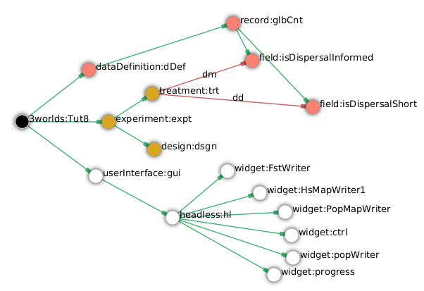
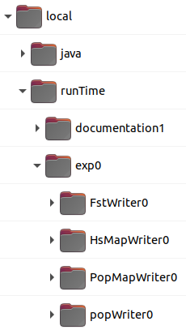

=== Tutorial 8: Running an experiment

==== Introduction

This tutorial introduces the current experiment design system (22/06/2022). This system has a major limitation in that it can only work with arena (i.e. global) constants. 
We will update this tutorial when OpenMOLE is integrated with 3Worlds, something we are currently working on.

We will demonstrate the current system using GDDM (Genetics, Demography and Disturbance Model).
GDDM is an individual-based spatial model of a population of animals in an environment experiencing recurrent disturbance. The disturbance return interval
is short (about every two years) because the study is intended for the North Australian savannah. Animals mate, give birth, disperse and die on an annual time step. Their longevity is about 12 years. 

One of the aims of the study is to examine the population and genetic consequences of informed dispersal. In the present case, informed dispersal means tending to select habitat with a higher carrying capacity.

We perform a simple ANOVA experiment to examine the variance explained in Fst and total population by just two parameters (constants): dispersal distance (long/short) and dispersal method (informed/uninformed). Most of the processes in this model depend on random number generation. Therefore, we will run (somewhat arbitrarily) five replicates.

==== Specifications

. Create a new project by selecting `new -> model library -> GDDM` and name it 'Tut8'.
. Run (Deploy) the model and adjust the widget settings (widget menu)to suit to get a feel for what's going on.

The model runs for 100 years and displays many variables such as Fst and population occupancy. The habitat pattern changes every year with approximately half being 'good' habitat and half 'bad'. 'Good' habitat has a carrying capacity of 3 animals per ha. and bad 1.5.

[#fig-tut8-MR]
.A view of GDDM running in _ModelRunner_.

Return to _ModelMaker_ and arrange the graph as follows:
[start = 3]

. Collapse `system.sys1`.
. Collapse all sub-trees from `DataDefintion:dDef` and then expand `record:glbCnt`.

===== User interface
To reduce the running time of the experiment, we can replace the graphic displays and just have text output to file.
[start = 5]
. Delete all sub-trees of `UserInterface:gui`.
. Add a `Headless` node as a child of `UserInterface:gui`.

Widgets that are children of `Headless` have no visible presence except for console output. Note: you won't see this output unless you are running tw.jar from a console.
[start = 7]
. Add a `widget` as a child or `headless:hl`, name it 'ctrl' and select 'HLControlWidget1' as its sub-class.

This control widget can be used even if you have visible widgets. It begins the simulation without user-intervention.

[start = 8]
. Add another `widget` as a child of `headless:hl` name it 'progress' and select 'HLProgressWidget1' as its sub-class.
. Add a `trackTime` edge from `widget:progress` to `dynamics:sim1`.

This progress widget will produce progress information to the console as the experiment proceeds.

[start = 9]
. Add two more widgets as a children of `headless:hl`, name them 'fstWriter' and 'popWriter' respectively and select 'HLTimeSeriesAnalysisWidget1' as their type.
. Add a `trackSeries` edge from `widget:fstWriter` to  `dataTracker:trkFst`.
. Add another `trackSeries` edge, this time from `widget:popWriter` to `dataTracker:trkMetaPop`.

===== Experiment
We now define some treatments of `fields` that are children of `record:glbCnt`.

. Add a `treatment` node as a child of `experiment:exp`.
. Add a `treats` edge from `treatment:trt` to `field:isDispersalInformed` and name it 'dm' (dispersal method).

This field (`isDispersalInformed`) is a boolean constant so the only treatments are 'true' and 'false'.
[start = 3]
. Click on the `treatment:trt` node and, in the selected properties editor, edit the `dm#values` property by adding 'true' and 'false' on two separate lines.

. Edit the `dm#valueName` property and enter 'inf' and 'uninf', again on two separate line. These are the names by which the setting is described in outputs.

. Add another `treats` edge from `treatment:trt` to `field:isDispersalShort` and name it 'dd' (dispersal distance).

This field (`isDispersalShort`) is also a boolean constant.
[start = 6]
. Click on the `treatment:trt` node and, in the selected properties editor, edit the `dd#values` property by adding 'true' and 'false' on two separate lines.
. Edit the `dd#valueName` property and enter 'short' and 'long', again, on two separate line. 

To run an ANOVA:
[start = 8]
. Select the `design:dsgn` node, and in the selected properties editor set `design:dsgn` to `crossFactorial`.

A message now appears indicating that treatments must have a designated rank order for this experiment design.
[start = 9 ]
. Select the `treatment:trt` node again and in the selected properties editor set `dd#rank` to 1 and `dm#rank` to 2.

This model employs random number generation in many of its processes so replicates must be used.
[start = 10]
. Right-click on the `experiment:exp` node, select `Optional properties...`, check `experiment:exp#nReplicates` and click 'ok'.
. Select `experiment:exp` and in the selected properties editor set `exp#nReplicates` to 5.

This experiment will create 5 x 2 x 2 simulators (20) running in parallel.

[#fig-tut8-config]
.Relevant parts of the configuration graph ready for running.

==== Simulation
. Save changes (Ctrl-S) and click the deploy button (Alt+D). 

The date and experiment design type are now written to the console followed by a message from each simulator as it is initialised. The headless controller then starts the simulators and a running message is produced from each. The number of simulators running in parallel depends on the number of cores on your machine. The experiment takes about 3 to 4 minutes on a 16 core machine.
The ODD documentation is generated automatically at the end of the experiment.

[#fig-tut8-consoleOutput]
.Console output produced when running Tutorial 8 experiment.

==== Results

The results of the experiment can be found in 2 directories with the names of the experiment widgets `fstWriter` and `popWriter`.

[#fig-tut8-expDirs]
.Directory structure pass:[ ] created by the `fstWriter` pass:[ ] and `popWriter` widgets.

The experiment widgets have produced the following files:

* **Design.csv**: Experiment design details.
* **<Field name>.csv**: time series of the data from each simulator
* **<Field name>_avg.csv**: time series of the data averaged over simulators
* **<Field name>_anova.R**: R script for the anova computation.
* **<Field name>_AnovaInput.csv**: table of data by treatment value name presented to R.
* **<Field name>_anovaResults.csv**: raw results produced by R.
* **<Field name>_RelSumSq.csv**: variance explained relative to the total explained.
* **<Field name>_var.csv**: variance in time series over replicates.

Examining *population_RelSumSq.csv* and **Fst_RelSumSq.csv** we can see that about 90% of variance in Fst is explained by dispersal distance (dd) and 80% of population. Dispersal Method (dm) played a bigger role in explained variance in population (18%) than Fst (6%). The interaction between dd and dm is twice as strong in explaining variation of Fst (4%) than variation in population (2%). 

You can recreate this tutorial by selecting `new -> tutorials -> 12 Running experiments`.

