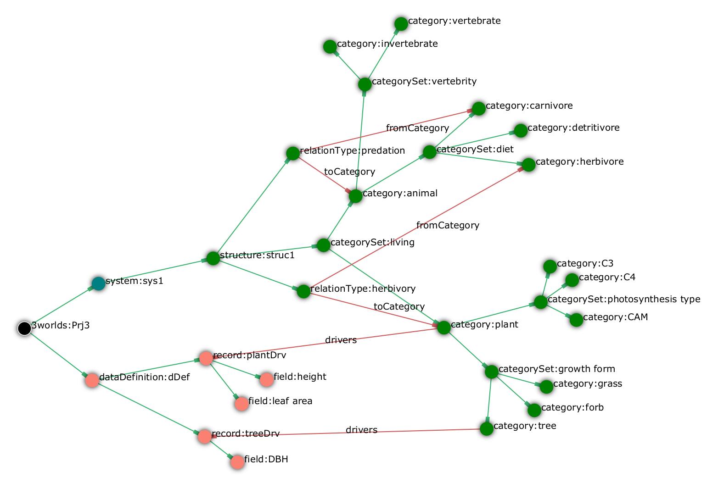
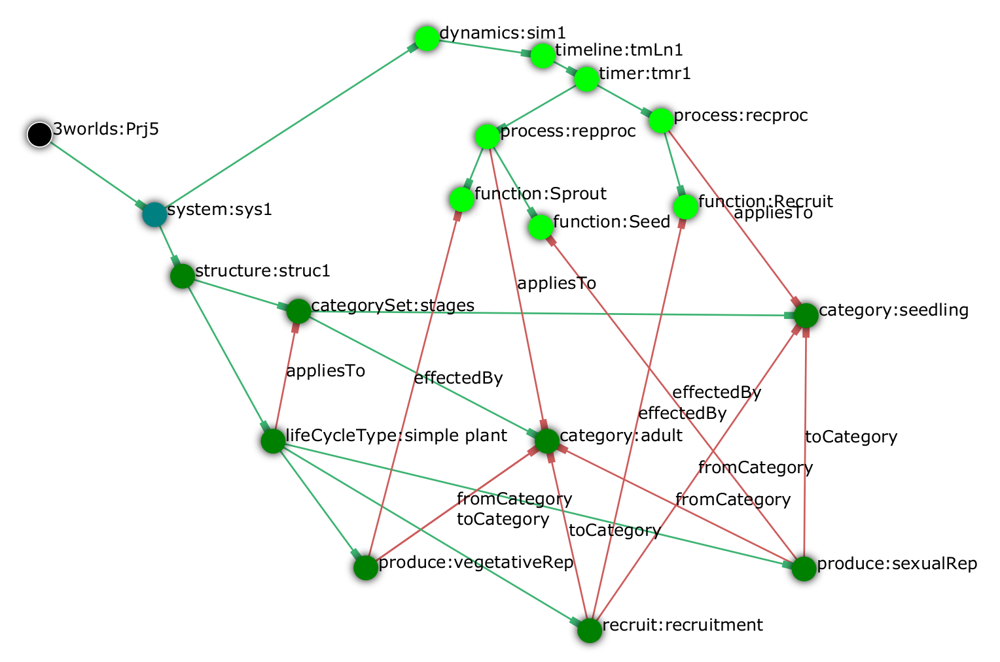

===== The __category__ and related concepts: specification of groups of entities

3Worlds uses these concepts to specify and generate the ecological entities manipulated during a simulations. 

====== Category

`.../categorySet/*category*:<[underline]##__name__##>` {1..*}

A `*category*` is simply a name attached to a set of objects sharing common properties (<<purpose.adoc#truecategories>>). These common properties are descriptors (<<purpose.adoc#truethe-complex-system-as-a-dynamic-graph>>), and dynamic behaviours (or _processes_). Categories, grouped into ``*categorySet*``s, constitute a user-defined _classification_ of _system component types_ relevant for a particular model.

Descriptors consist in _drivers_, _decorators_, _constants_ and _automatic variables_:

_drivers_:: are _independent_ variables (numbers, text, logical values) that characterize the state of a system component at an instant in time (_e.g._ biomass, age, sex, social status...). They will vary during a simulation. 'Independent' means that these variables cannot be computed from each other within a simulation step, they also depend on their previous <<truecausality,__causal__>> step values. For example, if some category is described by drivers _age_ and __biomass__, neither of them can be computed from the other: _age_ is computed from its previous value by adding the time step duration; _biomass_ is computed in some other way probably involving its previous value. The values of drivers are carried over from a simulation step to the next, i.e. they _drive_ the dynamics of the system.

_decorators_:: are _dependent_ variables that are computed from drivers and other decorators within a simulation step. For example, _leaf area_ could be computed as some constant times __biomass__: its value is completely determined by the value of __biomass__. As such, decorators are not independent from the drivers and are used only for convenience in computations or output display. They are not carried over from a simulation step to the next, they are always automatically reset to zero at the end of each <<truecausality,__time__>> step.

_constants_:: are values (numbers, text, logical values) that do not change during a simulation. For example, _sex_ or _number of legs_ are not going to change during the lifetime of an animal. They are set at birth and never changed after.

_automatic variables_:: are values internally managed by 3Worlds and available _read-only_ for computation. For components representing individuals, these are _age_ and __birth date__. For components representing populations, these are _number of individuals_, __number of newly created individuals__, __number of deleted individuals__.

The exact data structures for descriptors are specified under the `dataDefinition` node (<<configuration-reference.adoc#truethe-datadefinition-node>>) and linked to the category through the following:

_Cross-links for_ `category`:

`drivers -> record:<[underline]##__name__##>` {0..1}::

`decorators -> record:<[underline]##__name__##>` {0..1}::

`constants -> record:<[underline]##__name__##>` {0..1}::
These links tell which data structure in the `dataDefinition` node (<<configuration-reference.adoc#truethe-datadefinition-node>>) is used to store  _drivers_, _decorators_  and __constants__. 

_Automatic variables_ do not need to be specified - because they are automatic.

A category may be defined with no drivers, decorators or constants.

There are _predefined categories_ in 3Worlds under the node `/3worlds/*predefined*` (<<configuration-reference.adoc#truethe-predefined-sub-tree>>), used to specify particular components of the system. They will be explained in time.

====== CategorySet

`/3worlds/system/structure/*categorySet*:<[underline]##__name__##>` {1..*}

Some categories must be exclusive of each other: for example, an ecological entity is either a plant or an animal, but can't be both. For this reason, _exclusive_ categories are grouped into `*categorySets*`. A `categorySet` is _a set of **mutually exclusive** categories_ (mathematically, a https://en.wikipedia.org/wiki/Partition_of_a_set[__partition__]). Categories can be nested, by simply defining a `categorySet` as a child of a `category`:

`.../category/*categorySet*:<[underline]##__name__##>` {0..*}

====== RelationType

`/3worlds/system/structure/*relationType*:<[underline]##__name__##>` {0..*}

A `*relationType*` is just a name representing a meaningful link between two kinds of categories. It is specified by giving it a name and cross-linking it to the relevant categories with `fromCategory` and `toCategory` cross-links. Note that a `relationType` can link more than one 'from' categories to more than one 'to' categories if required. ``RelationType``s are used to implement specific processes acting on ecological entities (for example, a predation process). Notice that relations are _directed_ (i.e., they have a _start_ and an _end_ with potentially different roles).

_Cross-links for_ `relationType`:

`fromCategory -> category:<__name__>` {1..*}::
This link tells which categories are at the start of the relation.

`toCategory -> category:<__name__>` {1..*}::
This link tells which categories are at the end of the relation. 

_Properties for_ `relationType`:

[horizontal]
`lifespan`:: This property specifies if this type of relation will stay attached to its `systemComponents` during all their life, or may get created and deleted during their lifespan.
+
****
include::ArchetypeDoc-system-LifespanType.adoc[]
****

====== Example: a category tree

On this diagram (generated with `ModelMaker`), hierarchical links are in green and cross-links are in red.

[#fig-category-example]
.Example of a configuration with category sets, categories and relations

In this example, a _plant_ can be a _C3 tree_ but cannot be simultaneously a _grass_ and a _forb_. Similarly, an _animal_ cannot be both _herbivore_ and _carnivore_. The _predation_ relation links an _animal_ of any kind (the prey) to a _carnivore_ (its predator). A member of category _plant_ will have two driver variables, _height_ and _leaf area_. A member of category _tree_ will have three driver variables, _height_, _leaf area_ and _DBH_, as it inherits all the properties of the _plant_ category in which it is nested.

===== The specification of ecological entities: _system components_

====== System component

`/3worlds/system/structure/*componentType*:<[underline]##__name__##>` {1..*}

3Worlds simulates a _system_ made of _system components_. These are the things which are instantiated at run time, hold <<truethe-complex-system-as-a-dynamic-graph,descriptors>>, and are dynamically changed over the time course of a simulation. When setting up a simulation, one must attach _categories_ to _system components_. The rules prevailing to build up category hierarchies mean that a system can belong to a number of non-exclusive categories, as long as the exclusion and nesting rules are respected. For example (<<fig-category-example>>), we could define a system as belonging to the _plant_ and _tree_ categories, but not to the _animal_ and _tree_ categories.

_Cross-links_ for `componentType`:

`belongsTo -> category:<__name__>` {1..*}::
This link tells to which categories a system component type belongs. The categories must not belong to the same category set. If there are nested categories, membership is inherited (e.g. in the previous example, belonging to the _C3_ category automatically implies the system component is also a _plant_). The categories targets of these links must be specific to component types, i.e. no `groupType` or `lifeCycleType` should refer (`belongTo` cross-link) to any of them.

`belongsTo -> category:*component*` {1}::
This link to the predefined category `\*component*` is required in all models.

`belongsTo -> category:*atomic*` {1}::
This link to the predefined category `\*atomic*` is required in all models. It means that a component has no further subdivisions.

`belongsTo -> category:*ephemeral*|\*permanent*` {1}::
This link to either of the predefined category `\*ephemeral*` or `\*permanent*` is required in all models. It specifies if components of this `componentType` are going to stay forever (permanent) or can be created and deleted (ephemeral) during a simulation. Ephemeral components have two automatic variables, `birthDate` and `age`. 

`loadFrom -> dataSource:` {0..*}::
These optional links refer to <<trueinputs-datasource,data sources>> from which to read initial values of component-level <<truethe-complex-system-as-a-dynamic-graph,descriptors>> (<<trueimport-data-from-external-sources>>).

_Optional child_ for `componentType`:

`/3worlds/.../componentType/*initFunction*:<[underline]##__name__##>` {0..1}

This node declares a <<truefunction,function>> of type `SetInitialState` to set or transform the initial values of component-level <<truethe-complex-system-as-a-dynamic-graph,descriptors>> (<<truedata-input-methods>>).

====== Component group

`/3worlds/system/structure/*groupType*:<[underline]##__name__##>` {0..*}

Sometimes it makes sense to group components of a given `componentType` into __groups__; the best example of this in ecology is the species. Animals of different species may be described by the same descriptors, but nevertheless they will only reproduce within their species. Typically, animals of a species would share some constants, like plumage coloration, average body size, main diet etc. The `*groupType*` node is meant to fullfil this use case.

To make a `componentType` belong to a `groupType`, you just need to declare it as a child of the `groupType`:

`.../groupType/*componentType*:<[underline]##__name__##>` {0..*}

_Cross-links_ for `groupType`:

`belongsTo -> category:<__name__>` {1..*}::
This link tells to which categories a system component type belongs. The categories must not belong to the same category set. If there are nested categories, membership is inherited. The categories targets of these links must be specific to groups, i.e. no `componentType` or `lifeCycleType` should refer (`belongTo` cross-link) to any of them.

`belongsTo -> category:*group*` {1}::
This link to the predefined category `\*group*` is required in all models.

`belongsTo -> category:*assemblage*` {1}::
This link to the predefined category `\*assemblage*` is required in all models. It means that a group is a population of components. Assemblages have three automatic variables: the group size (number of components) `count`, the number of new components added during last <<truecausality,causal>> step `nAdded`, and the number of components deleted during the causal step `nRemoved`.

`belongsTo -> category:*permanent*` {1}::
This link to the predefined category `\*permanent*` is required in all models. It means that groups will stay forever in the system, even if all components of this groups are gone. 

`loadFrom -> dataSource:` {0..*}::
These optional links refer to <<trueinputs-datasource,data sources>> from which to read initial values of group-level <<truethe-complex-system-as-a-dynamic-graph,descriptors>> (<<trueimport-data-from-external-sources>>).

_Optional child_ for `groupType`:

`/3worlds/.../groupType/*initFunction*:<[underline]##__name__##>` {0..1}

This node declares a <<truefunction,function>> of type `SetInitialState` to set or transform the initial values of group-level <<truethe-complex-system-as-a-dynamic-graph,descriptors>> (<<truedata-input-methods>>).

====== Life cycle

`/3worlds/system/structure/*lifeCycleType*:<[underline]##__name__##>` {0..*}

As __system component__s are designed to represent -- among other things -- individual organisms, they are able to create other system components at runtime, or to transform themselves into a system component of another category assemblage. These abilities are captured in a `*lifeCycle*`, which describes the possible creations and transitions of system components of a given category set into another.

Since `components` belong to `categories`, different types of system components represented by different state variables, subject to different ecological processes, can coexist in a simulation. It may occur in a particular model that one wishes to represent a transition between, e.g. development stages: think for example of a caterpillar turning into a butterfly. There are chances that you don't want to describe the caterpillar with the same variables and behaviours as the adult butterfly. The operation of transforming a system component from a selection of categories to another is called _recruitment_. Computationally, it means that the simulator must keep track of the system component's identity and age in the first stage and carry these properties on to the new system component of the second stage, and call an appropriate function to transform state variables of the first stage into the new one.

_Reproduction_ is the second process by which system components of a given group of categories may produce other system components belonging to possibly different categories.

A specification of a life cycle requires:

. a `categorySet` in which the categories represent the various stages of the life cycle;

. at least one `groupType` definition per `category` of the above `categorySet`;

. `recruit` and `produce` nodes linking categories within the above `categorySet` to describe possible recruitment and reproduction transitions;

. optionnally, `categories` can be linked to a `lifeCycleType` if one wants to attach <<truethe-complex-system-as-a-dynamic-graph,descriptors>> to the life cycle.

To define a `groupType` within the context of a `lifeCycleType`, simply make it a child node of the lifeCycleType:

`.../lifeCycleType/*groupType*:<[underline]##__name__##>` {1..*}

_Cross-links for_ `lifeCycleType`

`appliesTo -> categorySet:<[underline]##__name__##>` {1}::
This links indicates which categories define the stages of the life cycle. `recruit` or `produce` nodes can only link categories of this set.

`belongsTo -> category:<[underline]##__name__##>` {0..*}::
These links enable to attach descriptors to a `lifeCycle`, if needed by some ecological processes. The categories targets of these links must be specific to life cycles, i.e. no `componentType` or `groupType` should refer (`belongTo` cross-link) to any of them.

`belongsTo -> category:*life cycle*` {1}::
This link to the predefined category `\*life cycle*` is required in all models.

`belongsTo -> category:*assemblage*` {1}::
This link to the predefined category `\*assemblage*` is required in all models. It means that a life cycle is a population of components. Assemblages have three automatic variables: the group size (number of components) `count`, the number of new components added during last <<truecausality,causal>> step `nAdded`, and the number of components deleted during the causal step `nRemoved`.

`belongsTo -> category:*permanent*` {1}::
This link to the predefined category `\*permanent*` is required in all models. It means that life cycles will stay forever in the system. 

`loadFrom -> dataSource:` {0..*}::
These optional links refer to <<trueinputs-datasource,data sources>> from which to read initial values of life cycle-level <<truethe-complex-system-as-a-dynamic-graph,descriptors>> (<<trueimport-data-from-external-sources>>).

_Optional child_ for `lifeCycleType`:

`/3worlds/structure/lifeCycleType/*initFunction*:<[underline]##__name__##>` {0..1}

This node declares a <<truefunction,function>> of type `SetInitialState` to set or transform the initial values of life cycle-level <<truethe-complex-system-as-a-dynamic-graph,descriptors>> (<<truedata-input-methods>>).

====== Recruitment

`/3worlds/system/structure/lifeCycle/*recruit*:<[underline]##__name__##>` {0..*}

This node specifies that two categories of the life cycle `categorySet` are linked by a _recruitment_ process.

_Cross-links for_ `recruit`:

`fromCategory -> category:<__name__>` {1}::
This link tells which system component type is getting changed by the recruitment.

`toCategory -> category:<__name__>` {1}::
This link tells which system component type is the result of the recruitment.

NOTE: multiple targets are possible from the same category, i.e. a component of a category may recruit to different categories. E.g., a bee larva can recruit to a worker or a queen.

`effectedBy -> process:<__name__>` {1}::
This link tells which ecological process is used to compute the recruitment. This process must implement exactly one  <<configuration-ecosystem-dynamics.adoc#truefunction,`ChangeCategoryDecision`>> function.

====== Reproduction

`/3worlds/system/structure/lifeCycle/*produce*:<[underline]##__name__##>` {0..*}

This node specifies that two categories of the life cycle `categorySet` are linked by a _reproduction_ process.

_Cross-links for_ `produce`:

`fromCategory -> category:<__name__>` {1}::
This link tells which system component type is producing new system components.

`toCategory -> category:<__name__>` {1}::
This link tells which system component type is the result of the reproduction.

NOTE: multiple targets are possible from the same category, i.e. a component of a category may produce components of different categories. E.g., a tree can produce seedlings through sexual reproduction and root suckers through vegetative reproduction.

`effectedBy -> process:<__name__>` {1}::
This link tells which ecological process is used to compute the production of new system components. This process must implement exactly one  <<configuration-ecosystem-dynamics.adoc#truefunction,`CreateOtherDecision`>> function.

====== Example of a life cycle specification

This life cycle:
[#fig-life-cycle-example]
.Example of a life cycle

is specified with this graph:

[#fig-life-cycle-config-example]
.Example of a life cycle configuration

The life cycle has two categories, _seedling_ and __adult__, and three transitions: a _recruit_ transition called __recruitment__, effected by the function __Recruit__, and two _produce_ transitions, effected by the functions _Seed_ and __Sprout__.

.How is the simulated system implemented?
[#system-howto]
****
Internally, system __component__s (= ecological entities) are instances of the same class, `SystemComponent`. They are stored in a hierarchy of nested __container__s that represent logical groupings of components based on categories: all components of a container belong to the same categories, in order to facilitate their processing by the user-defined function (remember that a `Process` also applies to some categories).

The nesting of containers is based on the `System` > `LifeCycle` > `Group` > `Component` `-Type` hierarchy decided by the user. To each container is associated a single particular component instance that represents this container... as one more _component_ of the system. It is called the container's __avatar__. Since containers are, by construct, populations of components, they have natural descriptors such as the number of components they contain, and the number of additions and deletions of components during the last simulator iteration. These are stored in the avatar as _automatic variables_ (<<truecategory>>), as specified by the predefined `\*assemblage*` category (<<truethe-predefined-sub-tree>>) which must be associated to all containers.

At the top of the container hierarchy is the __arena__, which contains everything else and matches the `System` node. The arena is always present and unique. In a full complexity 3Worlds system, the _arena_ container has _life cycle_ sub-containers, each of which can have _group_ sub-containers wich ultimately contain the __components__. Of course this can be simplified: if there are no life cycles or groups defined in a model, these containers will not exist in the simulator and the container hierarchy will be simplified. Possibly to the simplest simulated system in 3Worlds, made of only the arena.

A `LifeCycleType`, `GroupType`, or `ComponentType` does not represent just one life cycle / group / component, but a _class_ of those defined by their categories. As all classes, there can be many instances of these at runtime. When initialising a simulation with data (<<truethe-setup-of-an-initial-state-for-a-simulation>>), it is possible, and important, to define names that will be used to uniquely identify e.g., various groups as instances of the same `GroupType`.
****

===== The representation of space

Sometimes modellers want an explicit representation of space for their model. 3Worlds provides a <<true3worlds-library-of-spaces,library>> of different spaces for this need.
Technically, space could just be treated as a component related to other components through particular relations. But since many optimal algorithms have been coded to handle particular aspects of space in relation to other entities, we use space as a kind of container for system components optimized for various operations such as searches for partners for establishing relations (see <<configuration-ecosystem-dynamics.adoc#trueprocess,process>>).

====== Space and spatial indexing

`/3worlds/system/structure/*space*:<[underline]##__name__##>` {0..*}

This defines a space, i.e. a container where system components can be located by their _spatial coordinates_ and where distances can be computed. More than one space can coexist in 3Worlds, applying to possibly different types of components and processes. Spaces can be of 1 to 3 dimensions (this is set by choosing a space type).

include::ArchetypeDoc-space.adoc[]

_Cross-links for_ `space`:

`coordinate -> space:<__name__>` {1..*}::
This link tells which descriptors are used as coordinates to locate system components in this space. This link has a required property `rank` which tells to which dimension of space a coordinate refers to. For example, you may set to 1 the rank of the _x_ field and to 2 the rank of the _y_ field if you want your 2D space coordinates to be _x_ and __y__, in this order.

`useRNG -> rng:<__name__>` {0..1}::
Points to the <<configuration-dataDefinition.adoc#truerandom-number-channels,random number generator channel>> to use with this space (e.g., to generate random locations). If unset, the default random number channel is used.

====== 3Worlds library of spaces

. `FlatSurface`: This is a 2 dimensional, continuous space with rectangular limits. Internally, it is coupled to a Quadtree (ref) to optimise the search of nearby points when establishing relations (`relateToDecision` function).
+
_Additional properties for space type_ `FlatSurface`:

+
[horizontal]
`x-limits`:: An `Interval` representing the minimum and maximum values of the x (first) dimension.

`y-limits`:: An `Interval` representing the minimum and maximum values of the y (second) dimension.

. `SquareGrid`: This is a 2 dimensional, discrete space with rectangular limits and square cells. The locations are only known at the cell level, which helps optimize searches for nearby locations.
+
_Additional properties for space type_ `SquareGrid`:

+
[horizontal]
`cellSize`:: The length of the side of the (square) cells in space units 

`x-nCells`:: The number of cells in the x (first) dimension.

`y-nCells`:: The number of cells in the y (second) dimension.

====== Shapes and topology

*This part is still under construction.*

===== The setup of an initial state for a simulation

To run a simulation, an initial population of system component, group, life cycle, and system _instances_ must be constructed from their respective _types_ (e.g. `groupType`, `componentType`, etc.). They constitute the _initial state_ of a simulation. The initial state is kept in memory by the simulator, and is re-loaded at every simulator reset prior to a new simulation run. To set descriptor values in initial instances, two methods are possible: through the use of a specific <<configuration-ecosystem-dynamics.adoc#truefunction,_function_>> (`setInitialState`), or through external data files listed as <<configuration-experiment.adoc#trueinputs-datasource, _data sources_>>.

====== Component

`/3worlds/.../componentType/*component*:<__name__>` {0..*}

Use this node to instantiate components of a given `componentType`.

_Properties for_ `component`:

[horizontal]
`nInstances`:: Number of instances to create. If not set, the default behaviour is to create only one instance of this component. Otherwise, `nInstances` components are created, all with identical descriptors - unless a `setInitialState` function is used that can use random numbers to differentiate instances.

_Cross-links for_ `component`:

`instanceOf -> group:<__name__>` {0..1}::
This link tells to which `group` these component instances belong. It is required if `groupTypes` have been defined in the model, optional otherwise. This property is ignored if a `loadFrom` link (see below) is present.

====== Group

`/3worlds/.../groupType/*group*:<__name__>` {0..*}

Use this node to instantiate a group of components. Use groups to set properties that are shared by a set of component instances, e.g. a species name or group-level constants.

_Cross-links for_ `group`:

`groupOf -> componentType:<__name__>` {0..1}::
If no `component` node is defined for this group, this link is required to specify which `componentType` should be used for instantiation of components of this group. In any other case it is not required. You can view this as a replacement for the `instanceOf` link above: either must be present for a group, but not both.

`cycle -> lifeCycle:<__name__>` {0..1}::
This link tells in which `lifeCycle` instance this group is involved. The `groupType` of this `group` must be compatible with the `lifeCycleType` category requirements.

====== Life cycle

`/3worlds/.../lifeCycleType/*lifeCycle*:<__name__>`

Use this node to instantiate a life cycle applying to a set of groups.
