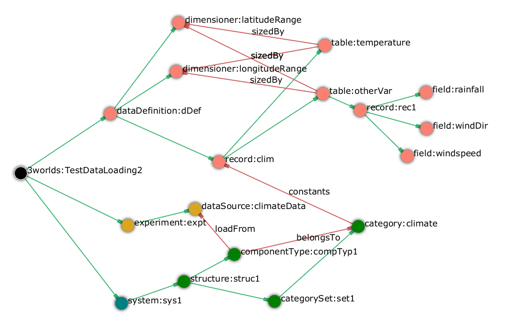

Simulators usually rely on possibly large data sets to initialise and run a simulation. 

==== Data uses

According to their use during a simulation, we can classify data into:

[horizontal]
Parameters:: Values usually visible to a large number of system components that remain constant over a simulation or over the life time of an ephemeral component. These are stored in the <<truethe-systemstructure-node,constants>> of components, groups, life cycles and the arena. 
+
__Examples__: the _average solar radiation at the top of the canopy_ for the arena component; the _spatial coordinates_ of a plant; the _species name_ for a group of components.

Initial community:: In most cases a simulation must start with a non-empty initial system. This implies that components be instantiated with specific initial values for their <<truethe-systemstructure-node,drivers>> and proper connections between them.
+
__Examples__: an initial forest reconstructed from LIDAR data; a monitored population of marked animals within an area, where each animal has a measured age.

Forcing data:: Sometimes a simulation requires that data be fed in during its time course, at some time step, replacing values of a driver that cannot be computed by the model.
+
__Examples__: a series of metorological data used to force a fire spread or a vegetation growth model.

Data for _parameters_ and _initial community_ are directly used to instantiate components and fill their descriptors with values. _Forcing data_ must be loaded into some initial data structure (probably most often a `DoubleTable`, cf. <<truetable>>, as a constant in the `system` instance), made accessible to some user-defined function that will read its content as the simulation proceeds.

==== Data input methods

There are three different ways of feeding `ModelRunner` with data to start a simulation experiment (cf. <<truethe-setup-of-an-initial-state-for-a-simulation>> for the specification of these):

. Entering parameter and initial driver values in the model configuration tree. This is useful only for small quantities of data, (i) with models requiring only a few parameters, or (ii) during the initial building/testing file of a model; typically when one does not want to bother with formatting an input file with only two parameter values. This is specified using `initialValues` nodes as children of `system`, `componentType`, `groupType` or `lifeCycleType`, depending on where the data should go (<<truethe-system-node>> and <<configuration-ecosystem-structure.adoc#truethe-systemstructure-node>>).
. Loading data from an external source, typically, one or more files. This is recommended whenever a large number of initial values and items must be used. This is specified using `loadFrom` cross-links to `dataSource` nodes (<<configuration-experiment.adoc#trueinputs-datasource>>).
. Using a user-defined initialiser function to set or modify initial values. This complements both points above and enables to compute transformations of initial drivers or constants prior to run the simulation. This is specified using `initFunction` nodes of the `SetInitialState` type (<<configuration-ecosystem-dynamics.adoc#truefunction>>) as children of `system`, `componentType`, `groupType` or `lifeCycleType`, depending on where the data should go (<<truethe-system-node>> and <<configuration-ecosystem-structure.adoc#truethe-systemstructure-node>>). 

These three methods can be used together within the same model. However, since an initialiser function must be run on an existing instance of a component, it can only be used (i) on the `system` node, which is always instantiated and unique, or (ii) as a complement to the two other methods which can specify the component instances to create.

===== The _loadFrom_ cross-link

`loadFrom -> dataSource:<__name__>` {0..*}::

A `dataSource` node specifies the information required to access some data source: for example, a file name, a file format, and all other requested information that the java code just needs to read the file.

A `loadFrom` cross-link links the `system`, a `componentType`, `groupType` or `lifeCycleType` a to a data source.

===== The _initialValues_ node

`/3worlds/.../componentType/*initialValues*:<__name__>`

`/3worlds/.../groupType/*initialValues*:<__name__>`

`/3worlds/.../lifeCycleType/*initialValues*:<__name__>`

`/3worlds/system/*initialValues*:<__name__>`

An `initialValues` node enables one to directly specify the number, driver and constant values, belonging to groups and life cycle instances, of initial instances of components, groups, life cycle, and the arena.

_Properties for_ `initialValues` :

[horizontal]
`nInstances`:: The number of instances of `componentType`, `groupType` or `lifeCycleType` to create at the start of the simulation. For groups and life cycle, the instance name will be the name of the initialValues node, plus a number if more than one instance is required. For components, the unique identifier is automatically generated. Note that a value of zero will not create any instance. Ignored for the arena (always present and unique).
`idGroup`:: (only applies to `.../groupType/componentType/initialValues` nodes): The `groupType` instance name of these `ComponentType` instances
`idLifeCycle`:: (only applies to `.../lifeCycleType/groupType/componentType/initialValues` and `.../lifeCycleType/groupType/initialValues` nodes): The `lifeCycleType` instance name of these `ComponentType` or `groupType` instances
`<__name__>`:: driver and constant (name,value) pairs to populate the instances. The property name must match a declared field. Tables are not supported. 

CAUTION: The latter property is only partly supported and at the time of writing, `ModelMaker` does not enable one to write such properties. One has to edit the configuration file by hand. Only do that if you are an expert.

===== The _initFunction_ node

`/3worlds/.../componentType/*initFunction*:<__name__>`

`/3worlds/.../groupType/*initFunction*:<__name__>`

`/3worlds/.../lifeCycleType/*initFunction*:<__name__>`

`/3worlds/system/*initFunction*:<__name__>`

_Properties for_ `initFunction` :

[horizontal]
`type`:: The type of function used: only <<configuration-ecosystem-dynamics.adoc#truefunction,`setInitialState`>> is possible.

`functionSnippet`:: The java code to be inserted into the body of the `initFunction` method in the generated code.

_Cross-links for_ `initFunction`:

`useRNG -> rng:<__name__>` {0..1}::
Points to the <<configuration-dataDefinition.adoc#truerandom-number-channels,random number generator channel>> to use in this function. If unset, the default random number channel is used.

==== Consistency of data files with the model component hierarchy

The simulated system is a hierarchy with up to 4 levels: arena > life cycle > group > component (cf. Box <<system-howto>>). As a consequence, input data files must reflect this hierarchy.

==== Data file formats

The data file formats currently supported as input to 3Worlds are listed in <<configuration-experiment.adoc#trueinputs-datasource>>. At the moment, `.csv` text files and `.ods` spreadsheet files are supported. Their content must comply with constraints listed in <<configuration-experiment.adoc#trueinputs-datasource>>.

For a practical understanding of how this works, we recommend to run the `TestDataLoading` model (accessible in *ModelMaker* through the `Projects > New > Test cases` menu). 

Here are examples extracted  from this test model:

====== Example 1: using a _dataSource_ only

This `.ods` spreadsheet:

with the following specifications: 

will result in the instantiation of a single system component with id **#49**, belonging to category **climate**, with an elaborate data structure as shown on the graph, containing a table *otherVar* of dimensions [12,8] with values read from the *climat.ods* file (from debugger):
[source,]
----
otherVar={[12,8],(8 3.1 C ),(0 2.9 C ),(2 5.3 C ),(0 3.1 C ),(16 3.9 C ),(17 3.9 C ),(5 2.0 C ),(17 2.6 C ),(0 1.2 C ),(0 0.4 C )...} 
temperature={[12,8],21.8,21.4,23.0,24.0,19.4,20.5,22.0,18.0,21.3,22.5...}
----

How?

* property  `subclass` in `dataSource:climateData` tells *ModelMaker* that the file to be read is in `.odf` format. Since there is no `sheet` property, only the first (actually, only) sheet is read;
* since `componentType:compTyp1` is child of the `structure` node and has no `initialValues` child node, the number of components to instantiate must come from the data source;
* since the `dataSource` node does not have a `componentId` property, only one component can be instantiated (there is no way to uniquely identify it in the spreadsheet). As a result, all data in _climat.ods_ will be used to instantiate a single instance of `componentType:compTyp1`;
* property `dim` tells ModelMaker that indices for the first table dimensions are to be read in column __lat__, and for the second dimension in column __long__;
* column headings prefixed with "__otherVar:__" indicate that these columns are sub-fields of the *otherVar* `table` (cf. graph);
* finally, the 96 (=12×8) different lines with different indices (CAUTION: the indices start at 0 for 3Worlds table data structures) will all go into the same constants table as specified by the *climate* `category` of the `componentType:compTyp1`, of which only one instance automatically identified as *#49* by *ModelRunner* has been created.

====== Example 2: using multiple _dataSource_ nodes
*[TODO]*

====== Example 3: using a mixture of _dataSource_ and _initialValues_ nodes

*[TODO]*

==== Import data from external sources

Not yet implemented.

