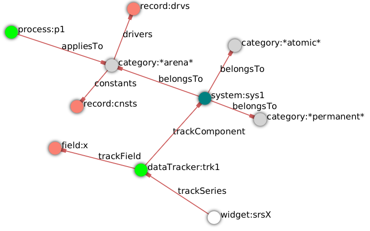

=== Tutorial 1: Construct and run a simulation for the first time

==== Introduction 

This tutorial explains the procedure for developing and running a simulation with _ModelMaker_. 
We start by using a simple https://en.wikipedia.org/wiki/Logistic_map[logistic growth model] as a test case and 
gradually introduce more capabilities in the tutorials that follow.

In _3Worlds_, the specification of a simulator is developed by constructing a graph of nodes and edges and 
setting their respective properties. The nodes represent elements of interest in the model while the edges show the 
relationships between them: the entire graph then constituting the simulator specification. 
The simulation can be run as soon as the specification is complete and Java code has been written to define the 
behaviour of the functions you have specified.

As you construct the graph, _ModelMaker_ is constantly checking and providing feedback on how the specification complies 
with the _specification archetype_. _ModelMaker_ guides you through this process by managing the available options at each 
stage in the graph construction and by providing an updated list of tasks requiring attention. 

While this process greatly accelerates model development, a more important aim is to provide a firm basis for model 
comparison. As all models developed with _ModelMaker_ must comply with the _specification archetype_, 
structural differences reduce to a comparision of graphs. That is, while you can construct any model, the design, 
being constrained by the _specification archetype_, will not be arbitrary. Of course, this is not the only difference 
between models. The code for each function defined in the specifications will be particular but at least these differences 
are encapsulated at specific places in the model implementation.

The specification graph is both a tree and a directed graph 
(<<truegeneral-concepts-structure-of-a-3worlds-configuration>>). Aside from the root, each node has a parent and may have 
additional edges between nodes to define particular relationships. We refer to these edges as _cross-links_ to distinguish 
them from edges that represent _parent-child_ relationships.

==== Installation

Installing _ModelMaker_ is very simple: create a directory called `3w` in your home directory and copy `tw.jar` to it. 
Then copy `modelMaker.jar` to your home directory. To start _modelMaker_, open a terminal and type: 
`java -jar modelMaker.jar`. If you receive a message saying "Unable to access jarfile modelMaker.jar", check for misspelling 
(including upper-case letters) and that the file is executable using the file manager of your operating system.

NOTE: To compile your own models, the Java Development Kit (JDK)  must be installed on your computer (<<trueprerequisites>>). 

==== Creating a new 3Worlds project

. Start _ModelMaker_ as above. If you haven't read any other _3Worlds_ documentation, reading "About ModelMaker" from the main menu (`Help -> About`) will provide some preliminary context.
 
. Create a new project (`Main menu: Projects -> New -> Templates -> Blank`)
. When prompted enter 'Tut1' (first letter upper case). A small graph of ten nodes appears in the graph window.

[#fig-blank-template]
.The appearance of _ModelMaker_ after creating a new project from the 'Blank' template.
image::tutorial1IMG/fig-blank-mm.png[align="center",role="thumb"]

The black node (`3worlds:Tut1`) is the _root_ of a graph that forms the simulator's specification. The other nodes are, 
for the most part, colour-coded roots of sub-trees of the graph wherein various aspects of the specification are defined 
(<<fig-blank-template>>, <<trueconfiguration-options-reference>>). 

All nodes are identified by a _label:name_ pair. The _label_ is the type of node, representing its role, while the _name_ 
is a unique identifier. A few node types, of which the root node is one, must have names beginning with an upper case 
letter. These nodes are used to generate Java classes when the simulation compiles.

At this stage you can try out a few basic edit operations:

- Move a node around the graph display by dragging it with the left mouse button;

- Zoom in and out in the graph display using the mouse wheel while holding down the `ctrl` key (or equivalent on your 
operating system). Zooming is centered on the mouse position;

- Pan the drawing surface by dragging with the left-mouse button anywhere outside a node (assuming the drawing area is 
larger than the display);

- Change the node and text size with the _element size_ slider in the tool bar;

- Right-click on a node to display a pop-up menu of edit options for that particular node. It is via these pop-up menus 
that the graph is constructed; and,

- While holding down the `shift` key, left-click on a node to see just this node and its nearest neighbours. What 
constitutes 'nearest' is set by the 'path len.' control in the tool bar.

A list of tasks remaining to be completed appears at the bottom-left of the main window (<<fig-blank-template>>). 
This list grows and shrinks as the developing graph is checked against the specification archetype.  A check takes place 
in the background every time the graph structure or its properties change. 

At the top-left of the main window are the two property editors - _Properties_ and _Selected Properties_ 
(<<fig-blank-template>>).  These show properties for the entire graph or for a single selected node 
(selected by clicking on the node with the left button) respectively. It's here that values are entered for node and 
edge properties created in the following steps. 

At this stage, there are five properties under the section `Tut1`.  These are properties of the root 
node (`3worlds:Tut1`) intended to provide a limited amount of documentation for this project. 
If you click on the root node and then select the _Selected Properties_ editor tab, an additional 
non-editable property is shown called '`built-by`'. This property is filled out automatically with your 
computer login name and the creation date of the project. Viewing non-editable properties can be useful 
at times. These are always shown in the _Selected Properties_ editor but for brevity, not in the 
_Properties_ editor. Two icons at the top left of the _Properties_ editor allow you to display properties 
by category (by sub-tree) or by name. When this last option is selected, all editable properties are 
display in one list.

===== Directory structure

All projects are located within the 3Worlds root directory called `3w`.

(<<fig-tut1-dir>>). 

[#fig-tut1-dir]
.The initial directory structure pass:[ ] after creating a new project from the 'Blank' pass:[ ] template. Later, after all tasks have been pass:[ ] completed and the model is deployed, another pass:[ ] sub-directory is added for run-time files.
image::tutorial1IMG/fig-tut1-dir.png[role="thumb",align="left",float="right"]

The `3w` directory contains a Jar file called `tw.jar` (<<fig-tut1-dir>>). This file contains all dependent libraries for _3Worlds_. It's a good idea to keep a backup of this file.

Within `3w` there is now a sub-directory called something like `project_Tut1_2020-06-07-01-47-44-708`. Every project 
directory begins with the key word `project`, followed by the name of the project you entered (`Tut1` in this case) 
and the creation date and time. The purpose of naming project directories in this way is to make it almost impossible 
to inadvertently overwrite a project. 

Inside this directory are a number of text files:

... `Tut1.utg` is the model configuration graph we're constructing;
... `.layout.utg` contains information used to display the graph;
... `MM.xml` contains the session's preference settings.
... `__StateA1` and sequences of similarly named files are temporary files to support the program's undo/redo of editing 
operations. These files are created during a session and deleted when the session ends.  

All these files are text files and you can open and inspect them with a simple text editor. 
However, as they are written by _ModelMaker_ you should _avoid editing them directly as this will 
likely cause problems for your project_. 

NOTE: Editing any project graph files (*.utg) with a text editor is likely to corrupt the project. 

On the other hand, you can delete project directories at any time you wish. If you accidentally 
delete the project of a currently open session, it will be recreated automatically by 
_ModelMaker_ (apart from the _undo-redo_ history). However, if you delete the entire `3w` directory 
you will have to restore `tw.jar` from backup.

==== Creating the specifications

Having created `Tut1`, the task list shows two actions are required (<<fig-blank-template>>).
 These tasks can be dealt with in any order but in general, a logical approach is to build 
 the specification as follows: 

... *data definition*: the data structures required (cf. <<truethe-datadefinition-node>> for full reference);
... *structure*: define the organisation of components - their roles and relationships (cf. <<truethe-systemstructure-node>> for full reference). 
... *dynamics*: define how the modelled system evolves over time and the parts of the *structure* that dynamic processes apply to (cf. <<truethe-systemdynamics-node>> for full reference).

For the most part, these tutorials will proceed in this order and leave defining the 
simulation's *user interface* (<<truethe-userinterface-node>>) and *experiment* design (<<truethe-experiment-node>>) 
until last. In fact, the Blank template has provided a minimum specification for the *experiment* sub-tree 
(a single run of the model) and  the *user interface* (a simulation controller).

===== Data definition

The logistic equation we will implement is: _x(t+1) = rx(t)(1-x(t))_. Though simple, it has interesting chaotic 
behaviour for values of _r_ between 3.7 and 4.0. All we need do for the data definition section is to define the 
parameter _r_ and the state variable _x_. 

From here on and throughout these tutorials, parameters are called _constants_ (data that does not change over the 
course of a simulation) and state variables are called _drivers_ (data that drives the simulation from one time to 
the next).

Note that at this stage, the task list says nothing about adding anything to the *data definition* sub-tree. This is 
because it is possible to define a model without data. Nevertheless, once data is defined, various actions will be 
required and displayed in the task list to correctly define its use.

. Right-click on the data definition node (`dataDefinition:dDef`) (pale red) and select `New node -> record` from the popup menu. You're then prompted for a name. The default name is `rec1`. Change this to 'cnsts' (constants) and click `ok`. The mouse pointer immediately becomes a cross-hair: _ModelMaker_ is asking where to place this node. Move to some place within the graph display and left-click the mouse. 

You can name nodes and edges anything you like but accepting the recommended names and edges will make these tutorials 
easier to follow. Note that _ModelMaker_ will prevent naming nodes or edges with duplicate names.

All nodes in the configuration graph are children of some parent (apart from the root node). You can only create nodes 
by right-clicking on a parent and selecting a child to create from the available options provided by the pop-up menu. 
The items in this menu vary according to the possibilities allowed by the _specification archetype_. This is one way 
_ModelMaker_ ensures the developing configuration conforms with the _archetype_, greatly simplifying an otherwise 
complex workflow.

[start = 2]
. Create a `field` node as child of `record:cnsts`, name it 'r' and when prompted, set its type as `Double`.

All `fields` (and later `tables`) must be children of some `record`. 

[start = 3]

. Create another `record` as child of `dataDefinition:dDef` and name it 'drvs' (drivers).

. Create a `field` node as child of `record:drvs`, name it 'x' and again set the type to `Double` (<<fig-ddef-subtree>>).

[#fig-ddef-subtree]
.Defining constant `r` and driver `x` pass:[ ] within the data definition sub-tree.

Note that the names 'drvs' and 'cnsts' don't imply any meaning to the simulation specification - they're just names. 
Their _roles_ as drivers and constants will be defined later. 

This is all the data required for this tutorial.  The task list has now grown to four because the roles of this data 
remains undefined. 
 
You can tidy up the graph display by clicking the `L` button (re-apply layout) in the tool bar.

===== Structure

At this time, the task list displays four actions. Three of these actions relate to the structure of the model. The `structure` sub-tree 
describes how the modelled system is organised into separate `components` playing particular roles. In an elaborate model, there can be 
many `components` but in the present case, we need only one, and for convenience, the `system` node can act as this single `component` 
without the necessity of actually creating a `component` within a `structure` sub-tree. 

Here, the component's _role_ will be defined as:

- lifetime: _permanent_; 

- organisation: _atomic_; 

- systemElements: _arena_; 

- Using _r_ as a constant and _x_ as a driver.

The component has a _permanent_ lifespan because it persists throughout the simulation; it's  _atomic_ simply because it is a single indivisible component and not an assemblage of sub-components; and, it belongs 
to something called the _arena_. The _arena_ is  a unique top level component - it's more or less a global component accessible to all 
other components. No matter how many components a model has, exactly one of them must belong to the _arena_ category, 

While this is complicated for such a simple model, later tutorials will show how this arrangement can be a powerful approach to 
structuring any complex hierarchical dynamic system composed of interacting physical and biological components. 

To create this role, we use nodes of the type `categorySet` and `category`. A `categorySet` is a set of mutually exclusive categories. 
By that we mean a `component` can only be associated with one category of a given categorySet. So for example _permanent_ and _ephemeral_  
are two categories within a set called _lifespan_ and clearly, a component can only be one or the other. Categories and CategorySets are 
recursive: a CategorySet contains Categories and Categories can contain CategorySets without limit. 

Apart from the `system` node doubling as a `component`, an additional convenience is provided: a sub-tree of predefined category sets and 
categories. We use these nodes to define the role described above. To see this sub-tree:

. Right-click on the root node and select `Collapse -> All`.

. Right-click again on the root node and select `Expand -> predefined:*categories*`.

. Re-apply the layout ('*L*' [Alt+L])

The `predefined:*categories*` sub-tree is created with every new project (collapsed by default) and is _immutable_ apart from allowing 
edges to be added between it and other sub-tree nodes.

There are two `record` nodes within this sub-tree for default handling of average population and ephemeral data. Since the single 
component used here will be neither of these we can ignore this section:

[start = 4]

. Right-click on `predefined:*categories*` and collapse both the `AVPopulation` and `AVEphemeral` sub-trees.

. Right-click on the root node, expand the `system` and re-apply the layout.

[#fig-system-role]
.The specification of the system component in belonging pass:[ ] to the three categories; _permanent_, _atomic_ and _arena_.

We are now in a position to define the _role_ of the `system` node (a.k.a. `component` in this case). The `system` node always belongs to 
the `arena` and `permanent` categories. This has already been done by the 'Blank' template. It just remains to make the system `atomic`.

[start = 6]

. Right-click on `system:sys1` and select `New edge -> belongsTo -> category:*atomic*`.

The system's role of belonging to the _atomic_, _permanent_ and _arena_ categories is indicated by three _cross-link_ edges 
(<<fig-system-role>>). All _cross-links_ are red - thin at the _start node_ and thick at the _end node_. Unlike parent-child links, 
they have names. Generally, the names of _cross links_ are not much use. They can be hidden by selecting the drop-down list `E text` in 
the tool bar, and selecting `Role`. The relationship can be read as, for example: `system:sys1 belongsTo category:*arena*`.

[#fig-arena]
.The specification of the constants and drivers for the _arena_, pass:[ ] a category to which the only component in this tutorial (aka pass:[ ] `system:sys1`) belongs.
image::tutorial1IMG/fig-arena.png[align="left",width=500,float="right",role="thumb"]

We have yet to relate `system:sys1` to the driver '_x_' and the constant '_r_'.  These are global data and therefore are defined as part 
of the `arena`.

[start = 7]

. Right-click on `category:*arena*` and select `New edge -> constants -> record:cnsts`.
. Right-click again on `category:*arena*` and select `New edge -> drivers -> record:drvs` (<<fig-arena>>).

 There is now one message remaining which refers to the dynamics of the model.
 
===== Dynamics

The `dynamics` sub-tree specifies how the modelled system will evolve over time. It determines the temporal order of 
function calls, their type, the categories they apply to (cf above), the conditions under which the simulation will stop (if any) and what and when data will be tracked 
for output. 

In the present case, the main task is to call the logistic equation a set number of times and present the result from 
each iteration to the equation at the next time step. 

The `dynamics` sub-tree (lime green) is a child of the `system` node - the root of the modelled system that defines 
both its dynamics and structure. These nodes are already present in the "Blank" template we started with.
The `dynamics` node is the specification of a type of simulator. There can be many simulators (instances) of this 
specification running in parallel depending on the experimental design. 

A dynamic system must have a single definition of the <<truetime-line,time scale>>. There are ten different types of 
time scale available: all of them define exact sub-divisions of time except for the `GREGORIAN` scale type which 
implements the standard Gregorian calendar. The 'Blank' template has already defined a `timeline` with an `ARBITRARY` 
time scale which is sufficient for this tutorial. 

In the task list is an action asking that a `timer` be added to `timeline:tmLn1`.

. Create a <<truetimers,`timer`>> as a child of `timeline`. Here an extra prompt appears asking for the class of the timer: {`ClockTimer`, `EventTimer`, `ScenarioTimer`}. Select `ClockTimer`. This timer class increments time by a constant step during simulation, unless the timeline uses a Gregorian scale in which case irregularities such as leap years are managed. 

Two new tasks have been added to the task list indicating that `dt` and `nTimeunits` must be greater than 1.0.

[start=2]

. In the property editor, locate these two properties (properties of `timer:tmr1`) and set them to 1.0.

Clock timers use their own time units to count time. The time unit is specified by: 

* the `timeUnit` property, which defines in which measurement unit time is to be expressed. There are 22 time unit types 
available ranging from microseconds to millennia, constrained by the choice of the time scale. The current default 
value of `UNSPECIFIED` is fine for this tutorial, as here, time is just a sequence of steps; 

* `nTimeUnits`, i.e. the number of measurement units per timer unit - for example, a timer could use '2 days' as its 
basic time unit. It means that an elementary time tick in this timer represents 2 days, so (time = 11) means 22 days, 
etc. It is the finest _grain_ at which time can be measured with this timer. In this tutorial, 1 is fine as we simply 
use a sequence of steps.

Finally, `dt` is the number of time _grains_ per time step. Here, 1 will do. This tutorial runs with time steps of 1 
unspecified unit, i.e just simple ticks.

Note that a model can have any number of `timers` using any of the available time steps and time units as long as the 
time units selected are compatible with the parent `timeline`. The task messages will indicate if this is not the case. 
Because the specification archetype allows for more than one system, it follows there can be many dynamics sub-trees, 
each with their own time system.

There is currently a task asking that a `process` be added to `timer:tmr1`.

[start = 3]

. Create a <<trueprocess,`process`>> node as child of `timer:tmr1`. 

This process will opereate on _r_ and _x_ that we defined in the Data definition section. These data are associated with the _arena_ as constants (_r_) and drivers (_x_). Therefore `process:p1` will `applyTo` the arena.

[start = 4]

. Right-click on `process:p1` and select 'New edge > appliesTo -> category:*arena*'.

A `process` defines a set of computations acting on model components driven at the rate of the parent `timer`. 
A component is some unit of simulation. It can be any physical or biological entity represented in the model 
that has dynamic behaviour (plants, animals, nutrient pools, lakes, the atmosphere or the rhizosphere etc).

Processes can be composed of any number of functions of various types (much more on this later). We need just one 
function to implement the logistic equation - a `ChangeState` function that takes the current state of a component and 
calculates the next state.

[start = 5]

. Create a <<truefunction,`function`>> as a child of `process:p1`, name it `Chaos` and select `ChangeState` as its type.

The function type can't be changed after creating node, so if you make a mistake, delete and recreate it (`Delete` 
from the pop-up menu or `Undo` from the main menu).

_ModelMaker_ can link to an Integrated Development Environment (IDE) such as _Eclipse_, to write code for these 
functions. However, in this tutorial the funcion is only one line of code and we can just associate a code snippet 
with the function without the need to link to an IDE. The snippet will be inserted in the function when the simulation 
is compiled.

[start = 6]

. Edit the `functionSnippet` property of `function:Chaos`, and enter the following text: 
`focalDrv.x = r*x*(1-x);`

This line sets the next value of _x_ (`focalDrv.x`) in terms of the current value of _x_.

Save your work (`Ctrl+s`) and the task list will be empty indicating the simulation is ready to deploy.

===== Deployment: launching _ModelRunner_

Before deploying the simulation, it's useful to display the overall specifications by hiding the predefined sub-tree and showing the 
experiment and user interface sub-trees.

[#fig-deploy1]
.A view of the specification graph showing principal nodes of interest.
image::tutorial1IMG/fig-deploy1.png[align="left",role="thumb"]

. Right-click the root node and select 'Collapse -> predefined:*categories*'.
. Again, right-click the root node and select 'Expand -> experiment:expt' and 'UserInterface:gui'.
. Re-apply the layout (*L*) (<<fig-deploy1>>).
. Click the `Deploy` button. _ModelMaker_ now launches _ModelRunner_ to start the run-time application: _ModelRunner_ (cf. <<truesimulation-reference-running-a-simulation-experiment-with-modelrunner>> for a full reference). 

At the top of _ModelRunner_ are some control buttons to start, step and stop the simulation. This is the `ControlWidget1` shown in the 
figure above that was included by default in the 'Blank' template. The _run_ button becomes a _pause_ button while running and the _stop_ 
button resets the simulator to it's starting state. 

However, as expected, there's nothing to see so the next step is to add a time series widget. This is an optional requirement so the 
task list didn't complain about this. 

You can move easily between design and execution of the specifications simply by deploying _ModelRunner_, checking the simulation and 
quitting to return to _ModelMaker_.

To add a time series for _x_:

[start = 5]

. Quit _ModelRunner_ and return to _ModelMaker_.

. Create a `tab` node from the  `userInterface:gui` node. 

A `tab` is a container that can contain either widgets or other containers. The task list indicates this now asking that one of these be 
added.

[start = 7]
. Create a `widget` node from `tab:tab1`, name it 'srsx' and select `TimeSeriesWidget1` from the drop-down list. 

A new task has been added to the list requiring an edge from this widget to a dataTracker. 

For this widget to receive values of _x_, something must post values of _x_ to the widget at the same rate as the `Chaos` function is 
executed. This is the job of a `dataTracker` and it properly belongs in the `dynamics` sub-tree. 

[start = 8]

. Create a `dataTracker` as a child of `process:p1` and choose `DataTracker0D` as it class. This class of data tracker is suitable for scalar data such as _x_.

. Create an edge from the `dataTracker` to _x_ by selecting `New edge -> trackField - > field:x`. 

. Create an edge from `widget:srsx` to the new data tracker.

. Create an edge from `dataTracker:trk1` to a `component` i.e in this case `system.sys1`. A data tracker must not only track some data but also the `component` that uses this data.

. Save the graph (`Ctrl+s`) and click the 'Deploy' button again. 

The display is still uninteresting because we haven't set an initial value for _x_ or parameterised _r_. This can be done in a number of 
ways but for this tutorial we will add an initialisation function and a code snippet.

[#fig-javaCode]
.Entering Java code snippet for the `initFunction` (for the pass:[ ] `system:sys1` component) in the property editor.
image::tutorial1IMG/fig-javaCode.png[align="center",float="left"]

[start = 13]

. Create an `initFunction` as a child of `system:sys1`. As `system:sys1` is the only component in the specifications, it is the node requiring initialisation of _x_ and _r_.

. Enter the following two lines in the `Init1#javaCode` property (<<fig-javaCode>>):
  ... `focalDrv.x = 0.001;`
  ... `focalCnt.r = 3.7;`

If you make a typo, the task list will show the details of the compile error.

===== Stopping conditions 

If you examine the graph and all its properties, you may notice that there is no indication as to how long the simulation should run. 
This means that when we run it we should expect it to continue indefinitely. You may or may not want this. If your model contains an 
unconstrained exponential function, it may eventually crash unless your code takes measures to handle this. You can add a variety of 
simple or complicated stopping conditions to the `dynamics` node. These will be discussed in later tutorials.

When we first ran this model it had no output. Now that we have a time series chart, displaying data of unlimited length will make the 
_ModelRunner_ fairly unresponsive because the simulator has little to do but the UI must update the graph continuously. Note: the 
`TimeSeriesWidget1` displays data in a rolling buffer. The default buffer size is 1,000 data points. 

If you press the run button and then the stop or pause button of the controller, it may take a while for the simulator to respond. 
So for now, it's best to test the simulation with the `Step` button.
[start =16]

. Deploy _ModelRunner_ (saving first if prompted)

. Click the `step` button a few times. A time series of zeros is shown. 

. Click the `run` button twice in rapid succession. The time (x axis) now reads approximately 30,000 or so depending on the speed of your computer.

To complete this tutorial, add a simple stopping condition:

[start = 19]

. Close _ModelRunner_ and return to _ModelMaker_.

. Create a `stoppingCondition` as a child of `dynamics:sim1`. When prompted, select `SimpleStoppingCondition` from the drop-down list.

. Select this new node and in the properties editor, set the value of `stCd1#endTime` to 100 (<<fig-final-specification>>).

. Save, re-deploy and run the simulation. You'll now see a time series of the chaos function of 100 time steps (<<fig-tut1-MR>>).

[#fig-final-specification]
.The specification graph for Tutorial 1.

[#fig-tut1-MR]
.The appearence of _ModelRunner_ while running Tutorial 1.
image::tutorial1IMG/fig-tut1-MR.png[align="center"]

You can now generate documentation for this model from _ModelRunner_.

[start = 23]

. From _ModelRunner_ select 'About -> Create documentation' from the main menu. 

This creates  an ODD template (Overview, Design concepts and Details) (`Tut1.odt`, <<fig-ODD1>>), an established standard for documenting simulation 
models. This file can be generated any time from _ModelRunner_. When you're satisfied with the specification, edit this file as 
a basis for the complete documenting of the model.  The file can be found in the Tut1 project directory <<fig-dir-post-run>>:

`~/3w/project_Tut1_2021-05-07-01-36-13-257/local/runTime/Tut1.odt`.

Most word processors can read this standard format, native to LibreOffice, including Microsoft Word.

NOTE: Every time this file is created, it will have a number added to its name to prevent overwrites. 

[#fig-ODD1]
.A section of the automatically generated documention for Tutorial 1. The text in italics is a quote from <<bibliography.adoc#Grimm2010,Grimm et al. (2010)>> supplementary material ODD template file with suggestions as to how to write this section of the documentation. This quote is replaced by the `precis` property of the root node for convenience.
image::tutorial1IMG/fig-ODD1.png[align="left",role="thumb",width=850]

[#fig-dir-post-run]
.The directory structure after deploying pass:[ ]_ModelRunner_ and creating the ODD pass:[ ] documentation.
image::tutorial1IMG/fig-dir-post-run.png[align="left",width=313,float="right",role="thumb"]

Once the specification has been compiled without errors and deployed and the documentation generated, a number of files will have been created <<fig-dir-post-run>>:

... `local/java/code/`: This directory contains the generated Java code. The entire model is contained within the `Tut1.java` class.

... `Tut1.jar`: A stand-alone jar of the model that can be run independently of _ModelMaker_ (<<truesimulation-reference-running-a-simulation-experiment-with-modelrunner>>).

... `runTime/MR.xml`: A preferences file for _ModelRunner_. These settings are saved whenever _ModelRunner_ quits so it will have the same appearance between successive uses.

... `runTime/Tut1.odt`: This is the documentation file generated in the previous steps.

==== Graph layouts

An aspect of _ModelMaker_ we have only touched on so far, is the graph layout system.

While using a graph to construct model specifications has many advantages, you can quickly become lost in a confusion of nodes and edges. 
The advantage in presenting the specification as a graph is that the huge number of options possible can be constrained by context. 
For example, to have a dynamic `process`, it makes sense that it's associated with a particular `timer`, that other processes working at 
the same rate are associated with the same `timer` and that all timers are coordinated by the one `timeline`. The user interface for 
problems such as this would be very error-prone if presented say, as a series of dialog boxes.

_ModelMaker_ has a number of features to help arrange the graph display. Please refer to <<truegraph-display>>.

As an exercise if you wish, try displaying just the nodes with _cross-links_ using the SpringGraph layout (*L4*) (<<fig-links-only>>). This is a common way to 
look at just the _cross-link_ relationships between nodes. Generally, adding a screen capture of this and a second screen capture of 
just the relevant _parent-child_ relationships make useful additions to the ODD appendix.

[#fig-links-only]
.A view of the specification graph for Tutorial 1 showing only relevant _cross-links_ using the Spring layout (*L4*).

That's the end of this tutorial. Recreate this project at any time from the main menu (`Project -> New -> Tutorials -> 1 Logistic`).

==== Next

The next tutorial (Tutorial 2) will demonstrate linking this project to an IDE and adding some Java program code.
