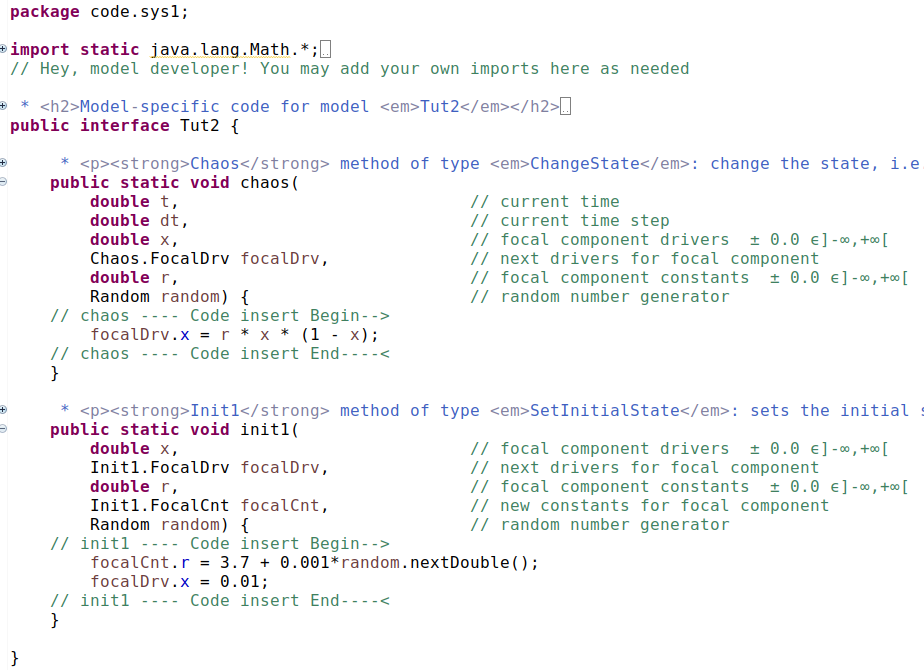

=== Tutorial 2: Linking a _3Worlds_ project to a Integrated Development Environment (IDE)

==== Introduction 

The previous tutorial used code snippets to insert Java code into the model specifications. In this tutorial we show how to use an Integrated Development Environment (IDE) to achieve the same end. Generally, the only way to develop any but the simplest of models is to code in a professional IDE such as _Eclipse_, _Intellij_ or _NetBeans_. At the time of writing, linking specifications to a Java project has only be tested with the _Eclipse_ IDE.

==== New Java project

First create a Java project in _Eclipse_.

. In _Eclipse_, create an new Java project and name it `tut2` (first letter lower case).

. Right-click on the new project and select  `properties -> Java Build Path`.

. Under the `Libraries` tab, highlight `Classpath` and  click the `Add External JARs...` button to the right.

. Navigate to the .3w directory and select `tw-dep.jar`.

. Click `Apply and close`.

This installs the _3Worlds_ dependencies for this java project.

==== Specifications
Now create a _3Worlds_ project using tutorial 1 as a starting point.

. From _ModelMaker_ main menu select `New -> Tutorials -> 1 Logistic` name it `Tut2`

. Right-click on the root node (`3worlds:Tut2`) and select `Collapse -> All`.

. Right-click again on the root node and select `Expand -> system:sys1` 

. Re-apply the layout (*L*).

. Delete `snippet:snpt1` and `snippet:snpt2` as they're no longer required.

. Save (`Ctrl+s`)

Next link this project to the Java project created above.

. From the _ModelMaker_ main menu, select `Edit -> Java project -> Connect...`.

. Navigate to your _Eclipse_ workspace and select `tut2`.

. In the _Eclipse_ Project Explorer view, right-click on `tut2` and select `Refresh`.

. In the _Eclipse_ main menu, select `Project - > clean` and apply to `tut2`.

While editing in _Eclipse_, a task message may appear in _ModelMaker_ from time to time complaining about file dates. If so, make sure your Java files are saved, refreshed and the project clean. The message will disappear when the project is re-complied in _ModelMaker_ using the button in the bottom left-hand corner.

==== Writing Java code 

In the `src` folder of `tut2`, you'll now find a new package called `code` and `code.sys1`. These have been generated by _ModelMaker_ upon linking. In the `code` package is a Java file with the same name as the 3Worlds project: `Tut2.java`. This single class is where you add all your code. The other classes in the `generated` package are not intended to be edited. If you do edit these, your edits will be overwritten whenever the specifications are edited in _ModelMaker_. 

[#fig-tut2-java-project]
.The package structure in Eclipse after linking Tutorial 2 to a Java project.
image::tutorial2IMG/fig-tut2-java-project.png[role=left]

. Open `Tut2.java` in the _Eclipse_ editor.

Near the bottom of the file are two methods: `chaos` and `init1`, mapped from the names of the function and initFunction nodes we created in `Tut2` with _ModelMaker_. Within the body of these methods are a pair of insertion markers: 

- `Code insert Begin-- >`; and 
- `Code insert End---- <`.

. Add the following code between these markers, taking care to leave the text of the markers themselves unchanged.

`chaos`:

[source,Java]
-----------------
 	focalDrv.x = r*x*(1-x);
-----------------

`init1`:

[source,Java]
-----------------
	focalDrv.x = 0.001;
	focalCnt.r = 3.7;
-----------------

[#fig-tut2-src]
.The main souce code file ('Tut2.java').

Because these two methods are mapped to this generated file from the specifications created in _ModelMaker_, it follows that changes to the specifications may result in changes to these methods. So the question arises, how does _ModelMaker_ manage this without losing the Java code you write?

If there have been changes to the number, name or type of `function` used in the specification, changes to anything in the `dataDefinition` sub-tree, or changes to the _roles_ of `components`, _ModelMaker_ will back up your old file as a text file with a unique name (e.g `+_Tut2_1.txt+`,`+_Tut2_2.txt+` etc...) within the current java package. This way you can copy and paste you code back to the proper place. Otherwise _ModelMaker_ will never overwrite this file. 

When _ModelMaker_ searches for differences between previous and current versions of this Java file, it will ignore any comments, import statements and the code you have added between the insertion markers. Therefore, although you can do as you please with the generated comments, you should take care not to alter the text of the markers themselves. 

If the task list is empty, you can now execute the specifications by deploying them from _ModelMaker_.

Running the simulation directly from _ModelMaker_ is a convenient way to speed up the turn-around time in developing and testing specifications. Once the specifications are stable, you can run your model from a jar: the jar file that is created in your project directory in this case `Tut2.jar`. To do this:

[start = 2]

. Open a terminal, change to your project directory and enter the following text: `java -jar Tut2.jar`

Finally we discuss how to debug your equations by running your model from the IDE.

===== Debugging your code

Once the specifications are valid (i.e no tasks in the task list) you can quit _ModelMaker_ and debug your code from the IDE.

In the default package of the linked java project (`tut2`) is a java file called `UserCodeRunner.java`. This was created the first time you linked the project made with _ModelMaker_ to the Java project. By placing breakpoints in the methods you added to `Tut2.java` above, you can debug by running from this `main` class. The correct command-line arguments have already been provided.

==== Next

The next tutorial will introduce the use of tables and some additional output `widgets` to add to the simulator's user interface.

