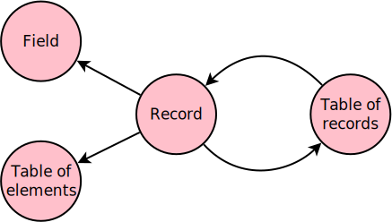
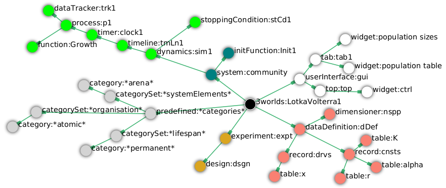
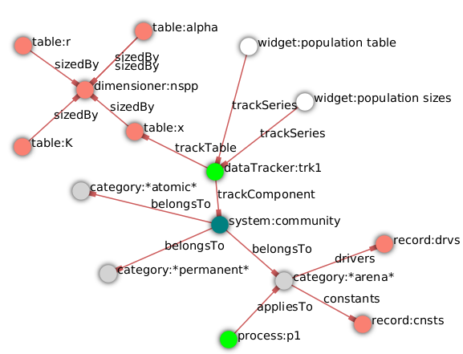
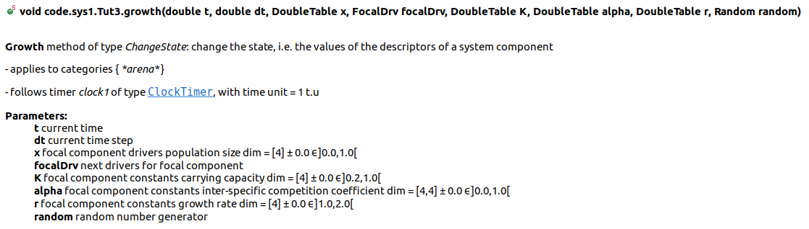
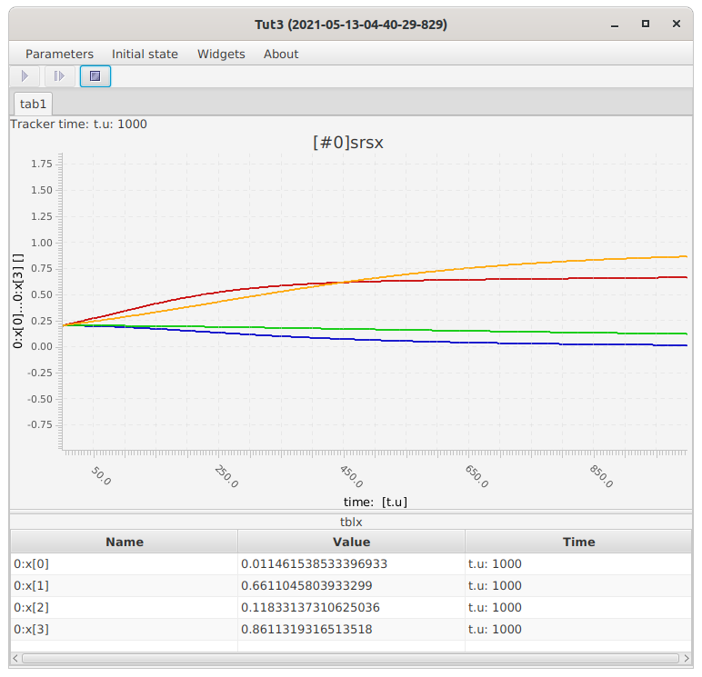

=== Tutorial 3: Using tables 

==== Introduction 

This tutorial introduces the use of tables in _ModelMaker_ by implementing a multi-species https://en.wikipedia.org/wiki/Competitive_Lotka%E2%80%93Volterra_equations[competitive Lotka-Volterra equation] (CLV).

The equation has three _constants_ and one _driver_; all of which are tables:

* constants:
- _K_: carrying capacity;
- _r_: growth rate;
- _alpha_: inter-specific competition coefficient;
* driver:
- _x_: population size. 

==== Specifications

Apart from the use of tables and a more elaborate model equation, these specifications are very similar to those of Tutorial 1. _ModelMaker_ provides a library of model templates for common model patterns such this. One of these, the `SimpleClock` template, has already defined a basic structure, dynamics and a minimal user interface.

. Start _ModelMaker_ and create a new: `Projects -> New -> Templates -> 2 SimpleClock` and name the project 'Tut3'.

[#fig-simple-clock-template]
.The appearance of _ModelMaker_ after creating a new project from the 'SimpleClock' template.
image::tutorial3IMG/fig-simple-clock-template.png[align="center"]

===== Data definition

[#fig-records-tables]
.Data is defined through the recursive use of pass:[ ] records and tables. A definition begins with a record. pass:[ ] Leaf nodes of the resulting graph must be either Fields pass:[ ] or Tables that define a standard Java type (element) pass:[ ] such as Double, Integer etc.

Data is defined through the recursive use of records and tables: records can contain tables and tables can contain records without limit. Records can also contain fields of any primitive Java type. Tables can also contain Java primitive types as well as user-defined records (<<fig-records-tables>>). Tables can have any number of dimensions.

There is usually more than one way of defining the data for any model. For the CLV, we will use a 2-dimensional table for _alpha_, a 1-dimensional table for  _r_ and _K_ and another 1-dimensional table for the population _x_.

[start = 2]

. Collapse all sub-trees from the root node and then expand `dataDefinition:dDef`.

. Create a `table` as a child of `record:cnsts`, name it 'alpha', choose `dataElementType` and then set its type to `Double` (the default).

. Create a second `table` as child of `record:cnsts`, name it 'r' and choose `dataElementType` and then set its type to `Double`.

. Create a third `table` as child of `record:cnsts`, name it 'K' and choose `dataElementType` and then set its type to `Double`.

. Create a  `table` as child of `record:drvs`, name it 'x', choose `dataElementType` and set its type to `Double`.

To complete the definition, we must set the table dimensions and indexing order for the 2-dim table 'alpha'. 

Only one dimensioner is needed: the number of species. This is done by creating a single `dimensioner` node to be associated with all these tables.

[start = 7]

. Create a `dimensioner` as a child of `dataDefinition:dtDef` and name it 'nspp' (number of species).

A new task appears in the task list saying the 'size' property must be greater than zero.

[start = 8]

. Click on `dimensioner:nspp` and go to the `Selected properties` tab. Set a value of `npp#size` to 4 (four species).
[start = 9]
. Right-click on each table node in turn and select `New edge -> dimensioner:nspp`. Repeat this for `table:alpha` to get the second dimension.

Now set the rank order for the indexing of `table:alpha`.

[start = 10]

. Click on `table:alpha` and examine its properties in the `Selected properties` editor.

. Set the value of one of its rank properties to 1 - it doesn't matter which.

[#fig-data-definition]
.The `dataDefinition` specifications for Tutorial 3: three tables of one dimension and one of two dimensions ('alpha'). This size of each table is the same so only one `dimensioner` is required.
image::tutorial3IMG/fig-data-definition.png[align="center",role="thumb"]

[#fig-description-property-option]
.Adding a `description` pass:[ ] property to the table 'K'.
image::tutorial3IMG/fig-description-property-option.png[float="right",align="center"]

Finally, add some meta-data to each table. This meta-data assists in documenting your Java source code and ODD documentation. Many nodes have optional properties. One such optional property is `description` for tables and fields. 

[start =12]
. Right-click on each of the table nodes and select 'Optional properties' and flag the 'Description` property. 

===== Dynamics

Although the task list is now empty (i.e. the specifications are now deployable), we have yet to write the model equation and provide some output. We can now rename the function provided by the template to something meaningful in the present context and add a data tracker to follow _x_.

. Expand the `system.sys1` sub-tree from the root node and re-apply the layout.

. Right-click on `Function:F1`, select `Rename node` and name it 'Growth'. If the prompt is unresponsive, remember to begin the name with an upper case letter.

. Create a `dataTracker` as a child of `process:p1` and select `DataTrackerD0` as the type (the default).

. Create an edge from the data tracker to _x_: `trackTable -> table:x`.

There are now two tasks in the list, one about 'indexing' and the other asking which 'component' to track. As with the previous tutorials, the component to track is the `system.sys1` node.

[start = 5]

. Create the edge `trackComponent -> system:sys1` from the data tracker node.

As we are using a scalar data tracker (`DataTrackerD0`) to follow a table, we can specify which elements of the table to track. If we want to track all elements of the table, we need do nothing as a blank entry for the `trks#index` property assumes this. Indexing is a property of the edge between data tracker and the table. Edge properties appear in the property list of nodes that are at the start of the edge (thin line) - in this case `dataTracker:trk1`.

This indexing will provide four data outputs. Indexing statements can select any number of contiguous or discontiguous table elements. The <<data-tracking,syntax>> is similar to that found in the https://www.r-project.org/[**R** statisical software].

===== User interface

We can now add some additional widgets to the user interface as the template provided only a controller. 

. Hide all nodes and expand the `userInterface:gui` node.

. Add a `tab` as a child of `userInterface:gui`.

. Add a `widget` as a child of `tab:tab1`, name it 'srsx' and select `TimeseriesWidget1` as the widget class.

. Add a second `widget` as a child of `tab:tab1`, name it 'tblx' and select `TableWidget1`.

Both these widgets are compatible with this data tracker class: the `TimeseriesWidget1` produces a chart while the `TableWidget1` displays the data as a continuously updated table. The task list requires these widgets to be connected to a data tracker. 

[start = 5]

. Right-click on each of these widgets in turn and select `New edge -> trackSeries -> dataTracker:trks`.
. Set the property `tblx#order` to '1' to arrange their positions in _ModelRunner_ as srsx on the left (`order` = 0) and tblx to the right (`order`=1).

Save the specifications (`Ctrl+s`) and they're now ready to run. The next step is to create a Java project to write the 'Growth' and 'Init1' functions, the latter having been provided by the `SimpleClock` template we started this tutorial with. 

[#fig-tree]
.Tree graph of the final specifiation graph for Tutorial 3.

[#fig-links]
.Cross-links of the final specifiation graph for Tutorial 3.

===== Link to a Java project

. Follow the steps in Tutorial 2 to create a Java project with _Eclipse_ and name it 'tut3'.

. Link it to this _ModelMaker_ project.

. Open `Tut3.java` in the _Eclipse_ editor and enter the following source code between the relevant insertion markers:

`init`:

[source,Java]
-----------------
for (int i = 0; i < r.size(0); i++) {
    focalCnt.r.setByInt(random.nextDouble() * 2.0, i);
	focalCnt.K.setByInt(0.2 + random.nextDouble(), i);
	for (int j = 0; j < alpha.size(1); j++) {
	    if (i == j)
		    focalCnt.alpha.setByInt(1.0, i, j);
		else
		    focalCnt.alpha.setByInt(random.nextDouble(), i, j);
	}
}
for (int i = 0;i<x.size(0); i++)
    focalDrv.x.setByInt(0.2, i);
-----------------

The above method simply initialises the equation constants: growth rate (_r_), carrying capacity (_K_) and the interspecific competition coefficient (_alpha_) to random values and the population size (_x_) to 0.2. 

There is a default random number generator (RNG) available to all functions. In later tutorials we will show how the specifications can factor any number of RNGs into groups. For example, one RNG can be assigned to functions of a particular type such as those effecting reproduction or mortality.

_ModelMaker_ has two types of RNG classes in addition to the standard Java RNG. These two are faster and produce streams of higher quality than the standard Java RNG. There are also various ways of seeding RNGs to ensure their uniqueness and to help with debugging.  

`growth`:

[source,Java]
-----------------
double integrationStep = 0.01;
double[] dxdt = new double[x.size(0)];
for (int i = 0; i < x.size(0); i++) {
    double sum = 0;
	for (int j = 0; j < alpha.size(1); j++)
	    sum += alpha.getByInt(i, j) * x.getByInt(j);
	dxdt[i] = r.getByInt(i) * x.getByInt(i) * (1 - sum / K.getByInt(i));
	}
for (int i = 0; i < dxdt.length; i++)
    focalDrv.x.setByInt(x.getByInt(i) + dxdt[i] * dt * integrationStep, i);
-----------------

[#fig-javaDoc]
.Example of the generated javaDoc for the `growth` function of Tutorial 3. The figure assumes correct meta-data has been added to the definitions of `K, r, alpha` and `x`.

Following a note from 'Tutorial 1', it is a good idea to keep the code snippets in _ModelMaker_ up-to-date with changes in the source code.
[start = 4]

. In _ModelMaker_ select `Edit -> Import snippets from IDE` and save (`Ctrl-s`).

The model is now ready to run. However, you may want to change the time duration of the simulation from the template default of 100 to 1,000 steps.

[#fig-tut3-MR]
._ModelRunner_ executing Tutorial 3. Note that the property `tab1#orientation` has be set to `vertical` is this figure. This displays the time series graph above the table.

==== Next

The next two tutorials (4 & 5) begin to elaborate the Lotka-Volterra model by developing the `structure` sub-tree through the addition of a disturbance component. 

