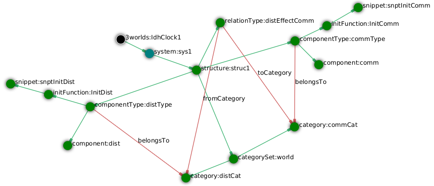
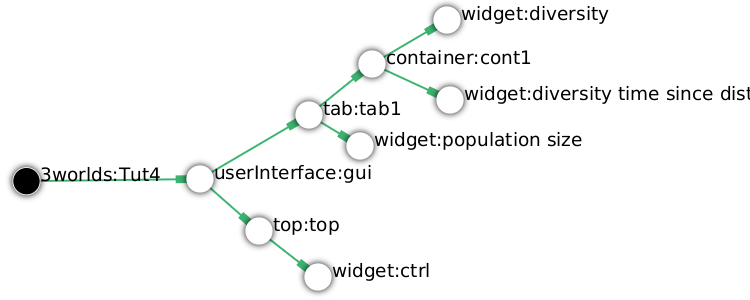
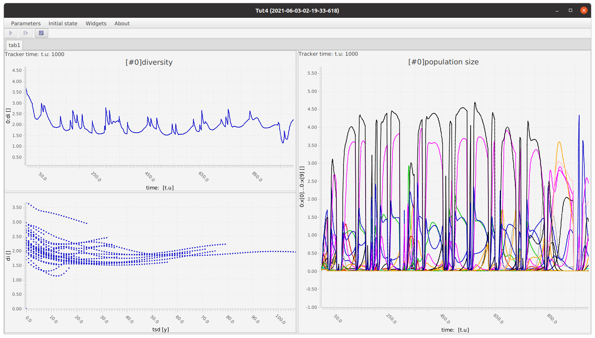
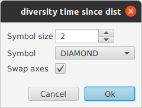

=== Tutorial 4: Elaborating the model structure: Testing the Intermediate Disturbance Hypothesis

==== Introduction

In this tutorial we add a disturbance to effect a community of species modelled with the competitive Lotka-Volterra equation (CLV) from Tutorial 3. This model could then be used to examine the Intermediate Disturbance Hypothesis (IDH: <<Connell1978, Connell, 1978>>). 

==== Specifications

Begin this tutorial using the Lotka-Volterra specifications from the `Tutorials` menu as a starting point.

. Create a new project from `Tutorials -> 2 LotkaVolterra` and name it 'Tut4'.

As the tutorial title suggests, we will be _elaborating_ the model structure. The Lotka-Volterra model has the simplest of structures: so simple that its `System` node can be named `community`. In the model we are developing here, this name would be misleading since we will have not only a 'community' but also a 'disturbance' (i.e. the system node will no longer be 'atomic' but an 'assemblage'). Therefore it will be clearer if we change the name of the system node back to its nondescript default name of `sys1`.

[start = 2]

. Right-click on `system:community` and rename 'community' to the default name 'sys1'.

===== Data definition

Data can play one of three _roles_ in the _3Worlds archetype_; as:

... _constants_, 
... _drivers_, or
... _decorators_. 

Thus far we have only made use of data as _drivers_ and _constants_. The third role, _decorators_, are values derived in some way from the other two. Importantly, they are re-initialised at the beginning of each time step. We need a species diversity index and this is a good example of a _decorator_ being derived from relative abundance of each species ('x[n]').

NOTE: _Decorators_ are re-initialised (zero, false, null etc.) at the start of each time step.

. Collapse all nodes except for the `dataDefinition` sub-tree, hide the _cross-links_ ('*X*'), and re-apply the layout ('*L*').

. Add a new `record` as a child of `dataDefinition:dDef` and name it 'decs'.

. Add a `field` as a child of `record:decs`, name it 'di' (diversity index) of type `Double`.

As noted previously, these names are just for clarity: they don't impose roles as _drivers_, _constants_ or _decorators_. Here, the records are named to indicate their intended roles just for clarity. Their role will later be formally defined by a relationship with a `category` which we create when building the `structure` specifications. 

While building the data definition (<<fig-tut4-data-definition>>), expect task messages to accumulate until these roles have been defined.

We now define some data for the simple disturbance model: frequency and intensity.

[start = 4]

. Add a new `record` to `dataDefinition:dDef` and name it 'distCnsts' (disturbance constants).

. Add two fields to this record, both of type `Double` called 'freq' and 'inten' respectively. 

The records carried over from the previous tutorial should now be given better names. A trick with the Tree layout functions is that they order children alphabetically. To arrange nodes so that related nodes of a particular role are close together, prefix the name with the same characters - in this case 'dist'. We should also prefix all the data associated with the CLV with 'comm' (community).

NOTE: Tree layout algorithms sort child nodes in alphabetical order. Consider this behaviour when choosing node names. 

[start = 6]

. Rename `record:cnsts` to `record:commCnsts`, `record:drvs` to `record:commDrvs` and `record:decs` to `record:commDecs`.

. Re-apply the layout and the nodes should now be arranged in a more sensible order.

To display an xy plot of diversity by time since disturbance, we can add a driver to the commDrvs record to record this.

[start = 8]
. Create a `field` of type `Double` as a child of `record:commDrvs` and name it 'tsd'. 

Fill out the meta-data properties with at least the description, range and units if relevant. This information will be incorporated in the comments of the generated Java code.

[start = 9]

. Add the following descriptions to the new data definitions properties:

- `freq#description`: 'average return time'
- `inten#description`: '% population decrease'
- `di#description`: 'Shannon's diversity index'
- `tsd#description`: 'Time since disturbance' 

Finally, change the number of species in the model to a larger value.

[start = 10]
. Set the value of `nspp#size` to 40.

For simplicity, we have defined `inten` as a constant rather than a driver.

[#fig-tut4-data-definition]
.The data definition sub-tree for Tutorial 4. Tree layout algorithms sort nodes in alphabetical order. Keeping this in mind when naming nodes can help keep your specifications in useful order.
image::tutorial4IMG/fig-tut4-data-definition.png[align="center",role="thumb"]

That's all the data needed for this model. We can now specify the system structure.

===== Structure

Recall from the previous tutorial, that `system:sys1` is acting as a single component. It's _role_ was defined as a permanent, indivisible global component:

... _permanent_;

... _atomic_; 

... belonging to the _arena_; 

The _arena_ is a special category. One and only one component must belong to this category. Any data associated with it (_constants_, _drivers_ and _decorators_) is available to all `functions`: the data is global. The system (`system:sys1`) was also being tracked by the data tracker. This relationship was removed above because _x_, the population being tracked, will now be part of a category related to the community component of the model i.e 'x' will no longer be global data.

The _role_ of a `component` is defined by its `componentType`. We'll need two `ComponentTypes`; one for the community (the CLV equation) and one for the disturbance. We also need a `relationType` to define the relationship between the disturbance and the effected community.

. Right-click on `system.sys1` and collapse the `dynamics:sim` sub-tree.

. Create a `structure` as child of `system:sys1`.

. Create a `componentType` as a child of `structure:struc1` and name it 'distType'.

. Create a `component` as child of `componentType:distType` and name it 'dist'.

. Create a second `componentType` as child of `structure:struc1` and name it 'commType'.

. Create a `component` as child of `componentType:commType` and name it 'comm'.

. Create a `relationType` as child of `structure:struc1` and name it 'distEffectComm'.

Before proceeding to the definition of the _roles_ of these component types, we should redefine the _role_ of `system:sys1` that we inherited from Tutorial 3 when starting this project.

The node `system:sys1`, in aliasing as a `componentType`, must now be redefined as an `assemblage` with no functions or data associated with it - that is, it is no longer `atomic`. 

[start = 8]

. Right-click on `system:sys1` and select `Delete edge -> belongsTo -> category:*atomic*`.

. Right-click again on `system:sys1` and select `New edge -> belongsTo -> category:*assemblage*`.

Remove the data associated with the _arena_.

[start = 10]
. Right-click on the root node (`3worlds:Tut4`), expand the `predefined:*categories*` and re-apply the layout. 

. Right-click on `category:*arena*` and select `Delete edge -> drivers -> record:commDrvs`.

. Right-click again on  `category:*arena*` and select `Delete edge -> constants -> record:commCnsts`.

. Right-click on the root node and collapse `predefined:*categories*` and re-apply the layout [Alt+L].

The node `system:sys` is now defined as simply a _permanent assemblage_ belonging to the _arena_.

Now define a `categorySet` to partition data between the disturbance and community. Category Sets contain mutually exclusive categories: something can belong to one or the other but not both. Since disturbance and community is all there is in this model, this is the 'world' of the model so this seems a reasonable name for this set of categories i.e the 'world' comprises a community and a disturbance category: something can belong to one or other of these but not both. 

[start = 14]

. Create a `categorySet` as child of `structure:struc1` and name it 'world'.

. Create a `category` as child of `categorySet:world` and name it 'distCat'.

. Create another `category` as child of `categorySet:world` and name it 'commCat'.

Define the data for these new categories.

[start = 16]

. Right-click on `category:commCat` and create the following edges:

... `drivers -> record:commDrvs`.

... `constants -> record:commCnsts`.

... `decorators -> record:commDecs`.

. Right-click on `category:commDist` and select `New edge -> constants -> record:distCnsts`.

. Expand the `dataDefinition:dDef` sub-tree, toggle the _cross-links_ to confirm you have done the links as above.

Now define the _roles_ of the new component types for the community and disturbance. Both belong to the _permanent_, _atomic_, and _component_ categories.

[start = 18]

. Right-click on `componentType:commType` and create `belongsTo` edges to:
... `category:*permanent*`,
... `category:*atomic*`,
... `category:*component*` and 
... `category:commCat`. 

. Right-click on `componentType:distType` and create `belongsTo` edges to:
... `category:*permanent*`,
... `category:*atomic*`,
... `category:*component*` and 
... `category:distCat`. 

Now define the relation between disturbance and the community.

[start = 20]

. Right-click on `relationType:distEffectComm` and create edges:

... `fromCategory -> distCat`.

... `toCategory -> commCat`.

Finally, add initialisation functions for the disturbance and community component types:

[start = 22]

. Create an `initFunction` as child of `componentType:commType` and name it 'InitComm'.

. Create an `initFunction` as child of `componentType:distType` and name it 'InitDist'.

[#fig-tut4-structure]
.The structure sub-tree for Tutorial 4. .

That's all that is required in this section. To finish up, we now need to connect various sub-trees of the graph to each other. Foremost among these is to associate processes with the new structure (<<fig-tut4-structure>>).

===== Dynamics

In this section we add two additional functions: one to initiate a disturbance and a second to apply the disturbance to the community.

Before proceeding, some explanations are required to make sense of the following steps. Ignoring `dataTrackers` for the moment, a `process` can have one or more `functions`. However, the relationships (_cross_links_) between the model's dynamics, data and structure are defined at the level of `processes` not `functions`. If we don't care what order the functions are called in, and they all apply to the same data and structural elements, then we need only one process to contain all the functions. However, this is not the case here. The three functions: community growth, disturbance occurrence, and disturbance effects, must have access to different data, components and component relationships. Specifically, whether or not a disturbance is to occur depends only on disturbance data (in this model). Also order is important: it must come before disturbance effects are applied to the community. The disturbance effects applies to a relationship: that of the disturbance and the community. The growth of the community only depends on community data (the Lotka-Volterra equation). In addition, we make the decision (in this model) that the disturbance can only occur after the growth of the community, mimicking a late growing season disturbance.

For clarity, we will prefix the names of `processes` in such a way that the layout algorithm will place them in execution order. 

. Collapse the `dataDefinition` sub-tree and expand `system:sys1`.

. Create a `process` as child of `timer:clock1` and name it 'p1DistOcc`.

. Create a `function` as child of `process:p1DistOcc` and name it 'DistOcc' and set its type as `RelateToDecision`.

. Create a second `process` as child of `timer:clock1` and name it 'p3DistEffectComm'.

. Create a `function` as child of `process:p3DistEffectComm`, name it 'DistEffectComm' and set its type to `ChangeOtherState`.

The name the growth process and function should now be changed to something more appropriate:

[start = 6]

. Rename `process:p1` to `process:p2CommGrowth`.

. Rename `function:Growth` to `function:CommGrowth`.

The function `function:CommGrowth` will perform the same task as it did in the previous tutorial: calculate the next state of _x_ from its current state. At the same time we can calculate the diversity index and increment a counter to record the time since the last disturbance.

The function `function:DistOcc`, a `RelateToDecision` function, will decide if a disturbance is to occur. If it returns _true_, a relation will be formed between the, yet to be specified, disturbance and community categories. 

If a disturbance occurs, `function:DistEffectComm` will implement the consequences of the disturbance on the community *but at the next time step*.

NOTE: All methods read data at the current time step and write data of the next time step. That is, always be mindful that _x[t+1] <- f(x[t])_. In code, _x[t+1]_ is `focalDrv.x` and _x[t]_ is just _x_.

As a reminder of this ordering, we have prefixed the process that creates the temporary (ephemeral) relation between disturbance and the community with 'p1' so that the layout (if using a _Tree_ layout) will display processes in a sensible order. 

First, show the _cross-links_ and set `process:p2DistEffectComm` to depend on `process:p1DistOcc`.

[start=8]
. Show the _cross-links_ (*X*).

. Right-click on `process:p2DistEffectComm` and select `New edge -> dependsOn -> process:p1DistOcc`.

To force the disturbance effects to take place _after_ the community growth (i.e. a late growing season disturbance), make `process:p2DistEffectComm` depend on `p2CommGrowth`.

[start = 10]

. Right-click on `process:p3DistEffectComm` and select `New edge -> dependsOn -> process:p2CommGrowth`.

After re-applying the layout (assuming a Tree layout is in use), it's clear why these process names were prefixed by p1, p2 and p3.

At this time, `dataTracker:trk1` is set to track the component `system.sys1`. There will be no global data to track in this model as there was in the previous Lotki-Volterra so we should remove this edge.

[start = 11]

. Right-click on `dataTracker:trk` and select `Delete edge -> trackComponent ->system.sys1`.

Finally, because there will be no global data in this model, `system:sys` will not need an initialisation function. Therefore we can delete this node.

[start = 12] 
. Right-click on `initFunction:Init1` and select 'Delete node'.

[#fig-tut4-dynamics]
.The system dynamics sub-tree for Tutorial 4. .
image::tutorial4IMG/fig-tut4-dynamics.png[align="center",role="thumb"]

That's all that's required in this section (<<fig-tut4-dynamics>>). The task list indicates that the new processes must belong to some categories. To do that we need to move on to the structure of the specifications.

===== Relations between sub-trees

Currently, `process:p3CommGrowth` is applied to `category:*arena*`. We want re-apply this process to `category:commCat`.

. Expand `dynamics:sim1` from `system:sys1`.

. Expand `predefined:*categories*` from the root node and re-apply the layout.

. Show _cross-links_ (*X*).

. Delete the `appliesTo` edge between `process:p3CommGrowth` and `category:*arena*` and re-apply it by creating an `appliesTo` edge to `category:commCat`.

The task list now has two tasks asking to connect both disturbance processes to either a `category` or a `relationType`.

[start = 5]

. Create `appliesTo` edges from both `process:p2DistEffects` and `process:p1DistOccurrence` to `relationType:distEffectComm`.

Note here that we expect this relation between the disturbance and the community to be reset every time step depending on whether or not `DistOccur` is true. That is, the relationship is ephemeral. This is achieved by setting the `lifespan` property of the `relationType:distEffectComm` to `ephemeral` (the default is `permanent`).

[start = 7]
. Change the property `distEffectComm#lifespan` to `ephemeral`.

The simulation can now be run but, of course, we have yet to add code to the various functions. Here, we'll just add code snippets but if you prefer, you can create a java project and add the code there instead (<<truetutorial-2-linking-a-3worlds-project-to-a-integrated-development-environment-ide>>).

===== Java code

. Copy and paste the code below to all the relevant `functionSnippet` properties. A convenient way to do this is to enter "func" into the search field in the _All properties_ property editor and edit each in turn. Note: click the 'By Name' button at the top-left of the editor, otherwise the search function will only show properties containing 'func' within a property category. If you received compile error messages, check that you have pasted into the property of the correct function:

`function:InitComm`:

[source,Java]
-----------------
double initFreq = 1.0 / x.size();
focalDrv.x.fillWith(initFreq);
for (int i = 0; i < r.size(0); i++) {
	focalCnt.r.setByInt(random.nextDouble(), i);
	focalCnt.K.setByInt(5.0 + initFreq + random.nextDouble(), i);
	for (int j = 0; j < alpha.size(1); j++) {
		if (i == j)
			focalCnt.alpha.setByInt(1.0, i, j);
		else
			focalCnt.alpha.setByInt(max(0.0001, random.nextDouble()), i, j);
	}
}
-----------------

`function:InitDist`:

[source, Java]
-----------------
focalCnt.freq = 5 + random.nextInt(50);
focalCnt.inten = random.nextDouble()*100;
-----------------

`function:CommGrowth`:
[source, Java]
-----------------
// growth
double[] dxdt = new double[x.size(0)];
for (int i = 0; i < x.size(0); i++) {
	double sum = 0;
	for (int j = 0; j < alpha.size(1); j++)
		sum += alpha.getByInt(i, j) * x.getByInt(j);
	dxdt[i] = r.getByInt(i) * x.getByInt(i) * (1 - sum / K.getByInt(i));
}
for (int i = 0; i < dxdt.length; i++)
	focalDrv.x.setByInt(Math.max(x.getByInt(i) + dxdt[i] * dt, 0.0), i);

// compute diversity
double xtot = 0.0;
for (int i = 0; i < focalDrv.x.size(0); i++)
	xtot += focalDrv.x.getByInt(i);

focalDec.di=0.0;
for (int i = 0; i < focalDrv.x.size(0); i++)
	if (focalDrv.x.getByInt(i) > 0.0)
		focalDec.di -= (focalDrv.x.getByInt(i) / xtot) * log(focalDrv.x.getByInt(i) / xtot);

// increment 'time since disturbance'
// use focalDrv.tsd not tsd as the order of calling of this method and DistEffectsComm could be altered
focalDrv.tsd = focalDrv.tsd +1;
-----------------

`function:DistOcc`:
[source, Java]
--------------------
if (random.nextDouble() < 1.0 / freq)
	return true;
else
    return false;
--------------------

`function:DistEffectsComm`:
[source, Java]
---------------------
for (int i = 0; i < other_x.size(); i++)
    if (other_x.getByInt(i) > other_K.getByInt(i) * inten / 100000.0) {
	    otherDrv.x.setByInt(otherDrv.x.getByInt(i) * other_K.getByInt(i) * inten / 100000.0, i);
		// reset time since disturbance
		otherDrv.tsd = 0;
	}
// compute diversity
double xtot = 0.0;
for (int i = 0; i < other_x.size(0); i++)
    xtot += other_x.getByInt(i);
otherDec.di = 0.0;
    for (int i = 0; i < other_x.size(0); i++)
		if (other_x.getByInt(i) > 0.0)
			otherDec.di -= (otherDrv.x.getByInt(i) / xtot) * log(otherDrv.x.getByInt(i) / xtot);
---------------------

==== User interface

We now need to modify the user interface, provided courtesy of the previous model (<<truetutorial-3-using-tables>>), to display `di` and `tsd`.
We are simulating 40 species so their abundance (`x[n]`) is best placed in a separate time series chart and `di` in another. In addition, we need an xy plot of `di` by `tsd`.
For this we need two additional `dataTrackers`.

. For clarity, rename `dataTracker:trk1` to `dataTracker:trkx`.
. Create another `dataTracker`, as a child of `process:p2CommGrowth`, name it 'trkdi' and select `DataTrackerD0` to follow this scalar value.
. Right-click on `dataTracker:trkdi` and select `Add edge -> trackField -> field:di`.
. Right-click again on `dataTracker:trkdi` and select `Add edge -> trackComponent -> component:comm`.

Now create a data tracker for `di` and `tsd` as an xy pair.

[start = 5]
. Create another `dataTracker`, as a child of `process:p2CommGrowth`, name it 'trkditds' and select `DataTrackerXY`.
. Right-click on `dataTracker:trkditsd` and select `Add edge -> trackField -> field:di`.
. Right-click on `dataTracker:trkditsd` and select `Add edge -> trackField -> field:tsd`.
. Right-click again on `dataTracker:trkditsd` and select `Add edge -> trackComponent -> component:comm`.

Now create the widgets to listen to these data trackers. First we delete the table widget inherited from the previous tutorial and then add time series and scatter plot widgets.

[start = 9]
. Collapse all sub-trees and expand the `userInterface` sub-tree.
. Right-click on `widget:population table` and select `Delete node`.
. Create a new `container` as a child of `tab:tab1`.

`Containers` form a binary tree of `widgets`. Each `container` can contain one or two `widgets` or one or two `containers` or a combination of both with a limit of two. 
These binary trees must end in a `widget` as a leaf node (i.e. you can't have empty `containers`).  The `tab` node also behaves as a `container` and the same rules apply. 
However, you can have as many `tabs` but of course only one tab is visible at a time in the _ModelRunner_ interface.

[start = 12]
. Add a `widget` as a child of `container:cont1`, name it 'srsdi' and select `TimeseriesWidget1` as its class.
. Add another `widget` as a  child of `container:cont1`, name it 'diversity time since dist'  or something similar, and select `ScatterPlotWidget1` as its class.

Set these `widgets` to track the appropriate `dataTrackers` (<<fig-tut4-user-interface>>).

[start = 14]
. From `widget:srsdi`, add a `trackSeries` edge to `dataTracker:trkdi`.
. From `widget:diversity time since dist`, add a `trackSeries` edge to `dataTracker:trktsddi`.

All that remains now is to arrange the widgets in the _ModelRunner_ interface. Between each pair of widgets/containers is a divider which can be moved as required (<<fig-tut4-modelrunner>>). You can specify the pairs to be divided horizontally or vertically and the order of the pairs (left/right or top/bottom).

[#fig-tut4-user-interface]
.The user-interface sub-tree for Tutorial 4. .

[#fig-tut4-modelrunner]
.Running Tutorial 4.

[#fig-tut4-user-interface-properties]
.User-interface properties for pass:[ ]Tutorial 4.
image::tutorial4IMG/fig-tut4-user-interface-properties.png[role="thumb",align="left",float="right"]

[#fig-tut4-xyplot-dlg]
.Scatter plot properties pass:[ ]editor in ModelRunner.

The axis order of the xy plot 'diversity time since dist' can be set using the appropriate dialog from the widget menu in _ModelRunner_ (<<fig-tut4-xyplot-dlg>>).

The arrangement of widgets in the `tab` binary sub-tree is controlled by the `order` and `orientation` properties (<<fig-tut4-user-interface-properties>>).

//*TODO run this with dependsOn reversed and discuss*
//*TODO Warnings about reading for x vs focalDrv.x etc*

==== Next

The next tutorial introduces the event timer to simulator episodic systems such as pulse germination or irregular disturbance regimes.
