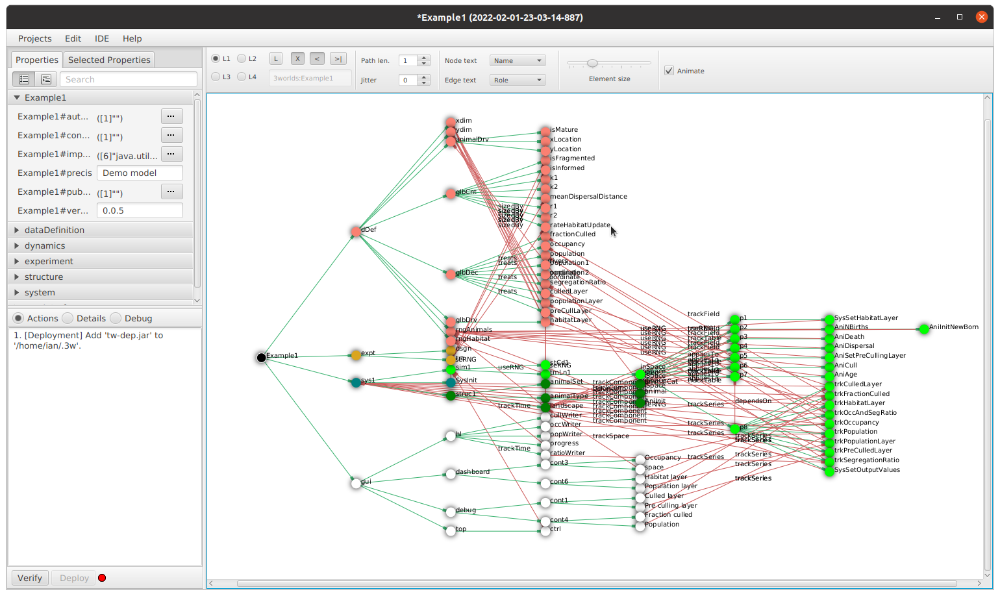

:xrefstyle: short

=== Using ModelMaker: software interface and functioning

[#fig-modelmaker]
._ModelMaker_ displaying an example project.

The user interface of _ModelMaker_ is divided into three main areas <<fig-modelmaker>>:
. Right-hand side: The graph display. This is where the specification graph is constructed. 
. Top left: Property editors for node and edge properties. 
. Bottom left: A message pane for displaying actions that are required to ensure the specifications are valid. 

==== Graph display

Construction takes place by adding (or removing) nodes and edges (_cross-links_) using the pop-up menus (right-click on any node). The options available in the pop-up menus are particular to the selected node. Above the graph display is a tool bar to enable various display options.

==== Property editors

There are two property editors: one for all editable properties of the currently displayed nodes and edges; and a second for all properties of a selected node (left-click on any node).

==== Message pane

Compilation takes place after every edit so there is rarely any need to click the compile button.

While using a graph to construct model specifications has many advantages, you can quickly become lost in a confusion of nodes and edges. The advantage in presenting the specifications as a graph is that the huge number of options possible can be constrained by context. For example, to have a dynamic `process`, it makes sense that it's associated with a particular `timer`, that other processes working at the same rate are associated with the same `timer` and that all timers are coordinated by the one `timeline`. The user interface for problems such as this would be very error-prone if presented say, as a series of dialog boxes.

_ModelMaker_ has a number of features to help arrange the graph display. These fall into three categories: arranging, hiding and resizing.

*Arranging*: There are four (five planned) layout algorithms currently available in _ModelMaker_ of which three make use of the tree structure of the graph to arrange nodes and one is a 'Spring' based algorithms which treat all edges alike, be they _parent-child_ or _cross-link_ edges. Tree methods are ideal for examining the parent-child structure while the last is better suited to examining relations between nodes. Tree methods are deterministic while Spring methods are not. Thus, Tree methods are better for maintaining your orientation to the graph but have the disadvantage of not arranging cross-link edges clearly. Spring methods do a better job of this but the resulting arrangement can change with each application of the layout.

Two of the Tree methods produce a radial layout. These are best suited to examining nodes that have many children such as a record with many fields.

All Tree methods allow selecting any node as the root of the tree (`Ctrl right-click`) on any node. The selected node will have a black circle around it and its name will appear in the tool bar. The graph is rearranged after re-applying the layout ('*L*').

When a project is first created, the default layout is an *orderedTree*. To change to other layouts, use buttons in the tool bar (*L1, L2, L3, L4*). This layout persists for repeated applications of the layout (*L*) button until another is chosen.

You can add a random displacement to nodes to help prevent node and edge text overlapping (*Jitter* from the tool bar). This setting is applied whenever the layout is re-applied.

Finally, you can of course move a node anywhere within the graph window. 

*Information hiding*: The following operations can help to hide temporally irrelevent information:

- *collapse/expand*: You can hide or show sub-trees from any node from its local popup menu. In addition, all properties of collapsed sub-trees and removed from the property editor;
- *X* Show/hide cross-link edges. 
- *<* Show/hide parent-child edges.
- *>|* Move all isolated nodes to one side (after re-applying the layout)
- change the node and edge names by hiding or showing either or both roles and names with the `N-text` and `E-text` drop-down lists.
- Hold down the `Shift` key while moving the mouse over any node. This highlights this node and any neighbours within the *path length*. The path length can be set from the tool bar. The default is '1'.

*Resizing*:

- *Zoom*: Zoom in and out in the graph window with the mouse pointer as the focus point (`Ctrl - mouse wheel`)
- *Pan*: If the drawing surface is larger than the window, you can drag the drawing surface of the graph window (left click outside a node)
- *Node Size*
- *Font size*