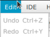
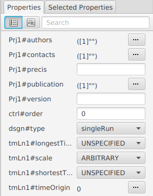

:xrefstyle: short

=== Using ModelMaker: software interface and functioning

[#fig-modelmaker]
.The appearance of _ModelMaker_ displaying an example project.
image::using-modelmakerIMG/fig-modelmaker.png[align="center"]

_ModelMaker_ has the traditional main menu bar, a variety of mouse/keyboard operations and three regions for the construction of the model specifications graph <<fig-modelmaker>>:

. Right-hand side: *Graph display* window and associated tool bar for graph construction. 
. Top left: *Property editors* for node and edge properties. 
. Bottom left: *Message pane* to display actions that are required to ensure the specifications are valid. 

The main window title is the currently open project and any linked Java project associated with it (*<3Worlds project name>(<date>) <o-o-o> <Java project name>*). Whenever the specifications are edited, an asterisk is prefixed to the window title and cleared upon saving.

==== Main menu

===== Project

====== New

[#fig-menu-new]
.Options for creating a new project.
image::using-modelmakerIMG/fig-menu-new.png[role="thumb",align="left",float="right"]

Creates a new project from either a library of *Templates*, *Tutorials*, *Model library* or *Test cases* <<fig-menu-new>>. You will be prompted for a unique name for the project. The first letter of this name must be upper case as it will eventually be used as the name of a Java class when the project successfully compiles.  A sub-directory with the name and creation date will be created under `.3w`.
Once created, the project name and its creation date appear in the window title and the graph root node name is that entered at the prompt. _ModelMaker_ will automatically compile the project and list any actions required in the *message pane*.

====== Open

[#fig-menu-open]
.The Open project menu choice.
image::using-modelmakerIMG/fig-menu-open.png[role="thumb",align="left",float="right"]

Open any project currently in the `.3w` directory <<fig-open-menu>>. Projects are listed in alphabetical order.

====== Import

Imports a tree-graph file from disk (*.utg). Imports are only possible if the tree-graph has a single root. You will be prompted for a unique name for the import.

NOTE: Tree-graphs with more than one root cannot be imported.

====== Save

Saves the configuration graph and its associated layout file (`.layout.utg`) to disk.

====== Save as

Saves the project under a new name in a new directory within `3w`. If the project was linked to a Java project, the new project will maintain this link and generate a new Java file with this name.

====== Exit

Exits _ModelMaker_ after a prompting to save any unsaved work. On exiting, a project specific preferences file is saved  automatically (`MM.xls`), recording the current appearance of _ModelMaker_.

===== Edit

[#fig-menu-edit]
.The edit menu choice.

====== undo/redo

Re-do or un-do most edit operations. Note that collapsing/expanding sub-tree operations are not included in this system. The undo/redo system creates temporary history files during a session. These are deleted when the project is closed.

====== import snippets

Enabled when a project is linked to a Java project. Imports method code from Java into any `snippet` nodes in the specifications. If this code references dependencies, _ModelMaker_ will show compile errors in the *message pane*. To avoid these errors but keep the snippet, add comment markers in the imported snippet to avoid these dependencies and prevent the compile errors. (*TODO: this may change*).

====== clear snippets

Clears the Java code in the configuration's `snippet#javaCode` property. Functions requiring return values will have default return values added.

====== Java project

Allows connecting to or disconnecting from an external Java project. When connecting to a Java project, the java project must have imported `tw-dep.jar` as an external jar to its class path. Upon first connecting to a Java project, a Java class called `UserCodeRunner.java` is added to the default package. Use this as a main class to debug your model code. If the specifications are valid, additional Java classes are created. One of these has the same name as the 3Worlds project. Edit this file in an Integrated Development Environment (IDE) to begin developing your model. At the time of writing, only the _Eclipse_ IDE is supported for this purpose.

If the creation times of Java source files and their associated class files become inconsistent, a message to this effect will appear in the *message pane*. In such cases, refresh or clean the Java project.

NOTE: To compile models, the Java Development Kit (JDK)  must be installed on your computer (<<trueprerequisites>>). 

NOTE: Use 'Refresh` in the IDE to keep _ModelMaker_ and the Java project synchronized. 

===== Help

====== Reference manual

Displays this user manual in a browser. *TODO*

====== About ModelMaker

A dialog with a succinct description of the purpose of _ModelMaker_. If you're using _ModelMaker_ for the first time, it's a good idea to at least read this overview. 

==== Graph display

Construction of the model specification graph takes place in the *Graph display* window by adding or removing nodes and edges (_cross-links_). Above the graph display is a tool bar to enable various display options. <<fig-graph-display-window>>.

[#fig-graph-display-window]
.The Graph display window and tool bar. The graph is both a Tree graph and a directed network graph. The tree graph is shown with green parent-child edges. The directed network graph is shown with red, named edges.
image::using-modelmakerIMG/fig-graph-display-window.png[align="center"]

The graph is both a tree graph (with a single root) and a directed network graph. The tree structure is shown with green parent-child edges with a thickened end at the child node. The directed network graph is shown with red, named edges with a thickened end at the 'end node'.

Node colours are based on a schema that, for the most part,  colours all nodes within a sub-tree the same. The colours are not editable.

===== Tool bar
. Layout selection: The four radio buttons (*L1, L2, L3, L4*) select one of four layout algorithms:
... *L1* - ordered tree. The nodes are listed vertically in alphabetical order.
... *L2* - radial tree. The radius decreases as the path distance from the root node increases.
... *L3* - radial tree. The radius remains constant. 
... *L4* - spring graph. A force directed layout. Parent-child edges (green) and treated in the same way as _cross-links_ (red).
. Layout options
... *L*: Applies the current layout options.
... *X*: Toggles the _cross-links_.
... *<*: Toggles the parent-child edges.
... *>|*: Moves any isolated nodes to the right-hand side of the window.
... *Current layout root*: The name of the node used for the display root of the graph. The default is the black 3worlds root node. This can be changed by right-clicking on any node while holding down the `Ctrl` key. The display root node is also indicated by a black circle. This option only applies to tree layouts.

. Miscellaneous
... *Path len.*: Sets the path length when the view local graph option is selected (move the mouse over a node while holding down the `Shift` key).
... *Jitter*: Sets the amount of random displacement of a node when applying a layout. This is useful to separate text and/or lines drawn over each other.

. Text options:
... *Node text*: Display the node label and name or any combination of the two including no text.
... *Edge text*: Display the edge label and name or any combination of the two including no text.

. *Element size*: Increases or decreases the size of all nodes, edges and text in the display.

===== Keyboard and mouse functions

// - mouse-keyboard options (2drag pane, 3drag node, 4popup, 5local graph, 6display root).
... *Pan*: Drag the mouse anywhere other than on a node to pan the graph drawing surface. This assumes the display size is larger than the window.
... *Drag node*: Right-click on any node to change its position. Nodes are shown in red when the mouse passes over them.
... *Show local graph*: Hold down the `Shift` key while moving the mouse over a node. The path length for this feature is set in the tool bar.
... *Show node properties*: Left-click on any node to display its properties in the _Selected properties_ property editor.
... *Zoom*: Hold down the `Ctrl` key while moving the mouse wheel to zoom in and out of the display.
... *Pop-up edit menu*: Right-click on any node to see the edit options for that node.

===== Pop-up edit options

This menu is the princple way in which the specification graph is constructed <<fig-popup>>. Note that the `predefined:*catoregories*` sub-tree cannot be edited except for any 'in-nodes' that may be allowed from outside this sub-tree.

[#fig-popup]
.The pop-up menu. Available options depend on the node selected.
image::using-modelmakerIMG/fig-menu-popup.png[role="thumb",align="left",float="right"]

... *New node*: Displays a list of valid node labels that can be children of this node.
... *New edge*: Displays a list of valid edges (_cross-links_) from this node to another existing node.
... *New child edge*: Displays a list of (parentless) nodes that can be valid children of this node.
...*Expand sub-tree*: Displays a list of sub-trees that can be expanded from this node. After expanding, any properties of these nodes and edges will appear in the property editor.
...*Collapse sub-tree*: Displays a list of sub-trees that can be collapsed from this node. After collapsing, any properties of these nodes and edges will be removed from the property editor.
... *Delete node*: Deletes this node. The `3Worlds` root node cannot be deleted.
... *Delete edge*: Displays a list of 'out-edges' from this node that can be deleted.
... *Delete child edge*: Displays a list of child nodes that can be orphaned. Note that the specifications are not valid until all child nodes have parents.
... *Optional properties*: Displays a dialog with any optional properties that can be added or removed from this node.
... *Rename node*: Change the node name to some other unqiue name. The name of the root node cannot be changed.
... *Rename edge*: Displays a list of 'out-edges' whose name can be changed to some other unqiue name. 
... *Import sub-tree*: Displays a list of valid child node labels that can form the root of a sub-tree read from file.
... *Export sub-tree*: Displays a list of the current child nodes of this node that can be exported to file as a sub-tree.

==== Property editors

There are two property editors available on separate tabs: one (_Properties_) displays all _editable_ properties of the currently displayed nodes and edges; and a second (_Selected properties_) shows _all_ properties of a selected node (left-click on any node) <<fig-properties-selected>>.

The _Properties_ editor has two buttons; one to display properties by category <<fig-properties-category>> (in this case this means by sub-tree) and the other to display properties by name <<fig-properties-all>>. There is also a search field that can be used to show only those properties that match the search text.

Properties are only shown for nodes that are currently visible (not collapsed) in the graph.

[#fig-properties-all]
.Property editor showing pass:[  properties listed by name.

[#fig-properties-category]
.Property editor showing pass:[  properties listed by category.
image::using-modelmakerIMG/fig-properties-category.png[role="thumb",align="left",float="right"]

[#fig-properties-selected]
.Property editor showing only pass:[  properties of a selected node (here a `TimeLine`).
image::using-modelmakerIMG/fig-properties-selected.png[align="center"]

==== Message pane

The *message pane* displays information about what is required to make the model specifications valid. It grows and shrinks during construction depending on the state of the graph. Information is presented in three levels of detail: action, details and debug. Generally, the 'action' level is all that is required.

Messages are displayed in alphabetical order of the Action text no matter what the display level. At the bottom of the *message pane* are two buttons described at the end of this section.

... *Action*: This level indicates what action must be taken for the specifications to comply with the 3Worlds archetype. Its format is: a) the message category (usually *[Node]*, *[Edge]* or *[Property]*); b) the target (the label:name of a node or edge or a property name) and the action message <<fig-msg-formatss>>.

... *Details*: This level shows the action message and the specification constraint that is unsatisfied. The information provided varies with the message but in general include <<fig-msg-formats>>:

.... Message number. Messages are always displayed in alphabetical order of the Action text no matter what the display level. 
.... The action message: usually in the form of "Do this or that".
.... The specification constraint: usually in the form of "Expected this but found that".
.... The Java class of the query issuing the message.
.... The node in the 3Worlds archetype that defines the application of this query class.
.... The target element (node, edge, property or some other item class)

... *Debug*: This level shows all information available for this message including a detailed description of the target and archetype elements. It is rarely informative unless you are a contributor to the development of 3Worlds <<fig-msg-formats>>.

[#fig-msg-formats]
.Message pane displaying three different message formats.
image::using-modelmakerIMG/fig-msg-formats.png[align="center"]

===== Compile and Deploy

... *Compile*: Checks the specification graph against the archetype and compiles the Java code. This process takes place in the background anytime the graph is edited. Therefore, there is rarely any need to click the compile button.

... *Deploy*: This button is enabled (traffic light green) whenever the *message pane* is clear. When clicked, _ModelRunner_ is launched to run the model with the specified experment desgin.
