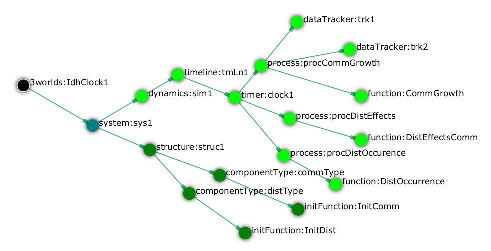
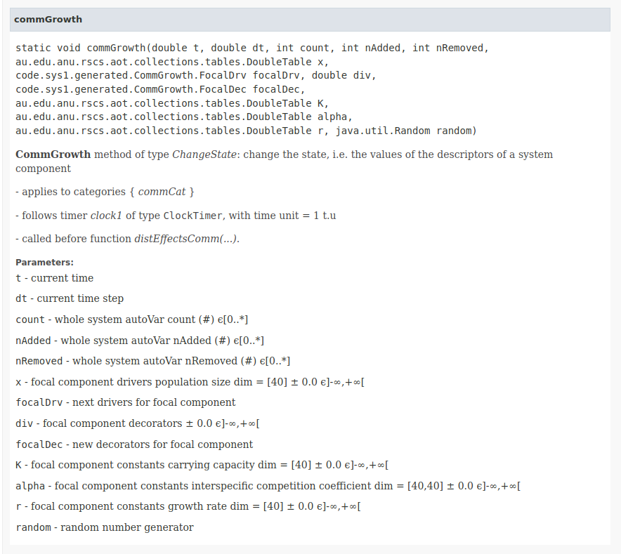
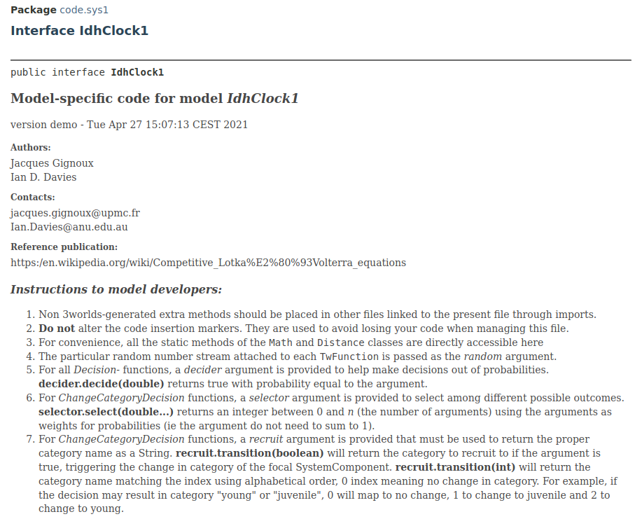

A model of an ecological system in 3Worlds consists in a _configuration file_ constructed with the `ModelMaker` application (<<trueconfiguration-reference-creating-and-editing-a-model-with-modelmaker>>) and _java code files_ that must be edited by the end-user, here a modeller. Some basic knowledge of https://en.wikiversity.org/wiki/Java_Programming/Introduction[java] is required before going on here.

==== Generated code: the __model main class__

During the specification of a model, ModelMaker generates java classes meant to be further edited in order to implement the specific behaviours imagined by the modeller. Among these classes, one is meant to be edited; the others are interface code, that you can see as 'glueing' code between the 3Worlds main code and the user-defined one. The file to be edited is named after the 3Worlds root node of the specification file (<<configuration-reference.adoc#truethe-3worlds-node>>): e.g., if your 3Worlds node has the name `myModel`, the java file to edit will be called `MyModel.java`. In what follows, we call it the __model main class__.

This section gives general rules to follow to successfully edit the generated _model main class_ in order for your model to behave as you wish. <<MMeclipse.adoc#truesetting-up-a-java-development-environment-for-the-user-code>> describes how to link your `ModelMaker` session with an eclipse development enviromnent where you can edit the generated _model main class_. It is important to read about  <<configuration-ecosystem-dynamics#truefunction,functions>> before starting writing your code, in order to master all the options you can setup in `ModelMaker` to specify your function.

For each `function` node of the specification, you will find one static method with the same name in the _model main class_. For example, the 'IDHClock' tutorial (<<tutorial4.adoc#truetutorial-4-elaborating-the-model-structure-testing-the-intermediate-disturbance-hypothesis>>) specifies 3 functions, 2 initFunctions and 2 data trackers (<<fig-idhClock-functions>>).

[#fig-idhClock-functions]
.The functions defined in the model of the IDHClock tutorial.

This generates a _model main class_ with corresponding methods (code stripped of its javadoc comments):

[source%nowrap,java]
----
package code.sys1;

import static java.lang.Math.*;
import au.edu.anu.rscs.aot.collections.tables.DoubleTable;
import au.edu.anu.twcore.ecosystem.runtime.biology.DecisionFunction;
import java.util.Random;
import code.sys1.generated.*;
// Hey, model developer! You may add your own imports here as needed

public interface IdhClock1 {

	public static void distEffectsComm(
		double t,                             // current time
		double dt,                            // current time step
		int count,                            // whole system autoVar count (#) ϵ[0..*]
		int nAdded,                           // whole system autoVar nAdded (#) ϵ[0..*]
		int nRemoved,                         // whole system autoVar nRemoved (#) ϵ[0..*]
		double freq,                          // focal component constants  ± 0.0 ϵ]-∞,+∞[
		double inten,                         // focal component constants  ± 0.0 ϵ]-∞,+∞[
		DoubleTable other_x,                  // other component drivers population size dim = [40] ± 0.0 ϵ]-∞,+∞[
		DistEffectsComm.OtherDrv otherDrv,    // next drivers for other component 
		double other_div,                     // other component decorators  ± 0.0 ϵ]-∞,+∞[
		DistEffectsComm.OtherDec otherDec,    // new decorators for other component 
		DoubleTable other_K,                  // other component constants carrying capacity dim = [40] ± 0.0 ϵ]-∞,+∞[
		DoubleTable other_alpha,              // other component constants interspecific competition coefficient dim = [40,40] ± 0.0 ϵ]-∞,+∞[
		DoubleTable other_r,                  // other component constants growth rate dim = [40] ± 0.0 ϵ]-∞,+∞[
		Random random) {                      // random number generator
	// distEffectsComm ---- Code insert Begin-->
	// distEffectsComm ---- Code insert End----<
	}

	public static boolean distOccurrence(
		double t,                             // current time
		double dt,                            // current time step
		int count,                            // whole system autoVar count (#) ϵ[0..*]
		int nAdded,                           // whole system autoVar nAdded (#) ϵ[0..*]
		int nRemoved,                         // whole system autoVar nRemoved (#) ϵ[0..*]
		double freq,                          // focal component constants  ± 0.0 ϵ]-∞,+∞[
		double inten,                         // focal component constants  ± 0.0 ϵ]-∞,+∞[
		DoubleTable other_x,                  // other component drivers population size dim = [40] ± 0.0 ϵ]-∞,+∞[
		double other_div,                     // other component decorators  ± 0.0 ϵ]-∞,+∞[
		DoubleTable other_K,                  // other component constants carrying capacity dim = [40] ± 0.0 ϵ]-∞,+∞[
		DoubleTable other_alpha,              // other component constants interspecific competition coefficient dim = [40,40] ± 0.0 ϵ]-∞,+∞[
		DoubleTable other_r,                  // other component constants growth rate dim = [40] ± 0.0 ϵ]-∞,+∞[
		Random random,                        // random number generator
		DecisionFunction decider) {           // decision function
	// distOccurrence ---- Code insert Begin-->
	// distOccurrence ---- Code insert End----<
	}

	public static void initDist(
		double freq,                          // focal component constants  ± 0.0 ϵ]-∞,+∞[
		double inten,                         // focal component constants  ± 0.0 ϵ]-∞,+∞[
		InitDist.FocalCnt focalCnt,           // new constants for focal component 
		Random random) {                      // random number generator
	// initDist ---- Code insert Begin-->
	// initDist ---- Code insert End----<
	}

	public static void commGrowth(
		double t,                             // current time
		double dt,                            // current time step
		int count,                            // whole system autoVar count (#) ϵ[0..*]
		int nAdded,                           // whole system autoVar nAdded (#) ϵ[0..*]
		int nRemoved,                         // whole system autoVar nRemoved (#) ϵ[0..*]
		DoubleTable x,                        // focal component drivers population size dim = [40] ± 0.0 ϵ]-∞,+∞[
		CommGrowth.FocalDrv focalDrv,         // next drivers for focal component 
		double div,                           // focal component decorators  ± 0.0 ϵ]-∞,+∞[
		CommGrowth.FocalDec focalDec,         // new decorators for focal component 
		DoubleTable K,                        // focal component constants carrying capacity dim = [40] ± 0.0 ϵ]-∞,+∞[
		DoubleTable alpha,                    // focal component constants interspecific competition coefficient dim = [40,40] ± 0.0 ϵ]-∞,+∞[
		DoubleTable r,                        // focal component constants growth rate dim = [40] ± 0.0 ϵ]-∞,+∞[
		Random random) {                      // random number generator
	// commGrowth ---- Code insert Begin-->
	// commGrowth ---- Code insert End----<
	}

	public static void initComm(
		DoubleTable x,                        // focal component drivers population size dim = [40] ± 0.0 ϵ]-∞,+∞[
		InitComm.FocalDrv focalDrv,           // next drivers for focal component 
		double div,                           // focal component decorators  ± 0.0 ϵ]-∞,+∞[
		DoubleTable K,                        // focal component constants carrying capacity dim = [40] ± 0.0 ϵ]-∞,+∞[
		DoubleTable alpha,                    // focal component constants interspecific competition coefficient dim = [40,40] ± 0.0 ϵ]-∞,+∞[
		DoubleTable r,                        // focal component constants growth rate dim = [40] ± 0.0 ϵ]-∞,+∞[
		InitComm.FocalCnt focalCnt,           // new constants for focal component 
		Random random) {                      // random number generator
	// initComm ---- Code insert Begin-->
	// initComm ---- Code insert End----<
	}

}
----

In this example, you can see that:

* the package name `code.sys1` is constructed from the name of the `system` node (<<fig-idhClock-functions>>);
* the interface name `IdhClock1` is constructed from the name of the `3Worlds` node (<<fig-idhClock-functions>>);
* each method name is constructed from a matching `function` or `initFunction` node (<<fig-idhClock-functions>>).
* the argument lists are partly constructed from the `categories` the `process` declaring the `function` applies to;
* the comments documenting the method arguments are constructed from the `field` or `table` node properties (`description`, `precision`, `interval`, `units`, etc.).

When ModelRunner is launched on the IDHClock tutorial model, it will include the generated `IdhClock1` class and call each of its methods for all system components they are dealing with as specified in the model configuration file.

As you can see in this example, the body of each method is empty, only containing two comments:

[source,java]
----
	// initComm ---- Code insert Begin-->
	// initComm ---- Code insert End----<
----
These are the __code insertion markers__. The user-defined code must be inserted between these two lines.

WARNING: Never remove the __code insertion markers__ as they are used by 3Worlds when using code <<configuration-ecosystem-dynamics.adoc#truefunction,snippets>>.

As _model main class_ is a java __**interface**__, all data is passed as arguments to its static methods. As you can see in the example above, there may be many arguments. If you look closely, you will see that these arguments match the _descriptors_ that were attached to the _categories_ to which the _processes_ apply. All this information is provided in the _model main class_ as javadoc comments. For example, the javadoc comment of the `commGrowth` method above produces this output:

This comment recalls the categories to which the `commGrowth` method applies, which timer it follows and which time units it uses, and any other useful information like precedence between methods as specified by `dependsOn` cross-links between processes.

Finally, the __model main class__ itself has a general javadoc description that gives some information about how to insert useful code into its methods:

==== __Model main class__ method arguments

The list of arguments of each method is defined by its <<configuration-ecosystem-dynamics.adoc#truefunction,function type>>, the organisation level to which it applies (system, life cycle, group or component), the categories or relation types it applies to, and the user-defined data structures attached to these.

* the first and second argument are _the current time_ _**t**_ and __current time step **dt**__, passed by the simulator as double values in units of the `timeModel` of the parent `process` of the `function`. 

+
CAUTION: In the case of multiple timers, for `ClockTimers`, the current time step may be different from the timer's `dt` property because it is the time since last simulator iteration, which may have been triggered by a different timer.

**[HERE]**

* For all function types which process applies to categories (`appliesTo ->  category`), i.e. `ChangeCategoryDecision`, `ChangeState`, `DeleteDecision`, `CreateOtherDecision`, there is an additional argument, the system component which will be affected by the computations, called __focal__.

* For all function types which process applies to relations (`appliesTo ->  relationType`), i.e. `ChangeOtherCategoryDecision`, `ChangeOtherState`, `DeleteOtherDecision`, `ChangeRelationState`, `MaintainRelationDecision`, and for `RelateToDecision`, there  is another additional argument, a second system component, the one at the other end of the relation starting from __focal__, called __other__.

==== generic method fields

In addition to these arguments, every function class has a protected field called `localContext` that contain contextual data that may be used in computations. The local context data consist in:

** __ecosystem__-level data, i.e. ecosystem population data (= number [source,]
+
----
focalContext.ecosystemPopulationData
focalContext.ecosystemName
----

** __life cycle__-level data, i.e. life cycle parameters, population data, and name:
+
----
focalContext.lifeCycleParameters
focalContext.lifeCyclePopulationData
focalContext.lifeCycleName
----

** __group__-level data, i.e. group parameters, population data, and name. A group represents here components sharing the same categories and same parameter set (eg _species_ characteristics for living organisms).
+
----
focalContext.groupParameters
focalContext.groupPopulationData
focalContext.groupCycleName
----

`PopulationData` has 3 accessible fields: `count`, `nremoved` and `nAdded`.

**TODO** update this

* The `changeState(...)` method of the `ChangeState` and `ChangeRelationState` function types, and the `changeOtherState(...)` method of the `ChangeOtherState` function type,  are expected to compute changes in state variables of the _focal_ component or relation *[NB: this is not yet implemented for relations]*, or the _other_ component in the case of the `ChangeOtherState` function. The state variables are found in `focal.currentState()`, a read-only set of values, and new values may be computed into `focal.nextState()`.

* The `delete(...)` method of the `DeleteDecision` and `DeleteOtherDecision` must return a `boolean` value. If `true` is returned, this will trigger the removal of the _focal_ (for `DeleteDecision`) or _other_ component (for `DeleteOtherDecision`). 

TIP: In all `...Decision` functions except `CreateOtherDecision`, a helper method called `decide(double proba)` is available. This method will return true with probability `proba` and can be used to return a boolean result based on a probability computation. This method uses the in-built <<a,random stream facility>> of 3Worlds.

* The `nNew(...)` method of the `CreateOtherDecision` function takes an extra argument called `newType`, which is the category name of the newly created component, as per the life cycle. `nNew(...)` returns a number of new components to create as a decimal number (`double`): the _integral part_ directly translates into a number of new components, while the _decimal part_ is used as a probability of an extra new component. This way, very low fecundity probabilities can be simulated.

TIP: If there are >1 possible descendant categories, the `nNew(...)` method will be called as many times, with the `newType` parameter changing accordingly. The `nNew(...)` method must be prepared to handle multiple choices in such case (for example with a `switch` statement).

* The `changeCategory(...)` method of the `ChangeCategoryDecision` and `ChangeOtherCategoryDecision` function types returns a category name (`String`), that of the new recruit. This name must be consistent with the life cycle information. After the function is executed, the  _focal_ (for `ChangeCategoryDecision`) or the _other_ (for `ChangeOtherCategoryDecision`) component is recruited to its new category.

* The `maintainRelation(...)` method of the `MaintainRelationDecision` and the `relate(...)` method of the `RelateToDecision` both return a `boolean` value. If `true` is returned, the relation is maintained/set between the two components, otherwise it is removed/not set.**[TODO: a lot to add when indexers come in]**
